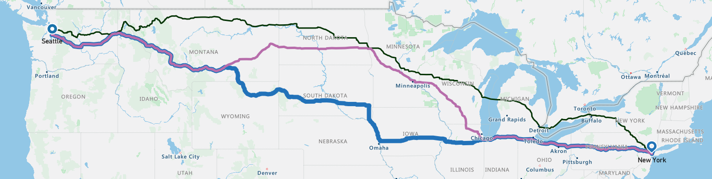

You've nearly completed the module.

In this module, you learned how to:

- Create a free Azure Maps account, using the Azure portal
- Create an app, for cross-country route finding, using Visual Studio Code
- Integrate maps into your own apps, using HTML and JavaScript

On a less serious note, you've learned more about hazardous materials than probably you ever thought you'd need, and you learned that if you ever wanted to bicycle from Seattle to New York, that Azure Maps is there for you!

  

## Next steps

Take your interest further with:

- [Azure Maps Documentation](/azure/azure-maps/)
- [Tutorial: Set up a geofence by using Azure Maps](/azure/azure-maps/tutorial-geofence)
- [Migrate from Google Maps to Azure Maps](/azure/azure-maps/migrate-from-google-maps)

Azure Maps are an integral part of other Learn modules. Check out:

- [Create your first Azure IoT Central app](/learn/modules/create-your-first-iot-central-app/)
- [Set up rules and take action on telemetry data in Azure IoT Central](/learn/modules/set-up-rules-take-actions-telemetry-data-azure-iot-central/)

Finally, to end your journey in this module, complete, and pass the knowledge check.