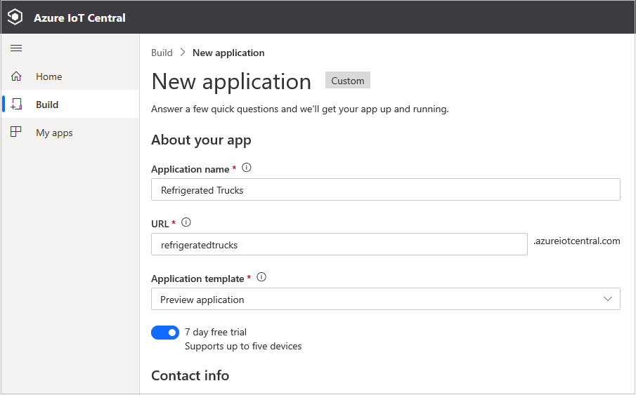

Azure IoT Central enables the easy monitoring and management of a fleet of remote devices.

Azure IoT Central encompasses a range of underlying technologies that work great, but can be complicated to implement when numerous technologies are needed. These technologies include Azure IoT Hub, the Azure Device Provisioning System (DPS), Azure Maps, Azure Time Series Insights, Azure IoT Edge, and others. It is only necessary to use these technologies specifically, if more granularity is needed than available through IoT Central.

One of the purposes of this module is to help you decide if there is enough features in IoT Central to support the scenarios you are likely to need, or whether going deeper into the underlying component technologies will be necessary. IoT Central is by far the easier option, so let's investigate what it is capable of with a fun and involved scenario.

## Learning objectives

In this module you will:

- Create an Azure IoT Central custom app, using the IoT Central portal
- Create a device template for a custom device, using the IoT Central portal
- Create a programming project to simulate refrigerated trucks, with routes selected by Azure Maps, using Visual Studio Code, or Visual Studio
- Monitor and command the simulated devices, from an IoT Central dashboard

## Prerequisites

- An introductory knowledge of the purpose of Azure IoT
- Ability to navigate Azure IoT portal
- Ability to use Node.js, or C#, at the beginner level
- Experience using Visual Studio, or Visual Studio Code, at the beginner level
- Must have, or be able to open, an Azure Maps account

## The scenario

Suppose you run a company that operates a fleet of refrigerated trucks.

 You have a number of customers within a city, and a base that you operate from. You command each truck to take its contents and deliver it to any one customer. However, the cooling system may fail on any one of your trucks, and if the contents does start to melt, you will need the option of instructing the truck to return to base, and then dump the contents. Alternatively, you can deliver the contents to another customer who might be nearer to the truck when you become aware the contents are melting.

In order to make these decisions, you will need an up-to-date picture of all that is going on with your trucks, certainly including their location on a map, the state of the cooling system, the state of the contents, and the ability to redirect or recall the trucks quickly.

IoT Central provides all you need to handle this scenario. In the following image, the colored circles show the locations of the trucks, truck 4 has been selected to receive a new command, and the exact location of truck 3 is being highlighted.

In this module, you will build the app displayed in the above image.

## Create a custom IoT Central app

1. Navigate to [Azure IoT Central](https://apps.azureiotcentral.com/?azure-portal=true). It is a good idea to bookmark this URL, as it is the home for all your IoT Central apps.

1. Click on **New Application**. Select the free **Trial** payment plan, the seven days that the trial gives you will be plenty of time to complete, and evaluate, the scenario.

    

1. Select **Custom application**, and configure the app as shown in the following image:

    

    > [!IMPORTANT]
    > Your **Application Name** can be any friendly name, such as "Refrigerated Trucks". However, the **URL** _must_ be unique, which is why you will add a unique ID to the end of the URL for the app. For example, `refrigerated-trucks-<your id>`, replacing `<your id>` with some unique ID.

1. Enter the rest of the required fields (your contact information) appropriately.

1. Click **Create**, and wait a few seconds whilst the app resource is built.

1. You should now see a **Dashboard** with a few default links. The next time you visit your home page, a large icon for your  **Refrigerated Trucks** app should appear.

You have now created the app. The next step is to specify a _device template_.
