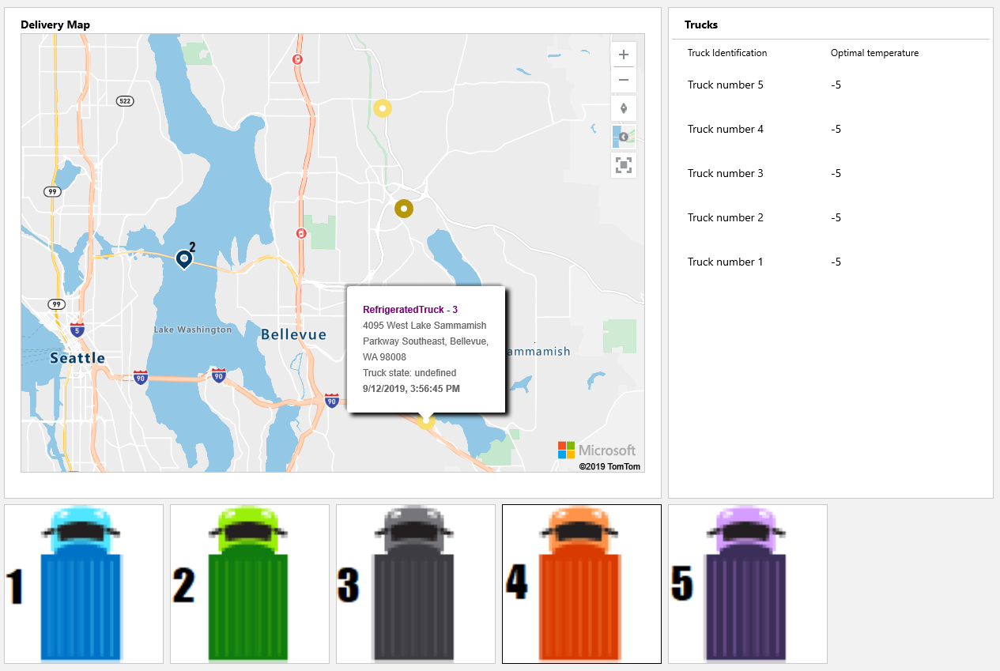
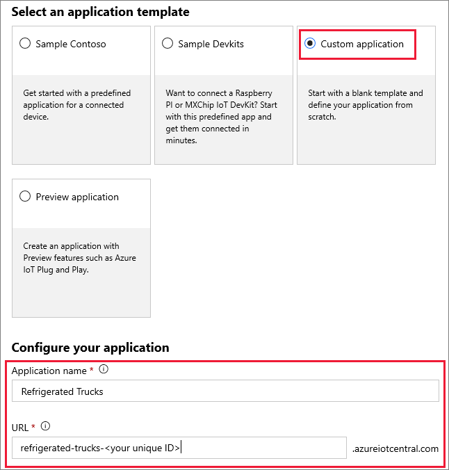

Azure IoT Central enables the easy monitoring and management of a fleet of remote devices. It encompasses a range of underlying technologies that work together well. 

IoT Central offers advanced functionality that's simple to use. It uses multiple underlying technologies. The underlying technologies include Azure IoT Hub, Azure Device Provisioning Service (DPS), Azure Maps, Azure Time Series Insights, Azure IoT Edge, and others. If you need more granular control over the underlying technologies, you can consider assembling them in your own solution.

One of the purposes of this module is to help you decide whether IoT Central has the features to support the scenarios you'll likely need. So let's investigate what IoT Central can do by using a fun and complex scenario.

## Learning objectives

In this module, you'll:

- Create an Azure IoT Central custom app by using the IoT Central portal.
- Create a device template for a custom device by using the IoT Central portal.
- Create a programming project to simulate a refrigerated truck, with routes selected by Azure Maps. You'll use Visual Studio Code or Visual Studio.
- Monitor and command the simulated device from an IoT Central dashboard.

## Prerequisites

- Introductory knowledge of the purpose of Azure IoT
- Ability to navigate the Azure IoT portal
- Ability to use Node.js or C#, at the beginner level
- Experience using Visual Studio or Visual Studio Code, at the beginner level
- An Azure Maps account

## Scenario

Suppose you run a company that operates a fleet of refrigerated trucks. You have many customers within a city, and you operate from a base. You command each truck to deliver its contents to a customer. 

If the cooling system fails on a truck and the contents start to melt, you need to instruct the truck to return to base and unload the contents. Or you can instead deliver the contents to a customer who's nearby when the cooling system fails.

To make these decisions, you need an up-to-date picture of all that happens with your trucks. You need to know the location of each truck on a map, the status of the cooling system, and the status of the contents.

IoT Central provides all you need to handle this scenario. In the following image, for example, the colored circles show the location of a truck on its way to a customer.

In this module, you'll build the app you see in this image.

## Create a custom IoT Central app

1. Right-click [Azure IoT Central](https://apps.azureiotcentral.com?azure-portal=true) and then select **Open in a new window**. It's a good idea to bookmark this URL. It's the home for all your IoT Central apps.

1. In the menu on the left, select **Build** and then select **Custom apps**. The **New application** form appears. Fill in the following information.

    | Setting  | Value  |
    |---------|---------|
    |**Application name** | any friendly name, such as "Refrigerated Trucks". However, the **URL** _must_ be unique, which is why you'll add a unique ID to the end of the URL for the app. For example, `refrigerated-trucks-<your id>`, replacing `<your id>` with some unique ID. |
    |**URL**     | *default*  |
    |**Application template**     | *Custom application*  |
    | **Pricing plan**: **Free** | Seven days is plenty of time to complete the scenario. |

    

    > [!TIP]
    > In this module, select any image to display an enlarged view.

1. Fill out the **Billing info**, and then select **Create**. Wait a few seconds while the app resource is built.

    > [!NOTE]
    > If you get the error "Subdomain already in use," your URL isn't unique. To resolve the error, change your URL.

The next time you visit your Azure IoT Central home page, in the menu on the left, select **My Apps**. An icon for your **Refrigerated Trucks** app should appear.

You've now created the app. The next step is to specify a _device template_.
