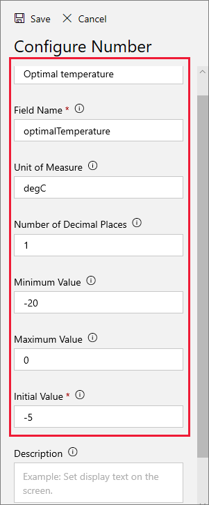
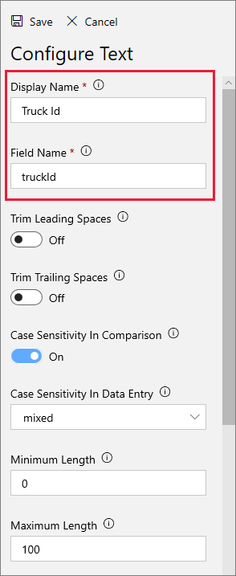
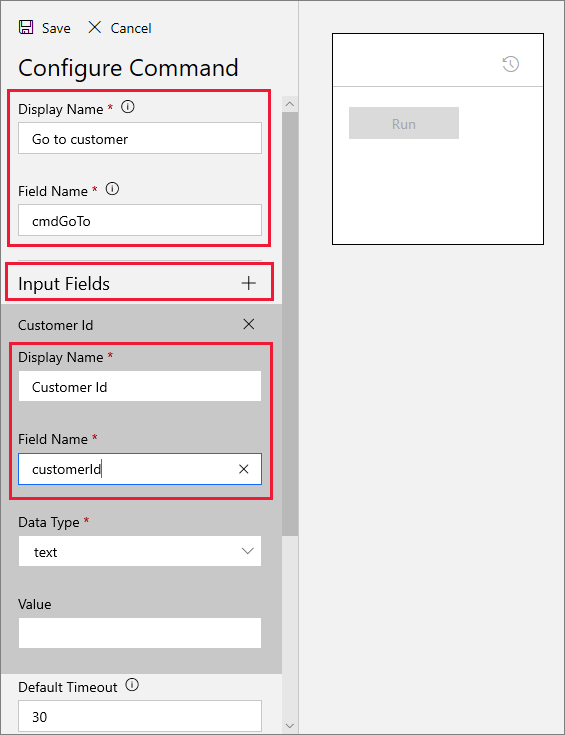
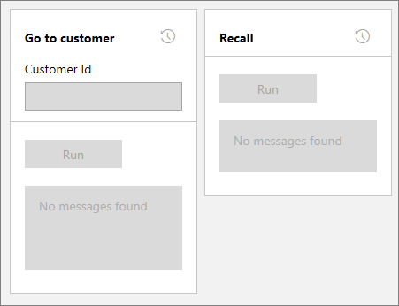

The data communicated between a remote device, and IoT Central, is specified in a _device template_. The device template encapsulates all the details of the data, so that both the device and IoT Central have all they need to make sense of the communication.

In this unit, you will create a device template for a refrigerated truck. 

## Create a device template

1. Within the [Azure IoT Central](https://apps.azureiotcentral.com/?azure-portal=true) portal (which you may still have open), select **Device Templates** from the menu on the left-hand side.

1. Click **+ New** to create a new template.

1. You will next see a range  of template options, select **IoT device**. We are going to build the template from scratch.

    > [!TIP]
    > Take note of the other options. You may want to use those prebuilt template options in a future project!

1. Click **Next: Customize**, then **Next: Review**. Do not select the **Gateway device** box. Then click **Create**.

1. Enter the name for your device template: "RefrigeratedTruck", and click Enter.

1. For **Create a capability model**, click **Custom**. You should now see a screen similar to the following image.

    

    > [!NOTE]
    > Take note of a few important elements of the above image. Including that the template is in Draft form, and the locations of the **+ Add interface**, **Views**, and **Publish** controls.

1. You are now ready to add the specifics of the device template. Click **Add interface**, then **Custom**, to start building from a blank interface.

An interface defines a set of _capabilities_. We have quite a few to create, to define a refrigerated truck.

### Add sensor telemetry

Telemetry is the data values transmitted by sensors. The most important sensor in our refrigerated truck, monitors the temperature of the contents.

1. Click **+ Add capability**, and enter the following values:

    | Entry summary | Value |
    | --- | --- |
    | Display Name | Contents temperature |
    | Name | ContentsTemperature |
    | Capability Type | Telemetry |
    | Semantic type | Temperature |
    | Schema | Double |
    | Unit | oF |

1. Your screen should now look like the following image.

  

    > [!IMPORTANT]
    > The names entered for the interface must be entered _exactly_ as shown in this unit. This is because an exact match is needed between these names, and entries in the code you will be adding later in this module.

Let's add the rest of the template.

### Add state telemetry

States are important, they let the operator know what is going on. A state in IoT Central is a name associated with a range of values. In addition, you later get to choose a color to associate with each value.

1. Use the **+ Add capability** control to add a state for the truck's refrigerated contents: _empty_, _full_, or _melting_.

    | Entry summary | Value |
    | --- | --- |
    | Display Name | Contents state |
    | Name | ContentsState |
    | Capability Type | Telemetry |
    | Semantic type | State |
    | Value schema | String |

1. Now, click **+**, and enter "empty" for the **Display name**, and **Value**. The **Name** field should automatically be populated with "empty". So, all three fields are identical, containing "empty".

1. Add two more state values: "full" and "melting". Again, the same text should appear in the **Display name**, **Name**, and **Value**.

    

1. Carefully check each capability before moving on. 

1. Now, to add some uncertainty to our simulation, let's add a failure state for the cooling system. If the cooling system fails, as you will see in the following units, the chances of the contents melting increase considerably! Add _on_, _off_ and _failed_ entries for a cooling system. Start by clicking **+ Add capability**, and add another state.

    | Entry summary | Value |
    | --- | --- |
    | Display Name | Cooling system state |
    | Name | CoolingSystemState |
    | Capability Type | Telemetry |
    | Semantic type | State |
    | Value schema | String |

1. Now add three values: on, off, and failed. Make sure that each word appears in the **Display name**, **Name**, and **Value** fields.

    

1. A more complex state is the state of the truck itself. If all goes well, a truck's normal routing might be: _ready_, _enroute_, _delivering_, _returning_, _loading_, and back to _ready_ again.  However, you should add the _dumping_ state to cater for when melted contents need to be disposed of! Using the same process as for the last two steps, create this new state.

    | Entry summary | Value |
    | --- | --- |
    | Display Name | Truck state |
    | Name | TruckState |
    | Capability Type | Telemetry |
    | Semantic type | State |
    | Value schema | String |

    

### Add event telemetry

Events are issues triggered by the device, and communicated to the IoT Central app. Events can be one of three types: _Error_, _Warning_, or _Informational_.

One possible event a device might trigger is a conflicting command. An example might be a truck is returning empty from a customer, but receives a command to deliver its contents to another customer. If a conflict occurs, it is a good idea for the device to trigger an event to warn the operator of the IoT Central app.

Another event might be just to acknowledge, and record, the customer ID that a truck is to deliver to.

1. Use **+ Add capability**, then create an event as follows.

    | Entry summary | Value |
    | --- | --- |
    | Display Name | Event |
    | Name | Event |
    | Capability Type | Telemetry |
    | Semantic type | Event |
    | Schema | String |

    

### Add location telemetry

A location is probably the most important, and yet one of the easiest measurements to add to a device template. Under the hood, it consists of a latitude, longitude, and an optional altitude, for the device.

1.  Use **+ New**, then click **Location**, and add a location for our trucks as follows.

    | Entry summary | Value |
    | --- | --- |
    | Display Name | Location |
    | Name | Location |
    | Capability Type | Telemetry |
    | Semantic type | Location |
    | Schema | Geopoint |

    

## Add properties

A Setting contains device configuration data. In our refrigerated truck example, you are going to define an _optimal temperature_ for the contents as a setting. This optimal temperature might change with different types of content, different weather conditions, or whatever might be appropriate. A setting has an initial default value, which may not need to be changed, but the ability to change it easily and quickly is there, if needed.

A setting is a single value. If more complex sets of data need to be transmitted to a device, a Command (see below) might be the more appropriate way of handling it.

1. Click on the **Settings** title (just to the right of **Measurements**) under the device template name. Add a single setting to set an optimal contents temperature, by clicking on **Number**, then entering the following fields:

    

    | Entry summary | Value |
    | --- | --- |
    | Display Name | Optimal temperature |
    | Name | optimalTemperature |
    | Unit of Measure | degC |
    | Number of Decimal Places | 1 |
    | Minimum Value | -20 |
    | Maximum Value | 20 |
    | Initial Value | -5 |

1. Click **Save**.

## Properties

Properties of a device are typically constant values, that are communicated to the IoT Central app once when communication is first initiated. In our refrigerated truck scenario, a good example of a property is the license plate of the truck, or some similar unique truck ID.

1. Click on the **Properties** title under the device template name, and add a single **Text** property to contain a truck ID.

    

    | Entry summary | Value |
    | --- | --- |
    | Display Name | Truck ID |
    | Name | truckId |

1. Click **Save**.

## Add commands

Commands are sent by the operator of the IoT Central app to the remote devices. Commands are similar to settings, but a command can contain any number of input fields, whereas a setting is limited to a single value.

For refrigerated trucks, there are two commands you should add: a command to deliver the contents to a customer, and a command to recall the truck to base.

1. Click the **Commands** title under the device template name, then click **New Command**.

1. For the first command, to send the truck to a customer, enter the following display and Names, and click **+** beside the **Input Fields** title to enter a text field.

    

    | Entry summary | Value |
    | --- | --- |
    | Display Name | Go to customer |
    | Name | cmdGoTo |
    | Input Fields Display Name | Customer ID |
    | Input Fields Name | customerId |

1. Click **Save**.

    > [!TIP]
    > You can use the corner icon in the lower-right corner of the box displaying the command, to stretch the bounding rectangle so that all elements of the command are displayed fully.

1. Enter another new command, this time with no input fields, but with "Recall" as the **Display Name**, and "cmdRecall" as the **Name**.

1. Click **Save**.

1. Validate that your two commands match the image below.

    

### Publish the template

Preparing a device template does take some care and some time.

In the next unit, you can do some validation of our device template.
