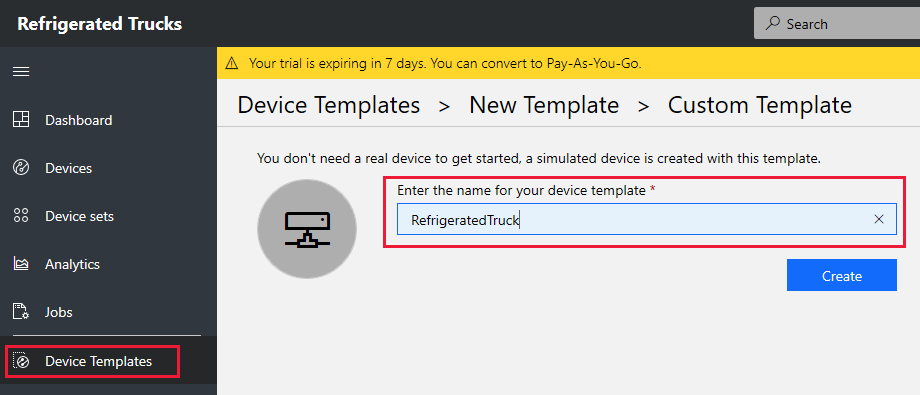
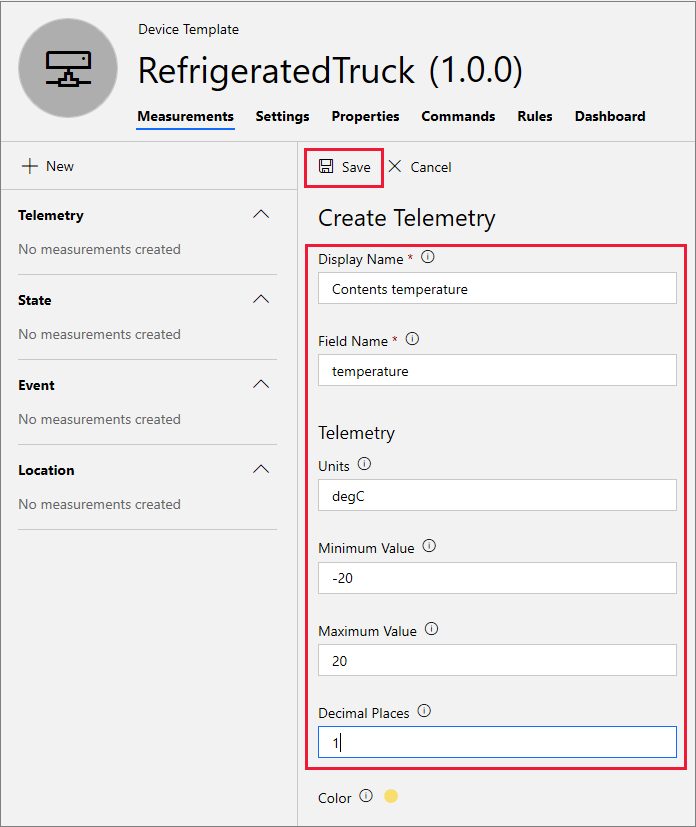
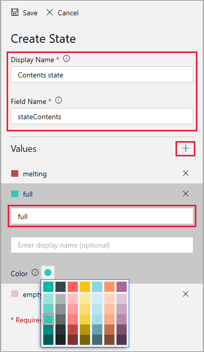
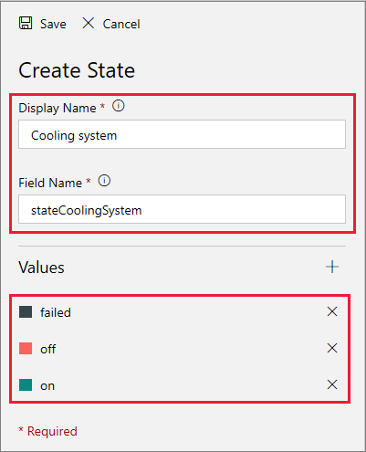
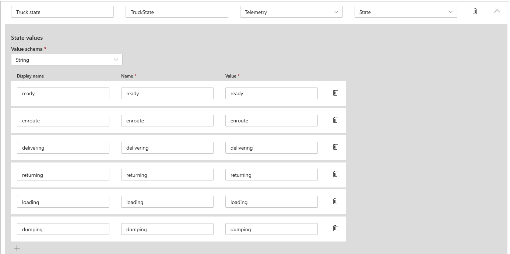
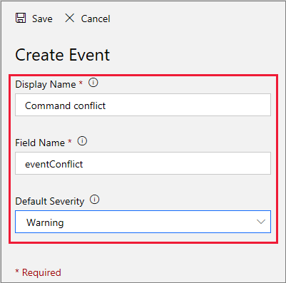
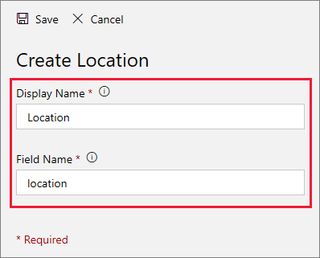
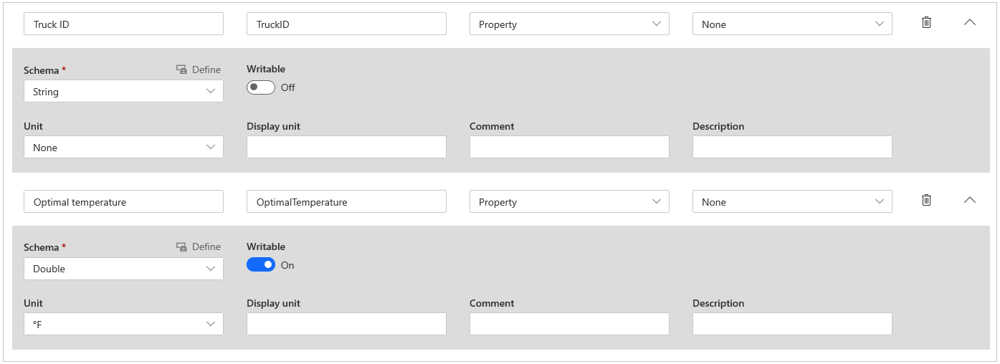
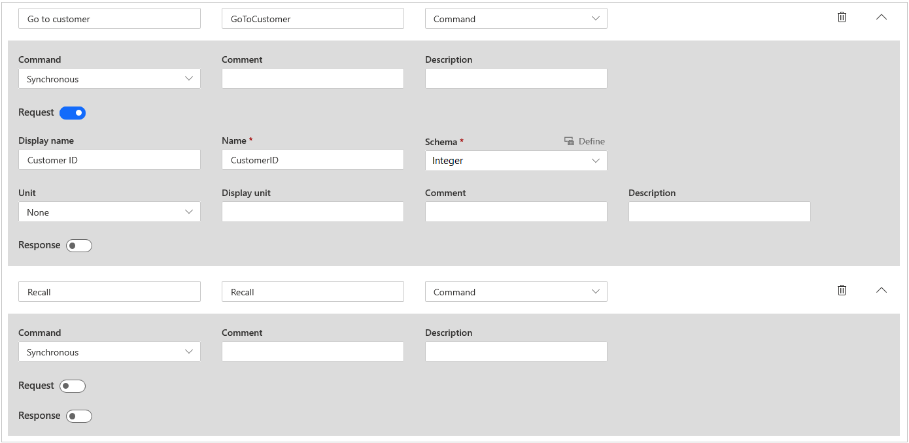

The data communicated between a remote device and IoT Central is specified in a _device template_. The device template encapsulates all the details of the data so that both the device and IoT Central have all they need to make sense of the communication.

In this unit, you'll create a device template for a refrigerated truck.

## Create a device template

1. In the [Azure IoT Central](https://apps.azureiotcentral.com/?azure-portal=true) portal, in the menu on the left, select **Device templates**.

1. Select **New** to create a new template.

1. You see a range of template options. Select **IoT device** to build the template from scratch.

    > [!TIP]
    > Review the other template options. You might want to use the prebuilt template options in a future project.

1. Select **Next: Customize**.

1. Name your device template *RefrigeratedTruck*. Don't select the **Gateway device** box.

1. Select **Next: Review**. Then select **Create**.

1. In the **Create a model** area, select **Custom model**. Your view should now look similar to the following image.

    

    > [!TIP]
    > In the image, notice that the template is in **Draft** form. Also notice the locations of the controls for **Add interface**, **Views**, and **Publish**.

1. You're now ready to add details for the device template. Select **Add an inherited interface**. Then select **Custom** to start building from a blank interface.

Components are interfaces made up of other interfaces. Interfaces define a set of capabilities. You'll need to create several capabilities to define a refrigerated truck.

### Add sensor telemetry

Telemetry is made up of the data values that sensors transmit. The most important sensor in our refrigerated truck monitors the temperature of the contents.

To get started, select **Add capability**. Then enter the values in the following table.

| Entry summary | Value |
| --- | --- |
| Display name | Contents temperature |
| Name | ContentsTemperature |
| Capability type | Telemetry |
| Semantic type | Temperature |
| Schema | Double |
| Unit | oC |

Your window should now look like the following image.

> [!NOTE]
> The interface names must be entered _exactly_ as shown in this unit. The names and entries must exactly match in the code you'll add later in this module.

> [!IMPORTANT]
> In all locales, capability names can currently contain _only_ characters *A* through *Z*, uppercase and lowercase letters, digits 0 through 9, and the underscore character (`_`). No spaces, special characters, or localized characters are allowed.

Let's add the rest of the template.

### Add state telemetry

States are important. They let the operator know what's happening. A state in IoT Central is a name associated with a range of values. Later you'll choose a color to associate with each value.

1. Use the **Add capability** control to add a state for the truck's refrigerated contents: _empty_, _full_, or _melting_.

    | Entry summary | Value |
    | --- | --- |
    | Display name | Contents state |
    | Name | ContentsState |
    | Capability type | Telemetry |
    | Semantic type | State |
    | Value schema | String |

1. Select **Add**. For **Display name** and **Value**, enter *empty*. The **Name** field should be populated automatically with **empty**. So all three fields are identical, containing **empty**.

1. Add two more state values: _full_ and _melting_. Again, the same text should appear in the fields for **Display name**, **Name**, and **Value**.

    

1. Carefully check each capability before you continue. 

1. To add some uncertainty to the simulation, add a failure state for the cooling system. If the cooling system fails, as you'll see in the following units, the chances of the contents melting increase considerably. 
 
    Add _on_, _off_, and _failed_ entries for the cooling system. Start by selecting **Add capability**. Then add another state.

    | Entry summary | Value |
    | --- | --- |
    | Display name | Cooling system state |
    | Name | CoolingSystemState |
    | Capability type | Telemetry |
    | Semantic type | State |
    | Value schema | String |

1. Add three values: _on_, _off_, and _failed_. Make sure that each word appears in the fields for **Display name**, **Name**, and **Value**.

    

1. A more complex state is the state of the truck itself. If all goes well, a truck's normal routing might be _ready_, _enroute_, _delivering_, _returning_, _loading_, and back to _ready_ again. Also add the _dumping_ state to account for the disposal of melted contents! To create the new state, use the same process as for the last two steps.

    | Entry summary | Value |
    | --- | --- |
    | Display name | Truck state |
    | Name | TruckState |
    | Capability type | Telemetry |
    | Semantic type | State |
    | Value schema | String |

    

### Add event telemetry

Events are issues triggered by the device and communicated to the IoT Central app. Events can be one of three types: _error_, _warning_, or _informational_.

One event a device might trigger is a conflicting command. An example might be when an empty truck that's returning from a customer receives a command to deliver its contents to another customer. If a conflict occurs, the device should trigger an event to warn the operator of the IoT Central app.

Another event might just acknowledge and record the customer ID that a truck is to deliver to.

To create an event, select **Add capability**. Then fill in the following information.

| Entry summary | Value |
| --- | --- |
| Display name | Event |
| Name | Event |
| Capability type | Telemetry |
| Semantic type | Event |
| Schema | String |

### Add location telemetry

A location is probably the most important and easiest measurement to add to a device template. It measures the device's latitude, longitude, and an optional altitude.

To add a location for the truck, select **Add capability**. Then fill in the following information.

| Entry summary | Value |
| --- | --- |
| Display name | Location |
| Name | Location |
| Capability type | Telemetry |
| Semantic type | Location |
| Schema | Geopoint |

### Add properties

A property of a device is typically a constant value. The value is sent to the IoT Central app when communication is initiated. In our refrigerated truck scenario, a good example of a property is the license plate of the truck or some similar unique truck ID.

Properties can also be device configuration data. You'll define an _optimal temperature_ for the truck contents as a property. This optimal temperature might change with different types of content, different weather conditions, or whatever might be appropriate. This kind of property is called a _writeable property_.

A property is a single value. If more complex sets of data need to be transmitted to a device, a **Command** is the more appropriate way of handling it. We'll explore commands in the next section.

To add a property:

1. Select **Add capability**. Then add the truck ID property.

    | Entry summary | Value |
    | --- | --- |
    | Display name | Truck ID |
    | Name | TruckID |
    | Capability type | Property |
    | Semantic type | None |
    | Schema | String |
    | Writable | Off |
    | Unit | None |

1. Add the optimal temperature property.

    | Entry summary | Value |
    | --- | --- |
    | Display name | Optimal Temperature |
    | Name | OptimalTemperature |
    | Capability type | Property |
    | Semantic type | Temperature |
    | Schema | Double |
    | Writable | On |
    | Unit |  oC  |

1. Confirm that your properties have the following fields:

      

### Add commands

The operator of the IoT Central app sends commands to the remote devices. Commands are similar to writable properties. But they can contain any number of input fields. By contrast, a writable property is limited to a single value.

For refrigerated trucks, you should add two commands: 
* A command to deliver the contents to a customer
* A command to recall the truck to base

To add the commands:

1. Select **Add capability**. Then add the first command.

    | Entry summary | Value |
    | --- | --- |
    | Display name | Go to customer |
    | Name | GoToCustomer |
    | Capability type | Command |

1. Turn on the **Request** option to enter more command details.

    | Entry summary | Value |
    | --- | --- |
    | Request | On |
    | Display name | Customer ID |
    | Name | CustomerID |
    | Schema | Integer |

1. Create a command to recall the truck.

    | Entry summary | Value |
    | --- | --- |
    | Display name | Recall |
    | Name | Recall |
    | Capability type | Command |

1. Make sure your two commands match the following image.

    

1. Select **Save**. Before you go any further, carefully double-check your interface. After an interface is published, editing options are limited. So you should get it right before publishing. 

    When you select the name of the device template, the menu that ends with the **Views** option summarizes the capabilities:

    

## Publish the template

1. If you've made changes since the last time you saved, select **Save**.

1. Select **Publish**. Then in the dialog box, select **Publish** again. The annotation should change from **Draft** to **Published**.

Preparing a device template takes some care and time.

In the next unit, you'll use the device template to prepare a controller's dashboard. You can prepare views before or after you publish a device template.
