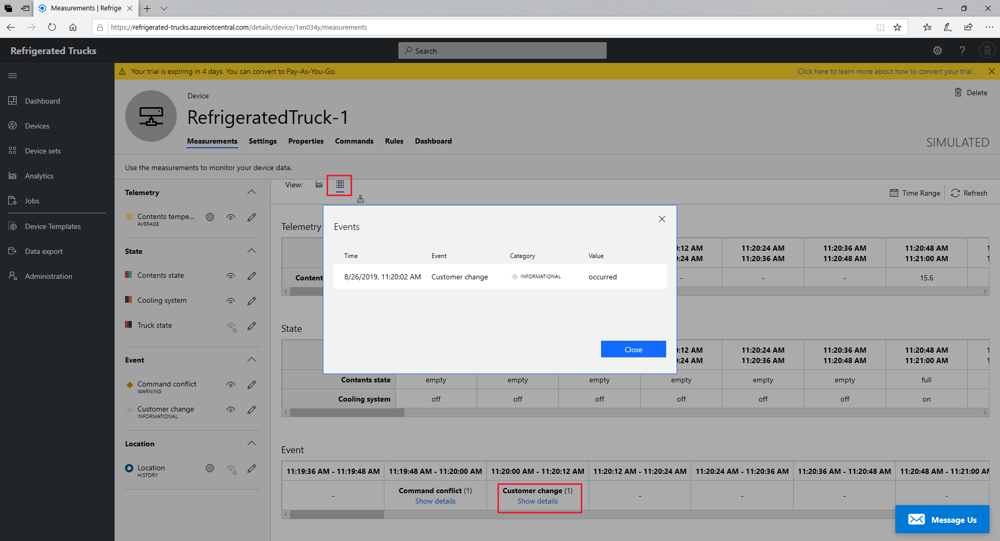
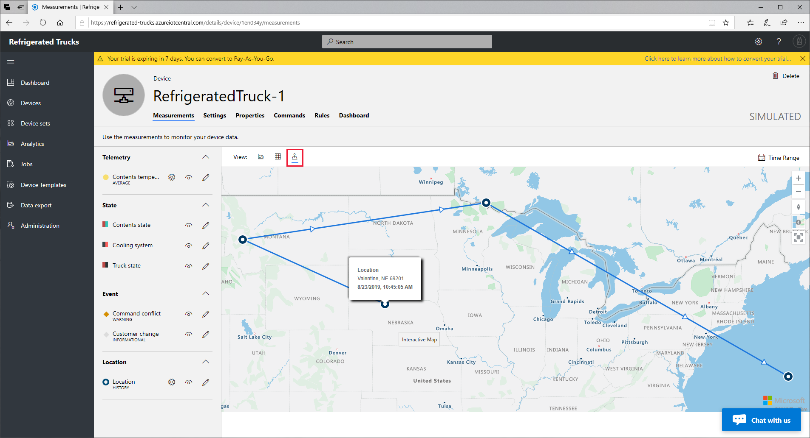

Even before a device template is complete, the automatically created simulated device will start sending data. As you entered the measurements, and other entries for the device template, you will probably have noticed values appearing in line and bar charts to the right of the screen.

## Validate the device template

Complete validation of the device template will not be possible until you have some real devices. However, the simulated device allows you both to check the completeness of what you have done so far, and to provide a helpful UI to learn the basics of managing devices through IoT Central.

1. Inside the [Azure IoT Central](https://apps.azureiotcentral.com/?azure-portal=true) portal, select the **Devices** entry in the left-hand menu, then click the one device you have so far (**RefrigeratedTruck-1**). In the range of **Views**, if it is not already selected, click the _chart_ entry (the left-most of the three view options, highlighted below).

    

1. This view shows the line chart of the telemetry, and bar charts for states and events. Note the column of eye icons, determining whether the field is visible or not. Some of these icons may be light-gray (indicating the field is not visible), and if so, click the eye icons to turn the fields visible.

1. Notice that the temperature telemetry falls within the minimum (-20 degC), and the maximum (20 degC), you set when defining this field. Hover over any telemetry, or any state in the bar charts, for a little more information.

1. The event chart is a bit less obvious than the telemetry and states, but notice the diamond icons (highlighted near the bottom edge of the image above) that represent an event that has been triggered. Clicking on any of these icons will give you more detail about the event. With the simulated device, this detail cannot be much more than that the event "occurred". With real devices, you can learn more about a real event.

1. Now, click on the _table_ view (the second of the three views).

    

1. The table view gives time slots, and a text description of the telemetry, state, or event. Again, click on the event link for some extra information. The table view is probably the least used of the three views, but is helpful in aligning what happened in any one time slot.

1. Now click on the third of the three views, the map.

    

1. The map view is certainly a fun one, and you will probably be a bit surprised to see our "truck" has superpowers, and may even have ended up in the ocean after traveling directly to various random locations on land! The simulated device has no concept of anything other than a random location, but at least you have verified that location data is being transmitted, so has been set up correctly.

1. Clicking on any of the blue circles provides more location information.

Let's take a break and test your knowledge so far.

