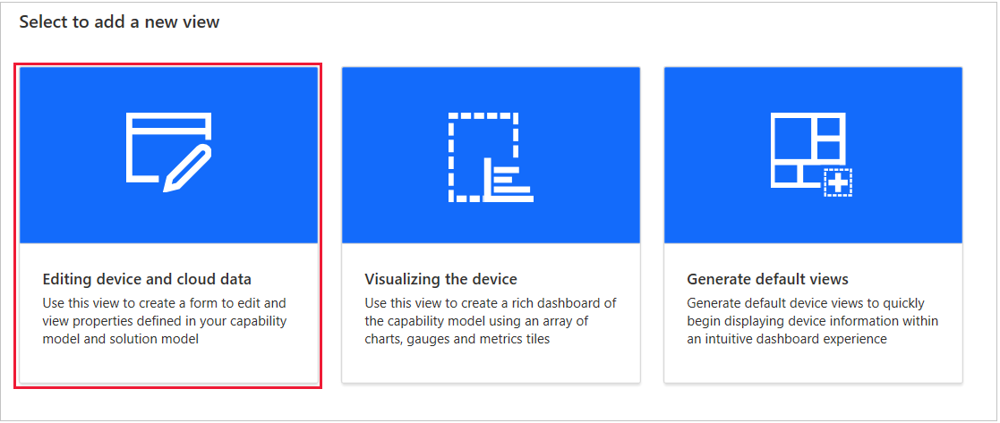
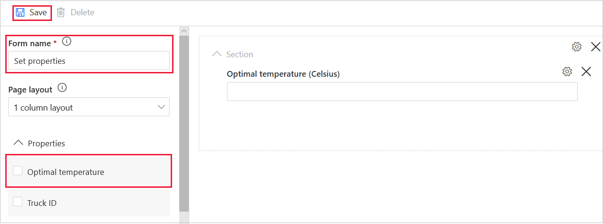
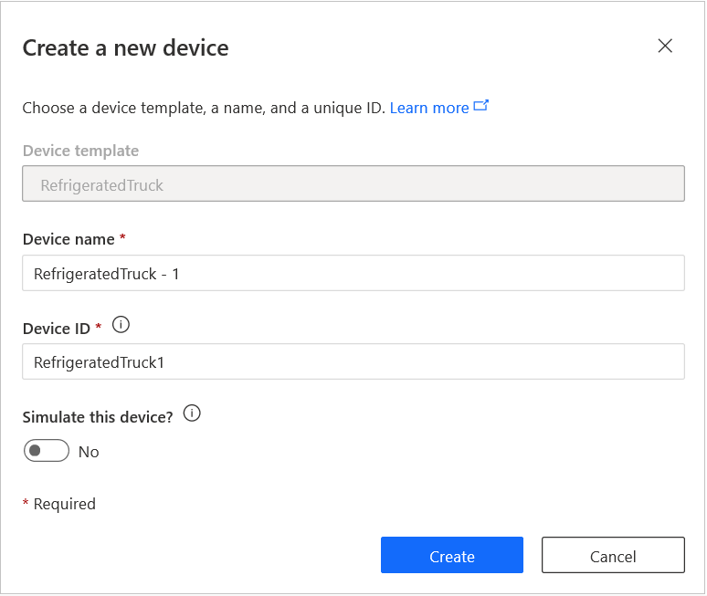

In this unit, you'll first create a dashboard showing all the capabilities of the device template. Then you'll create a view to set writable properties. Finally, you'll create a real device and record the connection settings needed for the remote device app.

## Create a rich dashboard

1. Select **Views**. Then select **Visualizing the device**.

    

    You see a list of all the **Telemetry**, **Property**, and **Commands** elements you created, each with a check box. You also see a list of **Cloud properties** and **Custom tiles**. Ignore these two lists for now.

1. Under **Telemetry**, select  **Location** > **Add tile**. Dashboards are made of tiles. We choose the location tile first because we want to expand it. 

    Drag the lower-right corner of the tile until it's at least twice the default size. This tile is the most fun. It shows the location of the truck on a world map.

1. Before you add more tiles, change the **View name** to something more specific, for example, *Truck view*.

1. Select each of the rest of the telemetry and property capabilities in turn, starting at the top. For each capability, select **Add tile**. 

    We're going for function over form here. We can make the dashboard pretty later. For now, we just want a dashboard that will confirm all the telemetry that our remote device sends. There's no need to add the commands to the dashboard, though that option exists.

    > [!TIP]
    > To save dashboard space, select two or more telemetry values, and then select **Add tile**. All the values will appear in _one_ tile.

1. After you add all the tiles, explore your dashboard. Look at the wording on the tiles.

    

    If you move the tiles around, the portal will try to rearrange them neatly.

1. Select **Save** to save this view.

### Create a dashboard to set writable properties

We need to create a separate view. Its sole purpose will be to set writable properties. 

1. Select **Views**, and then select the **Editing device and cloud data** tile.

    

1. Change the form name to something like _Set properties_.

1. Select the **Optimal temperature** property check box. Then select **Add section**.

1. Verify that your view looks similar to the following image. Then select **Save**.

    

1. When you're satisfied with your views, select **Publish**. In the dialog box that appears, **Views** is set to **Yes**. Select **Publish**.

You can create and give a friendly name to as many views as you want to. For this module though, the two views will work well.

The next step is to create a device.

## Create a real device

By *real* device, we mean IoT Central understands that a remote app is running. The app can be in a real device, taking input from real sensors. Or the app can run a simulation. Both options are treated as a connection to a _real_ device.

1. On the menu on the left, select **Devices**.

1. To ensure the new device uses this device template, in the **Devices** menu, select **RefrigeratedTruck**.

1. Select **New**. In the **Create a new device** dialog box, verify that the device template is **RefrigeratedTruck**.

    

1. Change the **Device name** to a friendlier name, such as _RefrigeratedTruck - 1_.

1. Change the **Device ID** to a friendlier name, such as _RefrigeratedTruck1_.

1. Leave the **Simulate this device?** setting at **No**. We're going to build a real truck here. That is, we're building a _simulated real_ truck! If you set this value to **Yes**, IoT Central will create random values for the telemetry. These random values can be useful in validating a device template.

1. Select **Create**. After a few seconds, your device list should be populated with a single entry. 

    Notice that the **Device status** is **Registered**. Only after the device status is **Provisioned** will the IoT Central app accept a connection to the device. The coding unit that follows shows how to provision a device.

1. Select **RefrigeratedTruck - 1**. You see the live dashboard. It includes lots of **Waiting for data** messages.

1. On the bar that includes **Truck view**, select **Commands**. Notice that the two commands you entered are ready to run.

The next step is to create the keys that will allow a remote device to communicate with this app.

### Record the connection keys

1. In the upper-right menu, select **Connect**. Do _not_ select **Attach to gateway**.

1. In the **Device connection** dialog box that opens, carefully copy the **ID scope**, **Device ID**, and **Primary key**. The ID scope identifies the app. The device ID identifies the real device. And the primary key gives you permission for the connection. 
 
    Paste this information in a text file. For example, use a tool like Notepad to save the text file with a meaningful name, such as _Truck keys.txt_.   

1. Leave the **Authentication type** setting as **Shared access signature (SAS)**.

1. After you save the IDs and the key, select **Close** on the dialog box.

Leave the IoT portal open in your browser.

Let's take a break and test your knowledge so far.
