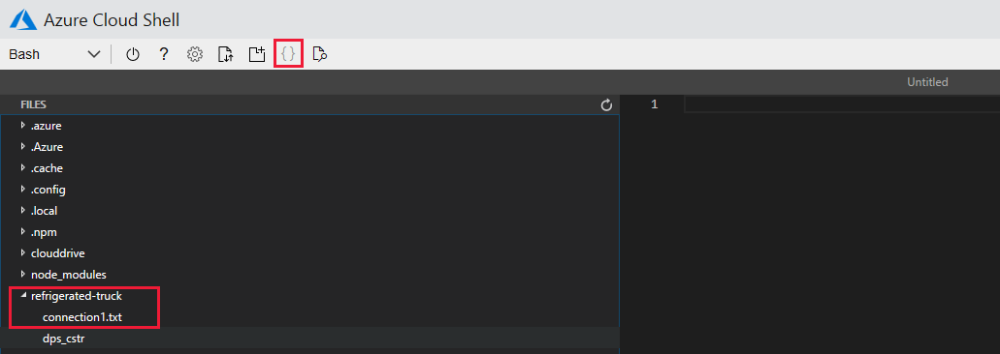

In this unit, Node.js developers go through the process of creating a _connection string_. C# developers do not use this process, though the device app code is slightly more involved as a result. In the unit that follows this one, we dive into the coding sections of the module.

To complete the unit, all developers need an Azure Maps account.

::: zone pivot="vs-node,vscode-node"

The essential component for communication between a Node.js device app, and IoT Central, is the connection string. There are some tools that make generating these strings easy. In this unit, you will access these tools in such as way that you can reuse them later on. To start with, you need some information on our real device.

## Generate a connection string

All of the work to generate connection strings is handled through Azure Cloud Shell.

1. Navigate to the [Azure Cloud Shell](https://shell.azure.com/?azure-portal=true)

1. In the Azure Cloud Shell, create a refrigerated-truck folder, and navigate to it:

    ```bash
    mkdir ~/refrigerated-truck
    cd ~/refrigerated-truck
    ```

1. Install the Device Provisioning System (DPS) key generator (_dps-keygen_), in the refrigerated-truck folder:

    ```bash
    npm install dps-keygen
    ```

1. Download and install a DPS connection string utility (_dps-cstr_) from GitHub:

    ```bash
    wget https://github.com/Azure/dps-keygen/blob/ota/bin/linux/dps_cstr?raw=true -O dps_cstr
    ```

    > [!NOTE]
    > You may have noticed in the above URL that you are downloading the Linux version of dps-cstr. This is needed to run in Azure Cloud Shell.

1. To give dps-cstr the correct permissions, run the following command:

    ```bash
    chmod +x dps_cstr
    ```

1. Remember that in the previous section you stored a **Scope ID**, **Device ID**, and **Primary Key**, for our device. It is a good idea to keep a text document such as Notepad open, and create in it the following string, replacing **{scope-id}**, **{device-id}**, and **{primary-key}** with your own values. Using the text document enables you to create and validate the string before committing to running it.

    ```bash
    ./dps_cstr {scope_id} {device_id} {primary_key} > connection1.txt
    ```

1. Now copy this command from your text document into the refrigerated-truck folder of Azure Cloud Shell, and run it.

1. Use the **{ }** icon in Azure Cloud Shell to navigate to the connection1.txt file. You will probably have to expand the **refrigerated-truck** node to locate it. Double-click on connection1.txt to open the file. Carefully copy all the contents to your text tool.

    

    > [!IMPORTANT]
    > The last element of the connection string is the Primary Key. Verify that the connection string in your text file ends with an exact copy of the Primary Key, and if not, correct the copy you have made of the correction string in your text document.

1. The connection string you will use in the Node.js app (that follows in the next unit) starts with **HostName=**, so separate off this part of the string in your text document, so you have one line containing a string that looks similar to the following:

    ```js
    HostName=iotc-<your Scope ID>.azure-devices.net;DeviceId=<your Device ID>;SharedAccessKey=<your Primary Key>
    ```

1. Save off your text file.

You now have the all important connection string. The Scope ID identifies the app, the Device ID the real device, and the Primary Key gives you permission for the connection.

::: zone-end
::: zone pivot="vscode-csharp"

## Install the C# extensions

1. To use C# in Visual Studio Code, ensure both [.NET Core](https://dotnet.microsoft.com/download), and [C# extension](https://marketplace.visualstudio.com/items?itemName=ms-vscode.csharp) are installed.

::: zone-end

## Create a free Azure Maps account

If you do not already have an Azure Maps account, you will need to create one.

1. Navigate to [Azure Maps](https://azure.microsoft.com/services/azure-maps/?azure-portal=true).

1. Follow the prompts to create a free account. When your account is set up, you will need the **Subscription Key** for the account. Copy and paste this key into your text document, with a note that it applies to Azure Maps.

1. You can (optionally) verify your Azure Maps subscription key works. Save the following HTML to an .html file. Replace the **subscriptionKey** entry with your own key. Then, load the file into a web browser. Do you see a map of the world?

```html
<!DOCTYPE html>
<html>

<head>
    <title>Map</title>
    <meta charset="utf-8">
    <meta name="viewport" content="width=device-width, initial-scale=1, shrink-to-fit=no">

    <!-- Add references to the Azure Maps Map control JavaScript and CSS files. -->
    <link rel="stylesheet" href="https://atlas.microsoft.com/sdk/javascript/mapcontrol/2/atlas.min.css" type="text/css">
    <script src="https://atlas.microsoft.com/sdk/javascript/mapcontrol/2/atlas.min.js"></script>

    <!-- Add a reference to the Azure Maps Services Module JavaScript file. -->
    <script src="https://atlas.microsoft.com/sdk/javascript/mapcontrol/2/atlas-service.min.js"></script>

    <script>
        function GetMap() {
            //Instantiate a map object
            var map = new atlas.Map("myMap", {
                //Add your Azure Maps subscription key to the map SDK. Get an Azure Maps key at https://azure.com/maps
                authOptions: {
                    authType: 'subscriptionKey',
                    subscriptionKey: '<your Azure Maps subscription key>'
                }
            });
        }
    </script>
    <style>
        html,
        body {
            width: 100%;
            height: 100%;
            padding: 0;
            margin: 0;
        }

        #myMap {
            width: 100%;
            height: 100%;
        }
    </style>
</head>

<body onload="GetMap()">
    <div id="myMap"></div>
</body>

</html>
```

## Next steps

You have now completed the preparatory steps of connecting your first IoT Central app to real devices. Good work!

The next step is to create the device app.
