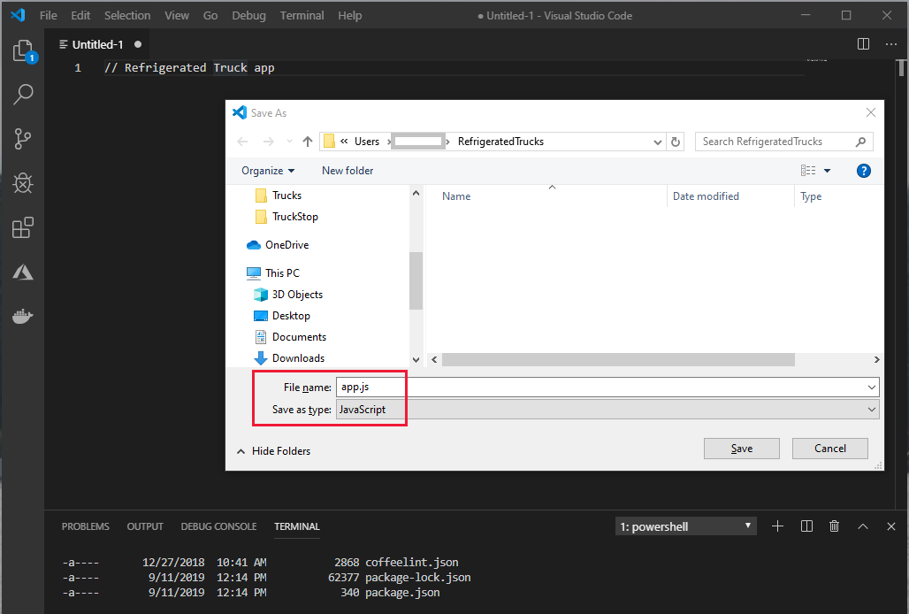
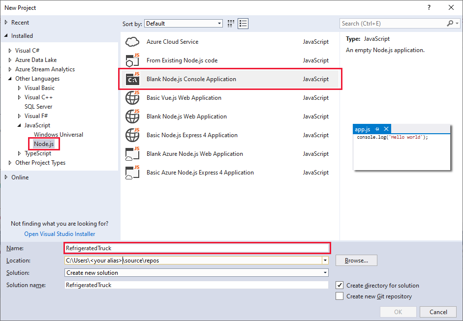
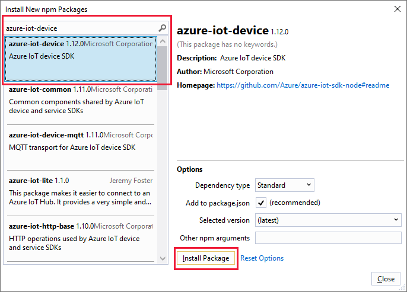

In this unit, you'll create a programming project to simulate a sensor device in a refrigerated truck. This simulation enables you to test the code long before you need a real truck! 

IoT Central treats this simulation as real. The communication code between the device app and the IoT Central app is the same for a real truck. 

In other words, if you actually run a refrigerated truck company, you would start with simulation code like the code in this unit. After this code works to your satisfaction, you would replace the simulation code with code that receives sensor data. Because the final code replacement is a simple switch, learning to write the following code is a valuable experience.

## Create the device app

Use your preferred development environment to build the device sensor app. This unit provides examples in Visual Studio Code and Visual Studio.

::: zone pivot="vscode-node"

Node.js is a platform for building server apps. It's based on JavaScript. All the JavaScript code you'll need is provided here, so you don't need to be a JavaScript developer to get this app up and running.

1. Open Visual Studio Code. From the **Terminal** menu, open a **New Terminal**.

1. In the opened terminal, create an empty folder where you'll develop your code. Name it *RefrigeratedTruck* by entering `mkdir RefrigeratedTruck`. Then go to that folder by entering `cd RefrigeratedTruck`.

1. From the **File** menu, create a new file. Insert a single line as a comment, such as `// Refrigerated Truck app`. Save the file to the _RefrigeratedTruck_ folder. In the folder, name the file _app.js_. 

    Visual Studio Code interprets files that have the .js file extension as JavaScript. It evaluates the contents of the file by using the JavaScript language service.

    [](../media/refrigerated-trucks-vscode.png#lightbox)

1. Back in the terminal, load the libraries you need by using the following commands.

    ```bash
    npm install azure-iot-device@1.17.0
    npm install azure-iot-device-mqtt@1.15.0
    npm install azure-iot-provisioning-device-mqtt@1.7.4
    npm install azure-iot-security-symmetric-key@1.7.4
    npm install azure-maps-rest@2.0.5
    npm install chalk
    ```

1. Enter the code in the following section into the _app.js_ file. Then run it from the terminal by entering `node app.js`. When you run the app, ensure that the _RefrigeratedTruck_ folder is the terminal's current folder.

::: zone-end
::: zone pivot="vscode-csharp"

1. Open a terminal in Visual Studio Code. Then create a folder called _RefrigeratedTruck_ by entering `mkdir RefrigeratedTruck`. Go to the folder by entering `cd RefrigeratedTruck`.

1. Enter `dotnet new console`. This command creates a _Program.cs_ file and a project file in your folder.

1. Enter `dotnet restore`. This command gives your app access to the required .NET packages.

1. Install the required libraries.

    ```bash
    dotnet add package AzureMapsRestToolkit
    dotnet add package Microsoft.Azure.Devices.Client
    dotnet add package Microsoft.Azure.Devices.Provisioning.Client
    dotnet add package Microsoft.Azure.Devices.Provisioning.Transport.Mqtt
    dotnet add package System.Text.Json
    ```

1. From the **File** menu, open the _Program.cs_ file. Then delete the default contents.

1. Enter the code in the following section into the _Program.cs_ file. Then run the app by using the command `dotnet run`. This command runs the _Program.cs_ file in the current folder, so ensure you're in the _RefrigeratedTruck_ folder.

::: zone-end
::: zone pivot="vs-node"

1. In the **JavaScript** project types, create a **Blank Node.js Console Application** project called _RefrigeratedTruck_.

    [](../media/refrigerated-trucks-vs-project.png#lightbox)

1. In **Solution Explorer**, right-click **npm**, and then select **Install New npm Packages**.

1. In the dialog box that opens, search for and install the following libraries:

    * azure-iot-device
    * azure-iot-device-mqtt
    * azure-iot-provisioning-device-mqtt
    * azure-iot-security-symmetric-key
    * azure-maps-rest
    * chalk

    [](../media/refrigerated-trucks-vs-npm.png#lightbox)

1. Delete the default contents of the _app.js_ file.

1. Enter the code in the following section. Then run the app by using **Start Without Debugging** or **Start Debugging**. In the latter case, you can set breakpoints, examine data, and do other debugging tasks.

::: zone-end
::: zone pivot="vs-csharp"

1. In Visual Studio, create a new **Visual C#/Windows Desktop** project. Select **Console App (.NET Framework)**.

1. Give the project a friendly name, such as _RefrigeratedTruck_.

1. Under **Tools/NuGet Package Manager**, select **Manage NuGet Packages for Solution**. Install the following libraries:
    * AzureMapsRestToolkit
    * Microsoft.Azure.Devices.Client
    * Microsoft.Azure.Devices.Provisioning.Client
    * Microsoft.Azure.Devices.Provisioning.Transport.Mqtt

1. Delete the default contents of the _Program.cs_ file.

1. In the _Program.cs_ file, add all the code in the following section.

::: zone-end

## Write the device app

::: zone pivot="vs-node,vscode-node"

In the blank _app.js_ file, insert the following code. Add each section of code to the end of the file, in order.

> [!NOTE]
> If you want to skip this unit and load all of the code into your app, download all of the contents of _app.js_ from the [GitHub location](https://github.com/MicrosoftDocs/mslearn-your-first-iot-central-app). Then copy the contents into your project's _app.js_ file. Be sure to replace the connection and subscription strings. Then go straight to the next unit and start testing!

1. Add the following code to connect to Azure IoT Central and Azure Maps. Replace the four `<your...>` strings with your own strings. Don't change any other lines of code.

    ```js
    "use strict";
    const chalk = require('chalk');

    // Use the Azure IoT device SDK for devices that connect to Azure IoT Central. 
    var iotHubTransport = require('azure-iot-device-mqtt').Mqtt;
    var Client = require('azure-iot-device').Client;
    var Message = require('azure-iot-device').Message;
    var ProvisioningTransport = require('azure-iot-provisioning-device-mqtt').Mqtt;
    var SymmetricKeySecurityClient = require('azure-iot-security-symmetric-key').SymmetricKeySecurityClient;
    var ProvisioningDeviceClient = require('azure-iot-provisioning-device').ProvisioningDeviceClient;
    var provisioningHost = 'global.azure-devices-provisioning.net';

    // Enter your Azure IoT keys.
    var idScope = '<your ID Scope>';
    var registrationId = '<your device ID>';
    var symmetricKey = '<your primary key>';

    var provisioningSecurityClient = new SymmetricKeySecurityClient(registrationId, symmetricKey);
    var provisioningClient = ProvisioningDeviceClient.create(provisioningHost, idScope, new ProvisioningTransport(), provisioningSecurityClient);
    var hubClient;

    var truckIdentification = "Truck number 1";

    var rest = require("azure-maps-rest");

    // Enter your Azure Maps key.
    var subscriptionKeyCredential = new rest.SubscriptionKeyCredential("<your Azure Maps key>");

    // Azure Maps connection 
    var pipeline = rest.MapsURL.newPipeline(subscriptionKeyCredential);
    var routeURL = new rest.RouteURL(pipeline);

    function greenMessage(text) {
        console.log(chalk.green(text) + "\n");
    }
    function redMessage(text) {
        console.log(chalk.red(text) + "\n");
    }
    ```

    > [!NOTE]
    > An Azure Maps `Pipeline` class contains the HTTP request policies. In this app, you use the default policies, so provide only your key as a parameter. 
    >
    > A `RouteURL` class represents a URL to the Azure Maps route operations. The class takes your pipeline as a parameter.

1. Add global variables.

    ```js
    // Truck globals initialized to the starting state of the truck. 
    // Enums, frozen name:value pairs. 
    var stateEnum = Object.freeze({ "ready": "ready", "enroute": "enroute", "delivering": "delivering", "returning": "returning", "loading": "loading", "dumping": "dumping" });
    var contentsEnum = Object.freeze({ "full": "full", "melting": "melting", "empty": "empty" });
    var fanEnum = Object.freeze({ "on": "on", "off": "off", "failed": "failed" });
    const deliverTime = 600; // Time to complete delivery, in seconds. 
    const loadingTime = 800; // Time to load contents. 
    const dumpingTime = 400; // Time to dump melted contents. 
    const tooWarmThreshold = 2; // Degrees C temperature that is too warm for contents. 
    const tooWarmtooLong = 60; // Time in seconds for contents to start melting if temperatures are above threshold. 
    var timeOnCurrentTask = 0; // Time on current task, in seconds. 
    var interval = 60; // Time interval in seconds. 
    var tooWarmPeriod = 0; // Time that contents are too warm, in seconds. 
    var temp = -2; // Current temperature of contents, in degrees C. 
    var baseLat = 47.644702; // Base position latitude. 
    var baseLon = -122.130137; // Base position longitude. 
    var currentLat = baseLat; // Current position latitude. 
    var currentLon = baseLon; // Current position longitude. 
    var destinationLat; // Destination position latitude. 
    var destinationLon; // Destination position longitude. 
    var fan = fanEnum.on; // Cooling fan state. 
    var contents = contentsEnum.full; // Truck contents state. 
    var state = stateEnum.ready; // Truck is full and ready to go! 
    var optimalTemperature = -5; // Setting - can be changed by the operator from IoT Central.
    var outsideTemperature = 12; // Ambient outside temperature.
    const noEvent = "none";
    var eventText = noEvent; // Text to send to the IoT operator. 
    var customer = [ // Latitude and longitude position of customers. 

        // Gasworks Park 
        [47.645892, -122.336954],

        // Golden Gardens Park 
        [47.688741, -122.402965],

        // Seward Park 
        [47.551093, -122.249266],

        // Lake Sammamish Park 
        [47.555698, -122.065996],

        // Marymoor Park 
        [47.663747, -122.120879],

        // Meadowdale Beach Park 
        [47.857295, -122.316355],

        // Lincoln Park 
        [47.530250, -122.393055],

        // Gene Coulon Park 
        [47.503266, -122.200194],

        // Luther Bank Park 
        [47.591094, -122.226833],

        // Pioneer Park 
        [47.544120, -122.221673]
    ];
    var path = []; // Latitude and longitude steps for the route. 
    var timeOnPath = []; // Time in seconds for each section of the route. 
    var truckOnSection; // The current path section the truck is on. 
    var truckSectionsCompletedTime; // The time the truck has spent on previous completed sections. 

    ```

1. Add the functions to get a route by using Azure Maps.

    ```js
    function Degrees2Radians(deg) {
        return deg * Math.PI / 180;
    }

    function DistanceInMeters(lat1, lon1, lat2, lon2) {
        var dlon = Degrees2Radians(lon2 - lon1);
        var dlat = Degrees2Radians(lat2 - lat1);
        var a = (Math.sin(dlat / 2) * Math.sin(dlat / 2)) + Math.cos(Degrees2Radians(lat1)) * Math.cos(Degrees2Radians(lat2)) * (Math.sin(dlon / 2) * Math.sin(dlon / 2));
        var angle = 2 * Math.atan2(Math.sqrt(a), Math.sqrt(1 - a));
        var meters = angle * 6371000;
        return meters;
    }

    function Arrived() {

        // If the truck is within 10 meters of the destination, call it good. 
        if (DistanceInMeters(currentLat, currentLon, destinationLat, destinationLon) < 10)
            return true;
        return false;
    }

    function UpdatePosition() {
        while ((truckSectionsCompletedTime + timeOnPath[truckOnSection] < timeOnCurrentTask) && (truckOnSection < timeOnPath.length - 1)) {
            // Truck has moved on to the next section. 
            truckSectionsCompletedTime += timeOnPath[truckOnSection];
            ++truckOnSection;
        }

        // Ensure remainder is less than or equal to 1, because the interval may take count over what is needed. 
        var remainderFraction = Math.min(1, (timeOnCurrentTask - truckSectionsCompletedTime) / timeOnPath[truckOnSection]);

        // The path should be one entry longer than the timeOnPath array. 
        // Find how far along the section the truck has moved. 
        currentLat = path[truckOnSection][0] + remainderFraction * (path[truckOnSection + 1][0] - path[truckOnSection][0]);
        currentLon = path[truckOnSection][1] + remainderFraction * (path[truckOnSection + 1][1] - path[truckOnSection][1]);
    }

    function GetRoute(newState) {

        // Set the state to ready, until the new route arrives. 
        state = stateEnum.ready;

        // Coordinates are in longitude first. 
        var coordinates = [
            [currentLon, currentLat],
            [destinationLon, destinationLat]
        ];
        var results = routeURL.calculateRouteDirections(rest.Aborter.timeout(10000), coordinates);
        results.then(data => {
            greenMessage("Route found. Number of points = " + JSON.stringify(data.routes[0].legs[0].points.length, null, 4));

            // Clear the path. 
            path.length = 0;

            // Start with the current location. 
            path.push([currentLat, currentLon]);

            // Retrieve the route and push the points onto the array. 
            for (var n = 0; n < data.routes[0].legs[0].points.length; n++) {
                var x = data.routes[0].legs[0].points[n].latitude;
                var y = data.routes[0].legs[0].points[n].longitude;
                path.push([x, y]);
            }

            // Finish with the destination. 
            path.push([destinationLat, destinationLon]);

            // Store the path length and the time taken to calculate the average speed. 
            var meters = data.routes[0].summary.lengthInMeters;
            var seconds = data.routes[0].summary.travelTimeInSeconds;
            var pathSpeed = meters / seconds;
            var distanceApartInMeters;
            var timeForOneSection;

            // Clear the time on the path array. 
            timeOnPath.length = 0;

            // Calculate how much time is required for each section of the path. 
            for (var t = 0; t < path.length - 1; t++) {

                // Calculate the distance between the two path points, in meters. 
                distanceApartInMeters = DistanceInMeters(path[t][0], path[t][1], path[t + 1][0], path[t + 1][1]);

                // Calculate the time for each section of the path. 
                timeForOneSection = distanceApartInMeters / pathSpeed;
                timeOnPath.push(timeForOneSection);
            }
            truckOnSection = 0;
            truckSectionsCompletedTime = 0;
            timeOnCurrentTask = 0;

            // Update the state now that the route has arrived, either enroute or returning. 
            state = newState;
        }, reason => {

            // Error: The request was aborted. 
            redMessage(reason);
            eventText = "Failed to find map route";
        });
    }
    ```

    > [!NOTE]
    > It's important to grasp the asynchronous nature of calls to Azure Maps. The call to the `calculateRouteDirections` function ends immediately after it's called, while your app is waiting for the results from Azure Maps. When Azure Maps returns the results, the method passed into `results.then(...)` is called by using the resulting route.

1. Add the command to deliver to a customer.

    ```js
    function CmdGoToCustomer(request, response) {

        // Pick up a variable from the request payload. 
        var num = request.payload;

        // Check for valid customer ID. 
        if (num >= 0 && num < customer.length) {
            switch (state) {
                case stateEnum.dumping:
                case stateEnum.loading:
                case stateEnum.delivering:
                    eventText = "Unable to act - " + state;
                    break;
                case stateEnum.ready:
                case stateEnum.enroute:
                case stateEnum.returning:
                    if (contents === contentsEnum.empty) {
                        eventText = "Unable to act - empty";
                    }
                    else {

                        // Set new customer event only when all is good. 
                        eventText = "New customer: " + num.toString();
                        destinationLat = customer[num][0];
                        destinationLon = customer[num][1];

                        // Find route from current position to destination, and store route. 
                        GetRoute(stateEnum.enroute);
                    }
                    break;
            }
        }
        else {
            eventText = "Invalid customer: " + num;
        }

        // Acknowledge the command. 
        response.send(200, 'Success', function (errorMessage) {

            // Failure 
            if (errorMessage) {
                redMessage('Failed sending a CmdGoToCustomer response:\n' + errorMessage.message);
            }
        });
    }

    ```

    > [!NOTE]
    > The device responds with a conflict if the device isn't in the correct state, and the command itself is acknowledged at the end of the function. The recall command that follows in the next step handles things similarly.

1. Add the recall command.

    ```js
    function ReturnToBase() {
        destinationLat = baseLat;
        destinationLon = baseLon;

        // Find route from current position to base, and store route. 
        GetRoute(stateEnum.returning);
    }

    function CmdRecall(request, response) {
        switch (state) {
            case stateEnum.ready:
            case stateEnum.loading:
            case stateEnum.dumping:
                eventText = "Already at base";
                break;
            case stateEnum.returning:
                eventText = "Already returning";
                break;
            case stateEnum.delivering:
                eventText = "Unable to recall - " + state;
                break;
            case stateEnum.enroute:
                ReturnToBase();
                break;
        }

        // Acknowledge the command. 
        response.send(200, 'Success', function (errorMessage) {

            // Failure 
            if (errorMessage) {
                redMessage('Failed sending a CmdRecall response:\n' + errorMessage.message);
            }
        });
    }
    ```

1. Add the function that updates the truck simulation at each time interval.

    ```js
    function dieRoll(max) {
        return Math.random() * max;
    }

    function UpdateTruck() {
        if (contents == contentsEnum.empty) {

            // Turn the cooling system off, if possible, when the contents are empty. 
            if (fan == fanEnum.on) {
                fan = fanEnum.off;
            }
            temp += -2.9 + dieRoll(6);
        }
        else {

            // Contents are full or melting. 
            if (fan != fanEnum.failed) {
                if (temp < optimalTemperature - 5) {

                    // Turn the cooling system off because contents are getting too cold. 
                    fan = fanEnum.off;
                }
                else {
                    if (temp > optimalTemperature) {

                        // Temperature is getting higher, so turn cooling system back on. 
                        fan = fanEnum.on;
                    }
                }

                // Randomly fail the cooling system. 
                if (dieRoll(100) < 1) {
                    fan = fanEnum.failed;
                }
            }

            // Set the contents temperature. Maintain a cooler temperature if the cooling system is on. 
            if (fan === fanEnum.on) {
                temp += -3 + dieRoll(5);
            }
            else {
                temp += -2.9 + dieRoll(6);
            }            

            // If the temperature is above a threshold, count the seconds of the duration, and melt the contents if it goes on too long. 
            if (temp >= tooWarmThreshold) {

                // Contents are warming. 
                tooWarmPeriod += interval;
                if (tooWarmPeriod >= tooWarmtooLong) {

                    // Contents are melting. 
                    contents = contentsEnum.melting;
                }
            }
            else {
                // Contents are cooling. 
                tooWarmPeriod = Math.max(0, tooWarmPeriod - interval);
            }
        }

        // Limit max temp to outside temperature.
        temp = Math.min(temp, outsideTemperature);


        timeOnCurrentTask += interval;
        switch (state) {
            case stateEnum.loading:
                if (timeOnCurrentTask >= loadingTime) {

                    // Finished loading. 
                    state = stateEnum.ready;
                    contents = contentsEnum.full;
                    timeOnCurrentTask = 0;

                    // Repair or turn on the cooling fan. 
                    fan = fanEnum.on;
                    temp = -2;
                }
                break;
            case stateEnum.ready:
                timeOnCurrentTask = 0;
                break;
            case stateEnum.delivering:
                if (timeOnCurrentTask >= deliverTime) {

                    // Finished delivering. 
                    contents = contentsEnum.empty;
                    ReturnToBase();
                }
                break;
            case stateEnum.returning:

                // Update the truck position. 
                UpdatePosition();

                // Check to see if the truck has arrived back at base. 
                if (Arrived()) {
                    switch (contents) {
                        case contentsEnum.empty:
                            state = stateEnum.loading;
                            break;
                        case contentsEnum.full:
                            state = stateEnum.ready;
                            break;
                        case contentsEnum.melting:
                            state = stateEnum.dumping;
                            break;
                    }
                    timeOnCurrentTask = 0;
                }
                break;
            case stateEnum.enroute:

                // Update truck position. 
                UpdatePosition();

                // Check to see if the truck has arrived at the customer. 
                if (Arrived()) {
                    state = stateEnum.delivering;
                    timeOnCurrentTask = 0;
                }
                break;
            case stateEnum.dumping:
                if (timeOnCurrentTask >= dumpingTime) {

                    // Finished dumping. 
                    state = stateEnum.loading;
                    contents = contentsEnum.empty;
                    timeOnCurrentTask = 0;
                }
                break;
        }
    }
    ```

    > [!NOTE]
    > This function is called at every time interval. The actual time interval is later set at 5 seconds. But the _simulated time_ (the number of specified seconds that have passed each time this function is called) is set by the global `var interval = 60`. So the simulation runs at a rate of 60 divided by 5, or 12 times the speed of real time. 
    >
    > To shorten the simulated time, reduce the `var interval` to, say, `30` (for a simulation that runs 6 times faster than real time). If you set `var interval = 5`, the simulation will run in real time. This would be realistic but slow, given the real driving times to the customer destinations.

1. Add the function to send truck telemetry and events, if any have occurred.

    ```js
    function sendTruckTelemetry() {

        // Simulate the truck. 
        UpdateTruck();

        // Create the telemetry data JSON package. 
        var data = JSON.stringify(
            {
                // Format: 
                // Name from IoT Central app ":" variable name from NodeJS app. 
                ContentsTemperature: temp.toFixed(2),
                TruckState: state,
                CoolingSystemState: fan,
                ContentsState: contents,
                Location: {

                    // Names must be lon, lat. 
                    lon: currentLon,
                    lat: currentLat
                },
            });

        // Add the eventText event string, if there is one. 
        if (eventText != noEvent) {
            data += JSON.stringify(
                {
                    Event: eventText,
                }
            );
            eventText = noEvent;
        }

        // Create the message by using the preceding defined data. 
        var message = new Message(data);
        console.log("Message: " + data);

        // Send the message. 
        hubClient.sendEvent(message, function (errorMessage) {
            // Error 
            if (errorMessage) {
                redMessage("Failed to send message to Azure IoT Central: ${err.toString()}");
            } else {
                greenMessage("Telemetry sent");
            }
        });
    }
    ```

    > [!NOTE]
    > The `sendTruckTelemetry` function is important. It sends telemetry, states, and events to IoT Central. Notice the use of JSON strings to send the data.

1. Add the code to handle writeable properties. You have only one writeable property in the app. But you could easily add more if you need to.

    ```js
    // Send device twin reported properties. 
    function sendDeviceProperties(twin, properties) {
        twin.properties.reported.update(properties, (err) => greenMessage(`Sent device properties: ${JSON.stringify(properties)}; ` +
            (err ? `error: ${err.toString()}` : `status: success`)));
    }

    // Add any writeable properties your device supports. Map them to a function that's called when the writeable property 
    // is updated in the IoT Central application. 
    var writeableProperties = {
        'OptimalTemperature': (newValue, callback) => {
            setTimeout(() => {
                optimalTemperature = newValue;
                callback(newValue, 'completed', 200);
            }, 1000);
        },
    };

    // Handle writeable property updates that come from IoT Central via the device twin. 
    function handleWriteablePropertyUpdates(twin) {
        twin.on('properties.desired', function (desiredChange) {
            for (let setting in desiredChange) {
                if (writeableProperties[setting]) {
                    greenMessage(`Received setting: ${setting}: ${desiredChange[setting]}`);
                    writeableProperties[setting](desiredChange[setting], (newValue, status, code) => {
                        var patch = {
                            [setting]: {
                                value: newValue,
                                ad: status,
                                ac: code,
                                av: desiredChange.$version
                            }
                        }
                        sendDeviceProperties(twin, patch);
                    });
                }
            }
        });
    }
    ```

    > [!NOTE]
    > This section of code is generic to most Node.js apps that communicate with IoT Central. You can add more writeable properties by adding entries to `var writeableProperties`.

1. Add the connection callback function. This function is called when the Node.js app first attempts to contact IoT Central. This method handles the _read-only_ properties.

    ```js
    // Handle device connection to Azure IoT Central. 
    var connectCallback = (err) => {
        if (err) {
            redMessage(`Device could not connect to Azure IoT Central: ${err.toString()}`);
        } else {
            greenMessage('Device successfully connected to Azure IoT Central');

            // Send telemetry to Azure IoT Central every 5 seconds. 
            setInterval(sendTruckTelemetry, 5000);

            // Get device twin from Azure IoT Central. 
            hubClient.getTwin((err, twin) => {
                if (err) {
                    redMessage(`Error getting device twin: ${err.toString()}`);
                } else {

                    // Send device properties once on device start up. 
                    var properties =
                    {
                        // Format: 
                        // <Property Name in Azure IoT Central> ":" <value in Node.js app> 
                        TruckID: truckIdentification,
                    };
                    sendDeviceProperties(twin, properties);
                    handleWriteablePropertyUpdates(twin);
                    hubClient.onDeviceMethod('GoToCustomer', CmdGoToCustomer);
                    hubClient.onDeviceMethod('Recall', CmdRecall);
                }
            });
        }
    };
    ```

    > [!NOTE]
    > Most of the `connectCallback` function is generic. You can use it for most Node.js apps that communicate with IoT Central. 
    >
    > Specific to this app are the two `hubClient.onDeviceMethod` calls. These calls link JavaScript functions in this app to the commands in the IoT Central app. Also specific to this app is the `setInterval(sendTruckTelemetry, 5000);` call. This call specifies that the `sendTruckTelemetry` function should be called every 5 seconds (5,000 milliseconds). 
    >
    > You can add more read-only properties by adding entries to `var properties`.

1. Complete the app by adding the code that starts the device. This code opens the connection callback.

    ```js    
    // Start the device (register and connect to Azure IoT Central). 
    provisioningClient.register((err, result) => {
        if (err) {
            redMessage('Error registering device: ' + err);
        } else {
            greenMessage('Registration succeeded');
            console.log('Assigned hub=' + result.assignedHub);
            console.log('DeviceId=' + result.deviceId);
            var connectionString = 'HostName=' + result.assignedHub + ';DeviceId=' + result.deviceId + ';SharedAccessKey=' + symmetricKey;
            hubClient = Client.fromConnectionString(connectionString, iotHubTransport);
            hubClient.open(connectCallback);
        }
    });
    ```

::: zone-end
::: zone pivot="vs-csharp,vscode-csharp"

In the blank _Program.cs_ file, insert the following code. Add each section of code to the end of the file, in order.

   > [!NOTE]
   > If want to skip this unit and load all of the code into your app, download all of the contents of _Program.cs_ from the [GitHub location](https://github.com/MicrosoftDocs/mslearn-your-first-iot-central-app). Then copy the contents into your project's _Program.cs_ file. Be sure to replace the connection and subscription strings. Then go straight to the next unit and start testing!

1. Add the `using` statements, including the statements for Azure IoT Central and Azure Maps.

    ```cs
    using System;
    using System.Text.Json;
    using System.Text;
    using System.Threading;
    using System.Threading.Tasks;
    using Microsoft.Azure.Devices.Client;
    using Microsoft.Azure.Devices.Shared;
    using Microsoft.Azure.Devices.Provisioning.Client;
    using Microsoft.Azure.Devices.Provisioning.Client.Transport;
    using AzureMapsToolkit;
    using AzureMapsToolkit.Common;
    ```

1. Add the namespace, class, and global variables. Replace the four `<your...>` strings with the keys you saved in the _Truck keys.txt_ file.

    ```cs
    namespace refrigerated_truck
    {
        class Program
        {
            enum StateEnum
            {
                ready,
                enroute,
                delivering,
                returning,
                loading,
                dumping
            };
            enum ContentsEnum
            {
                full,
                melting,
                empty
            }
            enum FanEnum
            {
                on,
                off,
                failed
            }
    
            // Azure Maps service globals.
            static AzureMapsServices azureMapsServices;
    
            // Telemetry globals.
            const int intervalInMilliseconds = 5000;        // Time interval required by wait function.
    
            // Refrigerated truck globals.
            static int truckNum = 1;
            static string truckIdentification = "Truck number " + truckNum;
    
            const double deliverTime = 600;                 // Time to complete delivery, in seconds.
            const double loadingTime = 800;                 // Time to load contents.
            const double dumpingTime = 400;                 // Time to dump melted contents.
            const double tooWarmThreshold = 2;              // Degrees C temperature that is too warm for contents.
            const double tooWarmtooLong = 60;               // Time in seconds for contents to start melting if temperatures are above threshold.
    
    
            static double timeOnCurrentTask = 0;            // Time on current task, in seconds.
            static double interval = 60;                    // Simulated time interval, in seconds.
            static double tooWarmPeriod = 0;                // Time that contents are too warm, in seconds.
            static double tempContents = -2;                // Current temperature of contents, in degrees C.
            static double baseLat = 47.644702;              // Base position latitude.
            static double baseLon = -122.130137;            // Base position longitude.
            static double currentLat;                       // Current position latitude.
            static double currentLon;                       // Current position longitude.
            static double destinationLat;                   // Destination position latitude.
            static double destinationLon;                   // Destination position longitude.
    
            static FanEnum fan = FanEnum.on;                // Cooling fan state.
            static ContentsEnum contents = ContentsEnum.full;    // Truck contents state.
            static StateEnum state = StateEnum.ready;       // Truck is full and ready to go!
            static double optimalTemperature = -5;          // Setting - can be changed by the operator from IoT Central.
            static double outsideTemperature = 12;          // Outside ambient temperature.

            const string noEvent = "none";
            static string eventText = noEvent;              // Event text sent to IoT Central.
    
            static double[,] customer = new double[,]
            {
                // Latitude and longitude position of customers.
                // Gasworks Park
                {47.645892, -122.336954},
    
                // Golden Gardens Park
                {47.688741, -122.402965},
    
                // Seward Park
                {47.551093, -122.249266},
    
                // Lake Sammamish Park
                {47.555698, -122.065996},
    
                // Marymoor Park
                {47.663747, -122.120879},
    
                // Meadowdale Beach Park
                {47.857295, -122.316355},
    
                // Lincoln Park
                {47.530250, -122.393055},
    
                // Gene Coulon Park
                {47.503266, -122.200194},
    
                // Luther Bank Park
                {47.591094, -122.226833},
    
                // Pioneer Park
                {47.544120, -122.221673 }
            };
    
            static double[,] path;                          // Latitude and longitude steps for the route.
            static double[] timeOnPath;                     // Time in seconds for each section of the route.
            static int truckOnSection;                      // The current path section the truck is on.
            static double truckSectionsCompletedTime;       // The time the truck has spent on previous completed sections.
            static Random rand;
    
            // IoT Central global variables.
            static DeviceClient s_deviceClient;
            static CancellationTokenSource cts;
            static string GlobalDeviceEndpoint = "global.azure-devices-provisioning.net";
            static TwinCollection reportedProperties = new TwinCollection();
    
            // User IDs.
            static string IDScope = "<your ID Scope>";
            static string DeviceID = "<your Device ID>";
            static string PrimaryKey = "<your device Primary Key>";
            static string AzureMapsKey = "<your Azure Maps key>";
    ```

1. Add the methods to get a route by using Azure Maps.

    ```cs
            static double Degrees2Radians(double deg)
            {
                return deg * Math.PI / 180;
            }
    
            // Returns the distance in meters between two locations on Earth.
            static double DistanceInMeters(double lat1, double lon1, double lat2, double lon2)
            {
                var dlon = Degrees2Radians(lon2 - lon1);
                var dlat = Degrees2Radians(lat2 - lat1);
    
                var a = (Math.Sin(dlat / 2) * Math.Sin(dlat / 2)) + Math.Cos(Degrees2Radians(lat1)) * Math.Cos(Degrees2Radians(lat2)) * (Math.Sin(dlon / 2) * Math.Sin(dlon / 2));
                var angle = 2 * Math.Atan2(Math.Sqrt(a), Math.Sqrt(1 - a));
                var meters = angle * 6371000;
                return meters;
            }
    
            static bool Arrived()
            {
                // If the truck is within 10 meters of the destination, call it good.
                if (DistanceInMeters(currentLat, currentLon, destinationLat, destinationLon) < 10)
                    return true;
                return false;
            }
    
            static void UpdatePosition()
            {
                while ((truckSectionsCompletedTime + timeOnPath[truckOnSection] < timeOnCurrentTask) && (truckOnSection < timeOnPath.Length - 1))
                {
                    // Truck has moved on to the next section.
                    truckSectionsCompletedTime += timeOnPath[truckOnSection];
                    ++truckOnSection;
                }
    
                // Ensure remainder is less than or equal to 1, because interval may take count over what is needed.
                var remainderFraction = Math.Min(1, (timeOnCurrentTask - truckSectionsCompletedTime) / timeOnPath[truckOnSection]);
    
                // The path should be one entry longer than the timeOnPath array.
                // Find how far along the section the truck has moved.
                currentLat = path[truckOnSection, 0] + remainderFraction * (path[truckOnSection + 1, 0] - path[truckOnSection, 0]);
                currentLon = path[truckOnSection, 1] + remainderFraction * (path[truckOnSection + 1, 1] - path[truckOnSection, 1]);
            }
    
            static void GetRoute(StateEnum newState)
            {
                // Set the state to ready, until the new route arrives.
                state = StateEnum.ready;
    
                var req = new RouteRequestDirections
                {
                    Query = FormattableString.Invariant($"{currentLat},{currentLon}:{destinationLat},{destinationLon}")
                };
                var directions = azureMapsServices.GetRouteDirections(req).Result;
    
                if (directions.Error != null || directions.Result == null)
                {
                    // Handle any error.
                    redMessage("Failed to find map route");
                }
                else
                {
                    int nPoints = directions.Result.Routes[0].Legs[0].Points.Length;
                    greenMessage($"Route found. Number of points = {nPoints}");
    
                    // Clear the path. Add two points for the start point and destination.
                    path = new double[nPoints + 2, 2];
                    int c = 0;
    
                    // Start with the current location.
                    path[c, 0] = currentLat;
                    path[c, 1] = currentLon;
                    ++c;
    
                    // Retrieve the route and push the points onto the array.
                    for (var n = 0; n < nPoints; n++)
                    {
                        var x = directions.Result.Routes[0].Legs[0].Points[n].Latitude;
                        var y = directions.Result.Routes[0].Legs[0].Points[n].Longitude;
                        path[c, 0] = x;
                        path[c, 1] = y;
                        ++c;
                    }
    
                    // Finish with the destination.
                    path[c, 0] = destinationLat;
                    path[c, 1] = destinationLon;
    
                    // Store the path length and time taken, to calculate the average speed.
                    var meters = directions.Result.Routes[0].Summary.LengthInMeters;
                    var seconds = directions.Result.Routes[0].Summary.TravelTimeInSeconds;
                    var pathSpeed = meters / seconds;
    
                    double distanceApartInMeters;
                    double timeForOneSection;
    
                    // Clear the time on the path array. The path array is 1 less than the points array.
                    timeOnPath = new double[nPoints + 1];
    
                    // Calculate how much time is required for each section of the path.
                    for (var t = 0; t < nPoints + 1; t++)
                    {
                        // Calculate distance between the two path points, in meters.
                        distanceApartInMeters = DistanceInMeters(path[t, 0], path[t, 1], path[t + 1, 0], path[t + 1, 1]);
    
                        // Calculate the time for each section of the path.
                        timeForOneSection = distanceApartInMeters / pathSpeed;
                        timeOnPath[t] = timeForOneSection;
                    }
                    truckOnSection = 0;
                    truckSectionsCompletedTime = 0;
                    timeOnCurrentTask = 0;
    
                    // Update the state now the route has arrived. Either: enroute or returning.
                    state = newState;
                }
            }
    ```

    > [!NOTE]
    > The key call here is `var directions = azureMapsServices.GetRouteDirections(req).Result;`. The `directions` structure is complex. Consider setting a breakpoint in this method and examining the contents of `directions`.

1. Add the direct method to deliver to a customer.

    ```cs
        static Task<MethodResponse> CmdGoToCustomer(MethodRequest methodRequest, object userContext)
        {
            try
            {
                // Pick up variables from the request payload by using the name specified in IoT Central.
                var payloadString = Encoding.UTF8.GetString(methodRequest.Data);
                int customerNumber = Int32.Parse(payloadString);

                // Check for a valid key and customer ID.
                if (customerNumber >= 0 && customerNumber < customer.Length)
                {
                    switch (state)
                    {
                        case StateEnum.dumping:
                        case StateEnum.loading:
                        case StateEnum.delivering:
                            eventText = "Unable to act - " + state;
                            break;

                        case StateEnum.ready:
                        case StateEnum.enroute:
                        case StateEnum.returning:
                            if (contents == ContentsEnum.empty)
                            {
                                eventText = "Unable to act - empty";
                            }
                            else
                            {
                                // Set event only when all is good.
                                eventText = "New customer: " + customerNumber.ToString();

                                destinationLat = customer[customerNumber, 0];
                                destinationLon = customer[customerNumber, 1];

                                // Find route from current position to destination, and store the route.
                                GetRoute(StateEnum.enroute);
                            }
                            break;
                    }

                    // Acknowledge the direct method call with a 200 success message.
                    string result = "{\"result\":\"Executed direct method: " + methodRequest.Name + "\"}";
                    return Task.FromResult(new MethodResponse(Encoding.UTF8.GetBytes(result), 200));
                }
                else
                {
                    eventText = $"Invalid customer: {customerNumber}";

                    // Acknowledge the direct method call with a 400 error message.
                    string result = "{\"result\":\"Invalid customer\"}";
                    return Task.FromResult(new MethodResponse(Encoding.UTF8.GetBytes(result), 400));
                }
            }
            catch
            {
                // Acknowledge the direct method call with a 400 error message.
                string result = "{\"result\":\"Invalid call\"}";
                return Task.FromResult(new MethodResponse(Encoding.UTF8.GetBytes(result), 400));
            }
        }
    ```

    > [!NOTE]
    > The device responds with a conflict if the device isn't in the correct state. The command itself is acknowledged at the end of the method. The recall command in the next step handles things similarly.

1. Add the recall direct method.

    ```cs
        static void ReturnToBase()
        {
            destinationLat = baseLat;
            destinationLon = baseLon;

            // Find route from current position to base, and store the route.
            GetRoute(StateEnum.returning);
        }
        static Task<MethodResponse> CmdRecall(MethodRequest methodRequest, object userContext)
        {
            switch (state)
            {
                case StateEnum.ready:
                case StateEnum.loading:
                case StateEnum.dumping:
                    eventText = "Already at base";
                    break;

                case StateEnum.returning:
                    eventText = "Already returning";
                    break;

                case StateEnum.delivering:
                    eventText = "Unable to recall - " + state;
                    break;

                case StateEnum.enroute:
                    ReturnToBase();
                    break;
            }

            // Acknowledge the command.
            if (eventText == noEvent)
            {
                // Acknowledge the direct method call with a 200 success message.
                string result = "{\"result\":\"Executed direct method: " + methodRequest.Name + "\"}";
                return Task.FromResult(new MethodResponse(Encoding.UTF8.GetBytes(result), 200));
            }
            else
            {
                // Acknowledge the direct method call with a 400 error message.
                string result = "{\"result\":\"Invalid call\"}";
                return Task.FromResult(new MethodResponse(Encoding.UTF8.GetBytes(result), 400));
            }
        }
    ```

1. Add the method that updates the truck simulation at each time interval.

    ```cs
        static double DieRoll(double max)
        {
            return rand.NextDouble() * max;
        }

        static void UpdateTruck()
        {
            if (contents == ContentsEnum.empty)
            {
                // Turn the cooling system off, if possible, when the contents are empty.
                if (fan == FanEnum.on)
                {
                    fan = FanEnum.off;
                }
                tempContents += -2.9 + DieRoll(6);
            }
            else
            {
                // Contents are full or melting.
                if (fan != FanEnum.failed)
                {
                    if (tempContents < optimalTemperature - 5)
                    {
                        // Turn the cooling system off because contents are getting too cold.
                        fan = FanEnum.off;
                    }
                    else
                    {
                        if (tempContents > optimalTemperature)
                        {
                            // Temperature is getting higher, so turn cooling system back on.
                            fan = FanEnum.on;
                        }
                    }

                    // Randomly fail the cooling system.
                    if (DieRoll(100) < 1)
                    {
                        fan = FanEnum.failed;
                    }
                }

                // Set the contents temperature. Maintain a cooler temperature if the cooling system is on.
                if (fan == FanEnum.on)
                {
                    tempContents += -3 + DieRoll(5);
                }
                else
                {
                    tempContents += -2.9 + DieRoll(6);
                }

                // If the temperature is above a threshold, count the seconds of duration. Melt the contents if it goes on too long.
                if (tempContents >= tooWarmThreshold)
                {
                    // Contents are warming.
                    tooWarmPeriod += interval;

                    if (tooWarmPeriod >= tooWarmtooLong)
                    {
                        // Contents are melting.
                        contents = ContentsEnum.melting;
                    }
                }
                else
                {
                    // Contents are cooling.
                    tooWarmPeriod = Math.Max(0, tooWarmPeriod - interval);
                }
            }

            // Ensure temperature of contents does not exceed ambient temperature.
            tempContents = Math.Min(tempContents, outsideTemperature);

            timeOnCurrentTask += interval;

            switch (state)
            {
                case StateEnum.loading:
                    if (timeOnCurrentTask >= loadingTime)
                    {
                        // Finished loading.
                        state = StateEnum.ready;
                        contents = ContentsEnum.full;
                        timeOnCurrentTask = 0;

                        // Turn on the cooling fan.
                        // If the fan is in a failed state, assume it has been fixed because it is at the base.
                        fan = FanEnum.on;
                        tempContents = -2;
                    }
                    break;

                case StateEnum.ready:
                    timeOnCurrentTask = 0;
                    break;

                case StateEnum.delivering:
                    if (timeOnCurrentTask >= deliverTime)
                    {
                        // Finished delivering.
                        contents = ContentsEnum.empty;
                        ReturnToBase();
                    }
                    break;

                case StateEnum.returning:

                    // Update the truck position.
                    UpdatePosition();

                    // Check to see if the truck has arrived back at base.
                    if (Arrived())
                    {
                        switch (contents)
                        {
                            case ContentsEnum.empty:
                                state = StateEnum.loading;
                                break;

                            case ContentsEnum.full:
                                state = StateEnum.ready;
                                break;

                            case ContentsEnum.melting:
                                state = StateEnum.dumping;
                                break;
                        }
                        timeOnCurrentTask = 0;
                    }
                    break;

                case StateEnum.enroute:

                    // Move the truck.
                    UpdatePosition();

                    // Check to see if the truck has arrived at the customer.
                    if (Arrived())
                    {
                        state = StateEnum.delivering;
                        timeOnCurrentTask = 0;
                    }
                    break;

                case StateEnum.dumping:
                    if (timeOnCurrentTask >= dumpingTime)
                    {
                        // Finished dumping.
                        state = StateEnum.loading;
                        contents = ContentsEnum.empty;
                        timeOnCurrentTask = 0;
                    }
                    break;
            }
        }
    ```

    > [!NOTE]
    > This function is called at every time interval. The actual time interval is set at 5 seconds. But the _simulated time_ (the number of simulated seconds you specify that have passed each time this function is called) is set by the global `static double interval = 60`. So the simulation runs at a rate of 60 divided by 5, or 12 times the speed of real time. 
    >
    > To shorten the simulated time, reduce `interval` to, say, 30 (for a simulation that runs 6 times faster than real time). If you set `interval` at 5, the simulation will run in real time. This would be realistic but slow, given the real driving times to the customer destinations.

1. Add the methods to send truck telemetry. Send events too, if any have occurred.

    ```cs
        static void colorMessage(string text, ConsoleColor clr)
        {
            Console.ForegroundColor = clr;
            Console.WriteLine(text + "\n");
            Console.ResetColor();
        }
        static void greenMessage(string text)
        {
            colorMessage(text, ConsoleColor.Green);
        }

        static void redMessage(string text)
        {
            colorMessage(text, ConsoleColor.Red);
        }

        static async void SendTruckTelemetryAsync(Random rand, CancellationToken token)
        {
            while (true)
            {
                UpdateTruck();

                // Create the telemetry JSON message.
                var telemetryDataPoint = new
                {
                    ContentsTemperature = Math.Round(tempContents, 2),
                    TruckState = state.ToString(),
                    CoolingSystemState = fan.ToString(),
                    ContentsState = contents.ToString(),
                    Location = new { lon = currentLon, lat = currentLat },
                    Event = eventText,
                };
                var telemetryMessageString = JsonSerializer.Serialize(telemetryDataPoint);
                var telemetryMessage = new Message(Encoding.ASCII.GetBytes(telemetryMessageString));

                // Clear the events because the message has been sent.
                eventText = noEvent;

                Console.WriteLine($"Telemetry data: {telemetryMessageString}");

                // Bail if requested.
                token.ThrowIfCancellationRequested();

                // Send the telemetry message.
                await s_deviceClient.SendEventAsync(telemetryMessage);
                greenMessage($"Telemetry sent {DateTime.Now.ToShortTimeString()}");

                await Task.Delay(intervalInMilliseconds);
            }
        }
    ```

    > [!NOTE]
    > The `SendTruckTelemetryAsync` function is important. It sends telemetry, states, and events to IoT Central. Notice the use of JSON strings to send the data.

1. Add the code to handle properties. You have only one writeable property and one read-only property in the app. But you could easily add more if you need to.

    ```cs
        static async Task SendDevicePropertiesAsync()
        {
            reportedProperties["TruckID"] = truckIdentification;
            await s_deviceClient.UpdateReportedPropertiesAsync(reportedProperties);
            greenMessage($"Sent device properties: {reportedProperties["TruckID"]}");
        }
        
        static async Task HandleSettingChanged(TwinCollection desiredProperties, object userContext)
        {
            string setting = "OptimalTemperature";
            if (desiredProperties.Contains(setting))
            {                
                optimalTemperature = reportedProperties[setting] = desiredProperties[setting];
                greenMessage($"Optimal temperature updated: {optimalTemperature}");
            }
            await s_deviceClient.UpdateReportedPropertiesAsync(reportedProperties);
        }
    ```

    > [!NOTE]
    > This section of code is generic to most C# apps that communicate with IoT Central. You can add more read-only properties to `reportedProperties`. To create a new writeable property, set the `setting` string to the new property name and create an `if` statement like the one in this code section.

1. Add the `Main` function.

    ```cs
            static void Main(string[] args)
            {
    
                rand = new Random();
                colorMessage($"Starting {truckIdentification}", ConsoleColor.Yellow);
                currentLat = baseLat;
                currentLon = baseLon;
    
                // Connect to Azure Maps.
                azureMapsServices = new AzureMapsServices(AzureMapsKey);
    
                try
                {
                    using (var security = new SecurityProviderSymmetricKey(DeviceID, PrimaryKey, null))
                    {
                        DeviceRegistrationResult result = RegisterDeviceAsync(security).GetAwaiter().GetResult();
                        if (result.Status != ProvisioningRegistrationStatusType.Assigned)
                        {
                            Console.WriteLine("Failed to register device");
                            return;
                        }
                        IAuthenticationMethod auth = new DeviceAuthenticationWithRegistrySymmetricKey(result.DeviceId, (security as SecurityProviderSymmetricKey).GetPrimaryKey());
                        s_deviceClient = DeviceClient.Create(result.AssignedHub, auth, TransportType.Mqtt);
                    }
                    greenMessage("Device successfully connected to Azure IoT Central");
    
                    SendDevicePropertiesAsync().GetAwaiter().GetResult();
    
                    Console.Write("Register settings changed handler...");
                    s_deviceClient.SetDesiredPropertyUpdateCallbackAsync(HandleSettingChanged, null).GetAwaiter().GetResult();
                    Console.WriteLine("Done");
    
                    cts = new CancellationTokenSource();
    
                    // Create a handler for the direct method calls.
                    s_deviceClient.SetMethodHandlerAsync("GoToCustomer", CmdGoToCustomer, null).Wait();
                    s_deviceClient.SetMethodHandlerAsync("Recall", CmdRecall, null).Wait();
    
                    SendTruckTelemetryAsync(rand, cts.Token);
    
                    Console.WriteLine("Press any key to exit...");
                    Console.ReadKey();
                    cts.Cancel();
                }
                catch (Exception ex)
                {
                    Console.WriteLine();
                    Console.WriteLine(ex.Message);
                }
            }
    
    
            public static async Task<DeviceRegistrationResult> RegisterDeviceAsync(SecurityProviderSymmetricKey security)
            {
                Console.WriteLine("Register device...");
    
                using (var transport = new ProvisioningTransportHandlerMqtt(TransportFallbackType.TcpOnly))
                {
                    ProvisioningDeviceClient provClient =
                              ProvisioningDeviceClient.Create(GlobalDeviceEndpoint, IDScope, security, transport);
    
                    Console.WriteLine($"RegistrationID = {security.GetRegistrationID()}");
    
                    Console.Write("ProvisioningClient RegisterAsync...");
                    DeviceRegistrationResult result = await provClient.RegisterAsync();
    
                    Console.WriteLine($"{result.Status}");
    
                    return result;
                }
            }
        }
    }
    ```

    > [!NOTE]
    > You can set direct methods in the client by using statements such as `s_deviceClient.SetMethodHandlerAsync("cmdGoTo", CmdGoToCustomer, null).Wait();`.

::: zone-end

Fantastic! You're now ready to test your code.
