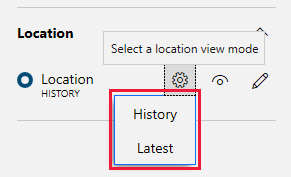

To fully test our one refrigerated truck device, it helps to break down the testing into a number of discreet checks:

1. The device app connects to Azure IoT Central.
1. The telemetry functions send data on the specified interval, and that data is picked up correctly by IoT Central.
1. The command to send the truck to a specified customer works as expected.
1. The command to recall the truck works as expected.
1. Check customer and conflict events are transmitted correctly.

In addition to this list, there are edge-cases you could also investigate, such as what happens when the truck's contents start to melt. However, as you have left this state up to chance in our simulation (note the use of random numbers in our code in the previous unit), you can perhaps leave this check out of our first round of testing.

To begin the testing, with your [Azure IoT Central](https://apps.azureiotcentral.com/?azure-portal=true) app open in a browser, run the device app (**Debug/Start without Debugging** from Visual Studio, or enter `node app.js` or `node Program.cs` into a terminal in Visual Studio Code). A console screen should open, with the text: **Starting Truck number 1**.

## Confirm the device app connects to Azure IoT Central

1. If the second line on the console is **Device successfully connected to Azure IoT Central** you have made the connection.
1. The "connected" line should be followed by some text verifying the settings and properties were sent successfully. If you do not get this message, it usually means either the IoT Central app is not running, or the connection key strings are not correct.

## Confirm the telemetry functions send data on the specified interval, and that data is picked up correctly by IoT Central

1. A console message should appear every five seconds, with the contents temperature.

1. To verify the data is being received at IoT Central, make sure your app is open, and select the **Devices** entry in the left-hand menu. Double-click the real device (**RefrigeratedTruck - 1**), not the simulated device, in the list of devices.

    >[!TIP]
    > These steps are an exciting time in IoT Central development! It can be helpful to have multiple monitors available for all the screens that are active.

1. Verify approximately that the temperatures being sent by the device app, in the console window, match the data being shown in the telemetry view of the IoT Central app.

    | Device app | IoT Central |
    | --- | --- |
    |  |  |

    > [!NOTE]
    > The screenshots in this module are taken from the Node.js version of the app. The C# app screens will be similar, but not identical.

1. Hover the mouse over the states in the IoT Central app, in the charts view, just to verify the truck and its contents are in the expected state.

1. Check the map view for the device. A blue circle near Seattle, USA shows our truck ready to go. You may have to zoom in a bit. Remember too, to make sure the visibility icon for **Location** is enabled.

    

## Confirm the command to send the truck to a specified customer works as expected

1. Now for the best fun of all. Click the **Commands** title for the device. Enter a customer ID, say "6" ("0" through "9" are valid customer IDs), and click **Run**.

1. In the console for the device app, you should see **Number of points=**, followed by a list of lat/lon coordinates. If you see a message including the text "Access denied due to invalid subscription key", then check your subscription key to Azure Maps.

1. Go back to the **Measurements** view in IoT Central. Hover over the Truck state bar chart, does it say "enroute"? Now, select the map view. Is your truck on its way?

    

1. Great progress! Take a moment to just watch the map update, and your truck deliver its contents.

## Confirm the command to recall the truck works as expected

1. When the truck returns to base, try issuing another delivery command. Choose another customer ID.
1. Issue a recall command before the truck reaches its customer, to check the truck responds to this command.

## Check customer and conflict events are transmitted correctly

1. Go to the table view for the device. Change the time range to the past hour. Click on **Show details** for any event that appears (you might have to scroll the table to the right). There should be informational events showing the change of customer ID.

1. To test a conflict event, send a returning truck a command to deliver to another customer, or any other command that you know doesn't make sense.

  > [!TIP]
  > In the map view, to better see where a truck is at any one moment, change the **Location** settings to show **Latest**. For the full route, choose **History**.
  >
  > 

## Check the dashboard

1. Navigate to the dashboard you created a few units back (click **Dashboard**, to the right of **Rules**).
1. Visually verify the map route, and contents temperature, are being updated.

## Next steps

Before you move on to adding multiple devices, there is a short knowledge check to help establish what you have learned in the past few units.
