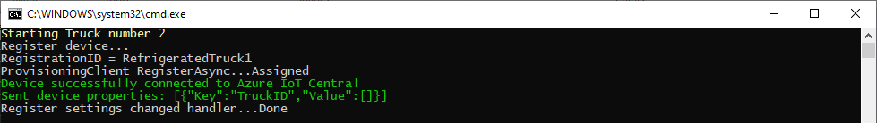
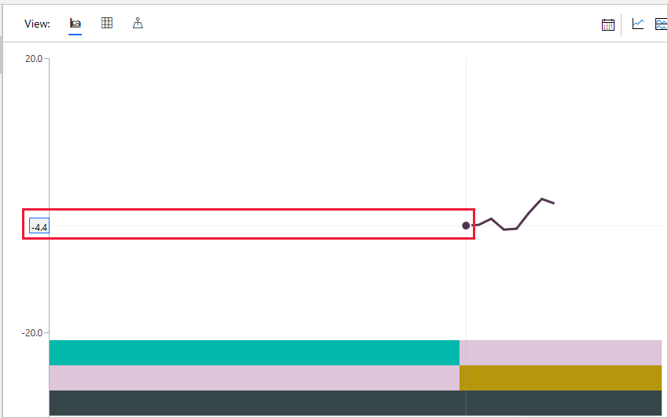
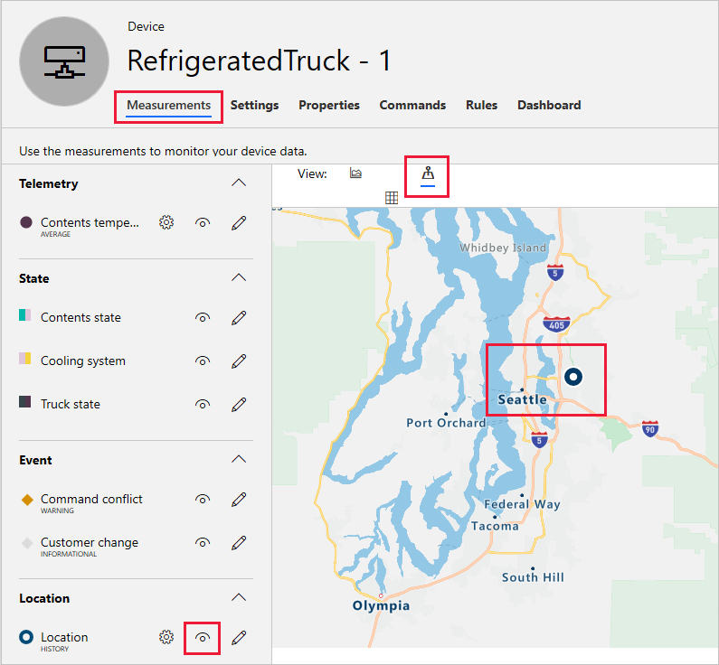

In this unit, you finally get to check whether the moving parts you've created work together.

> [!TIP]
> It can be helpful to use multiple monitors to display all the active browser windows and console screens at the same time.

## Test the device app and IoT Central app together

To fully test the refrigerated truck device, we'll break down the testing into several checks:

1. The device app connects to Azure IoT Central.
1. The telemetry functions send data at the specified interval.
1. The data is picked up correctly by IoT Central.
1. The command to send the truck to a specified customer works as expected.
1. The command to recall the truck works as expected.
1. The customer events and conflict events are transmitted correctly.
1. The truck properties are correct, and the optimal temperature can be changed.

In addition to this list, you could also investigate edge cases. One such case is what happens when the truck's contents start to melt. Our simulation leaves this state to chance by using random numbers in the code.

To begin testing, open the [Azure IoT Central](https://apps.azureiotcentral.com/?azure-portal=true) app in a browser. Then run the device app.

::: zone pivot="vs-csharp,vs-node"

In Visual Studio, select **Debug/Start without Debugging**.

::: zone-end
::: zone pivot="vscode-node"

In the terminal, enter `node app.js`.

::: zone-end
::: zone pivot="vscode-csharp"

In the terminal, enter `dotnet run`.

::: zone-end

A console screen opens with the message **Starting Truck number 1**.

### 1. Confirm the device app connects to Azure IoT Central

If one of the next lines on the console is **Device successfully connected to Azure IoT Central** you've made the connection. If you don't get this message, make sure the IoT Central app is running and that the connection key strings are correct.

The connection message should be followed by some text verifying that the settings and properties were sent successfully.

If all goes well, go straight into the second test.

### 2. Confirm the telemetry functions send data at the specified interval

A console message appears every 5 seconds, providing the temperature of the contents. Watch the telemetry for a while to mentally prepare for the main test of this module!

### 3. Confirm IoT Central correctly picks up the data 

To verify the data is being received at the IoT Central app: 

1. Make sure your IoT Central app is open and the device is selected. If the device isn't selected, in the menu on the left, select **Devices**. In the list of devices, double-click the real device, **RefrigeratedTruck - 1**.

1. On the **Contents temperature** tile, check the temperatures that the device app sends to the console window. These temperatures should approximately match the data shown in the telemetry view of the IoT Central app.

    | IoT Central | Device app |
    | --- | --- |
    |  |  |

    > [!NOTE]
    > The screenshots in this module are taken from the C# version of the app. The Node.js app views are similar but not identical.

1. In the IoT Central app, check the state tiles **Truck state**, **Cooling system state**, and **Contents state**. Verify that the truck and its contents are in the expected states.

1. Check the **Location** map view for the device. A blue circle near Seattle, USA, shows the truck ready to go. You might have to zoom out a bit.

    

If all is well, these checks show great progress. The truck is at its base, in the correct state, and waiting for a command.

## Next steps

Before you move on to the next steps of the testing, check your knowledge to help establish what you've learned in the past few units.
