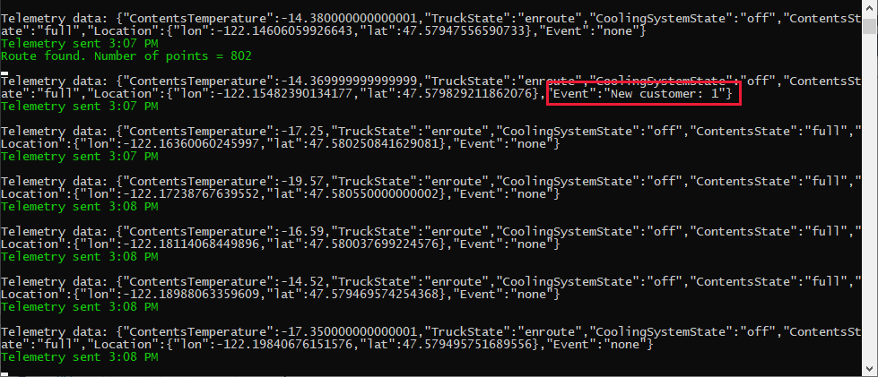
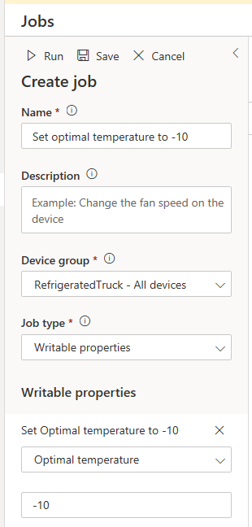

Working through this unit is an exciting time in IoT Central development! Finally, you get to check whether all the moving parts you have created work together.

  > [!TIP]
  > It can be helpful to have multiple monitors available, to display all the browser windows and console screens that are active at the same time.

## Test the device app and IoT Central app together

To fully test the refrigerated truck device, it helps to break down the testing into a number of discreet checks:

1. The device app connects to Azure IoT Central.
1. The telemetry functions send data on the specified interval.
1. The data is picked up correctly by IoT Central.
1. The command to send the truck to a specified customer works as expected.
1. The command to recall the truck works as expected.
1. Check customer and conflict events are transmitted correctly.
1. Check the truck properties, and change the optimal temperature.

In addition to this list, there are edge-cases you could also investigate. One such case is what happens when the truck's contents start to melt? This state is left up to chance in our simulation, with the use of random numbers in our code in the previous unit.

To begin the testing, with your [Azure IoT Central](https://apps.azureiotcentral.com/?azure-portal=true) app open in a browser, run the device app.

1. In Visual Studio select **Debug/Start without Debugging**. Or enter `node app.js`, or `node Program.cs`, into a terminal in Visual Studio Code. A console screen should open, with the text: **Starting Truck number 1**.

### 1. Confirm the device app connects to Azure IoT Central

1. If one of the next lines on the console is **Device successfully connected to Azure IoT Central** you have made the connection. If you do not get this message, it usually means either the IoT Central app is not running, or the connection key strings are not correct.

1. The "connected" line should be followed by some text verifying the settings and properties were sent successfully.

If all goes well, go straight into the second test.

### 2. Confirm the telemetry functions send data on the specified interval

1. A console message should appear every five seconds, with the contents temperature.

    

1. Watch the telemetry for a short while, and mentally prepare for the main test of this module!

### 3. Confirm the data is picked up correctly by IoT Central

If you have left the IoT Central browser page open on your device, you can skip step 1.

1. To verify the data is being received at IoT Central, make sure your IoT Central pp is open, and select the **Devices** entry in the left-hand menu. Double-click the real device (**RefrigeratedTruck - 1**), in the list of devices.

1. Locate the **Contents temperature** tile, and verify approximately that the temperatures being sent by the device app, in the console window, match the data being shown in the telemetry view of the IoT Central app.

    | Device app | IoT Central |
    | --- | --- |
    |  |  |

    > [!NOTE]
    > The screenshots in this module are taken from the C# version of the app. The Node.js app screens will be similar, but not identical.

1. Check the state tiles: **Truck state**, **Cooling system state**, and **Contents state** in the IoT Central app, to verify the truck and its contents are in the expected state.

1. Check the **Location** map view for the device. A blue circle near Seattle, USA shows our truck ready to go. You may have to zoom out a bit.

    

If all is well, this is great progress. The truck is at its base, in the correct state, and waiting for a command.

### 4. Confirm the command to send the truck to a specified customer works as expected

Now for the best fun of all.

1. Click the **Commands** title for the device. This control should be under the truck name, and right of the **Truck view** control.

1. Enter a customer ID, say "1" ("0" through "9" are valid customer IDs), and click **Run**.

1. In the console for the device app, you should see **Route found**.

    

   > [!NOTE]
   > If you see a message including the text **Access denied due to invalid subscription key**, then check your subscription key to Azure Maps.

1. In the dashboard **Location** tile, is your truck on its way? You might have to wait a short time for the apps to sync up.

    

1. Verify the event text in the console.

    

1. Verify the event text in the dashboard tile.

    

Great progress! Take a moment to just watch the map update, and your truck deliver its contents.

### 5. Confirm the command to recall the truck works as expected

1. When the truck returns to base, and is reloaded with contents, it's state will be **ready**. Try issuing another delivery command. Choose another customer ID.

1. Issue a recall command before the truck reaches its customer, to check the truck responds to this command.

### 6. Check customer and conflict events are transmitted correctly

To test a conflict event, send a command that you know doesn't make sense.

1. With your truck at the base, issue a Recall command. The truck should respond with the "already at base" event.

    

### 7. Check the truck properties, and change the optimal temperature

1. The simplest test is to check the **Truck ID** tile. This should have picked up the **Truck number 1** message when the apps were started.

1. A more complex test is to check the writable property, **OptimalTemperature**. To change this value, click on **Jobs** in the left-hand menu.

1. Click **+ New**, top-right.

1. Give the job a friendly name, "Set optimal temperature to -10".

1. For **Device group**, select **RefrigeratedTruck - All devices**. For **Job type**, select **Writable properties**. For **Writable properties**, select **Optimal Temperature**.

1. Finally, set the value as **-10**.

    

1. Running this job should set the optimal temperature for all trucks in the device group, just one in our case. Click **Run**. Wait for the **Status** of the job to change from **Pending** to **Completed**. This should only take a few seconds.

1. Navigate back, via **Devices** to your dashboard. Verify the **Optimal temperature** has been set to -10, in the tile on the dashboard.

    

## Next steps

Before you move on to adding multiple devices, there is a short knowledge check to help establish what you have learned in the past few units.
