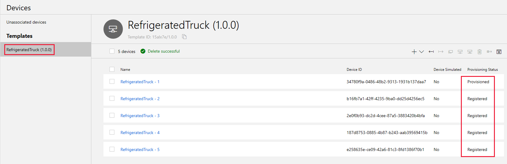
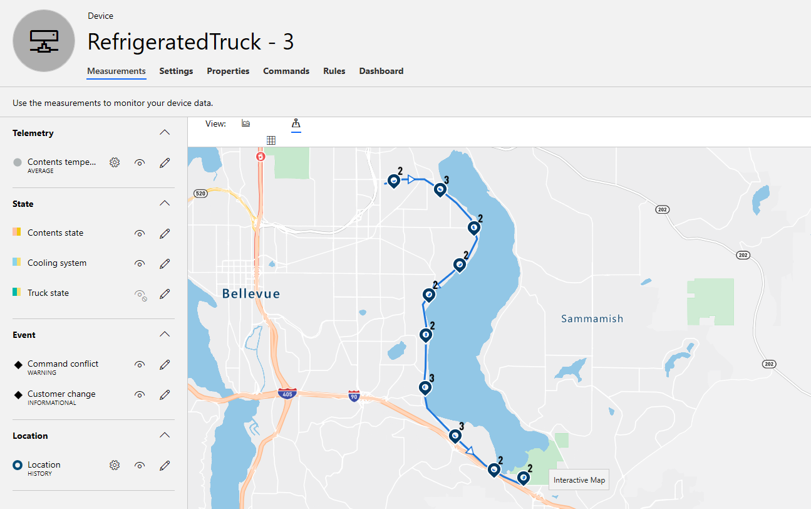

The heavy-lifting of this module has been completed, the process of extending our process to multiple trucks is relatively easy.

## Add multiple devices to the IoT Central app

1. To add multiple devices, start in the [Azure IoT Central](https://apps.azureiotcentral.com/?azure-portal=true) app, clicking **Devices** in the left-hand menu.

1. Click the **+** then **Real** to add a second truck, change the **Device Name** to "RefrigeratedTruck - 2". Clicking **Create** will take you to the **Device** page, which you do not need just yet, so go back to the **Devices** page.

1. Repeat the process so that you have five trucks. There is a limit in the Trial plan to the number of devices you can create. Feel free to delete the **(Simulated)** device if you run into this limit.

    > [!NOTE]
    > To delete any device, click the check box next to it, then select the garbage can icon top right. You will be prompted to confirm you want to delete the device.

1. Verify you now have five devices, all created with the same template. Only the first has **Provisioned** status, the additions are **Registered**.

    

## Provision the new devices

1. Double-click on **RefrigeratedTruck - 2**, and then click **Connect** (top right of your IoT Central screen).

1. In the **Device Connection** screen, copy the **Device ID** and the **Primary Key** to your text file, noting that they are for the second truck. There is no need to copy the **Scope ID**, as this value is identical to the value for the first truck (it identifies your app, not an individual device).

1. Click **Close**.

1. Back on the **Devices** page, repeat the process for trucks 3 through 5, copying their **Device ID** and **Primary Key** to your text file.

1. When you have completed connecting all four new trucks, notice that the **Provisioning Status** is still **Registered**. Not until you actually make the connection will this change.

## Create connection strings for the new devices

1. In your text file, create four strings that match the following outline, replacing **{scope_id}** with the actual value for the first truck, and the appropriate device values for each `{device_id#}` and `{primary_key#}` placeholder. To make things clear, the name of the output text file is changed to match the truck number.

    ```bash
    ./dps_cstr {scope_id} {device_id2} {primary_key2} > connection2.txt
    ./dps_cstr {scope_id} {device_id3} {primary_key3} > connection3.txt
    ./dps_cstr {scope_id} {device_id4} {primary_key4} > connection4.txt
    ./dps_cstr {scope_id} {device_id5} {primary_key5} > connection5.txt
    ```

     > [!NOTE]
     > Preparing strings manually this way does require patience and time. This would be onerous if there was a large number of devices. Automated device provisioning using Azure IoT Hub Device Provisioning Service (DPS) is a subject you can investigate further, if needed, for the scenarios you might be addressing in the future.

1. Navigate to the [Azure Cloud Shell](https://shell.azure.com/?azure-portal=true).

1. In the Cloud Shell session, navigate to the folder you created previously with `cd refrigerated-truck`.

1. Copy across one at a time, from your text file, each of the four strings (starting with **./dps_cstr...**) and press Enter after each is pasted into Azure Cloud Shell. Each will take a few seconds to run.

1. Select the **{ }** icon to open up the file structure, open the **refrigerated-truck** folder, and verify you have files named connection2.txt through to connection5.txt.

1. Open up each one of these files in turn, and copy across the connection string (from "HostName=" to the end of the file) to your text file.

1. Close Azure Cloud Shell.

1. Verify that each connection string ends with an exact copy of the **Primary Key**, just in case there is spurious text at the end of any of the **connection#.txt** files.

## Update the Node.js app to handle multiple devices

1. Open up your Node.js app in the development environment you are using.

1. Locate the `switch` statement at the top of the file, and add four entries:

    ```js
    switch (truckNum) {
        case 1:
            // Leave this entry as is.
            break;

        case 2:
            connectionString = "<your second truck connection string>";
            break;

        case 3:
            connectionString = "<your third truck connection string>";
            break;

        case 4:
            connectionString = "<your fourth truck connection string>";
            break;

        case 5:
            connectionString = "<your fifth truck connection string>";
            break;
    }
    ```

1. Carefully copy the four connection strings from your text file, to the correct location in this switch statement.

1. Take a moment to verify you have copied all four exactly, each connection string should be of identical length.

## Run five versions of the Node.js app

Each truck is simulated by one running copy of the Node.js app. So, you need five versions of this app running simultaneously.

1. With the line  `const truckNum = 1`, run the app, but _not_ in debugging mode. (Debugging mode might not work with five versions running together.)

1. Verify the app started, connected, and began sending telemetry data? If so, good, go on to the next step. If not, go back and check you have altered the code correctly.

1. Change the line to `const truckNum = 2;`, and run the app again. You should get a second console window, and the correct startup sequence should appear.

1. Repeat this process for trucks 3 through 5, changing the `const truckNum` line, and running the app again.

Exciting, isn't it? You now have five console windows open, with five simulated refrigerated trucks waiting for their commands!

## Monitor and command the trucks from IoT Central

1. In the **Devices** page of your IoT Central app, verify all devices are **Provisioned**.

1. Double-click on each device in turn, then select **Commands**. In the **Go to customer** command, send Truck 1 to any customer, Truck 2 to a different customer, and so on to Truck 5.

1. There is now a lot going on! Select each device in turn on the **Devices** page, and in the **Measurements** section, open up the map view. Make sure the eye icon of the **Location** is turned on. Each truck should now be on its way to a unique customer.

    

1. There is now so much going on it is tough to keep track of it. For each truck, open up one of the other views, and check the states and events. Did any of the cooling systems fail? Did any of the contents melt?

Clearly the map view is one of the most useful, at least in terms of giving the operator some confidence that they can see the larger picture. It is tough to have this confidence when each truck is shown on a different map. In the next unit, you will look about resolving this complexity by creating a _Device set_, which enables all device locations to appear on a single map.

You can leave all five Node.js apps running, the trucks will have returned to their base and will be ready for the next unit when needed.
