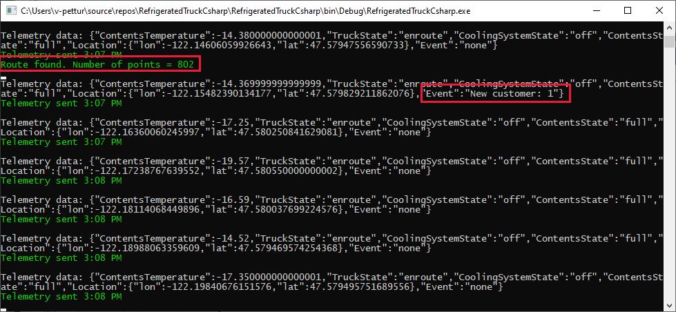
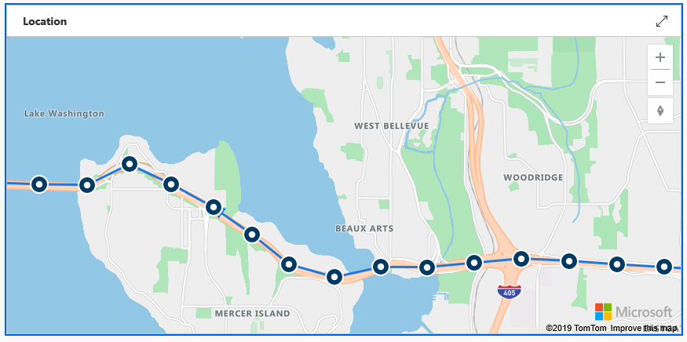
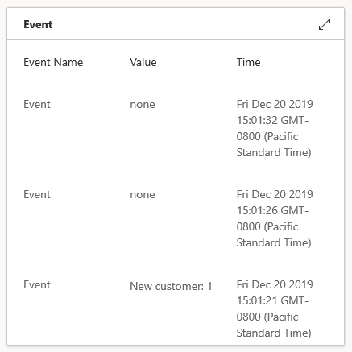
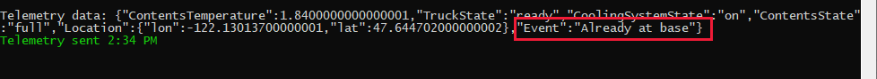
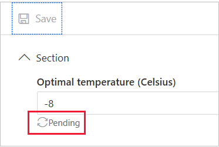
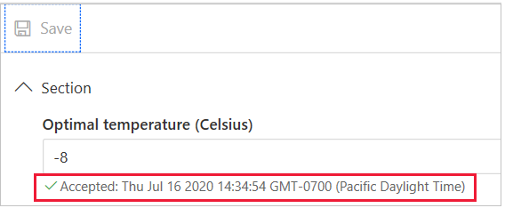
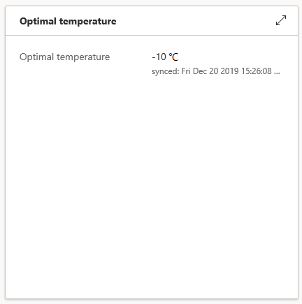

In this unit, you'll finish testing the app.

### 4. Confirm that the command to send the truck to a specified customer works as expected

Now for the best fun of all.

1. Select the device's **Commands** tab. This control should be under the truck name, to the right of the **Truck view** control.

1. Enter a customer ID, say _1_. (Numerals 0 through 9 are valid customer IDs.) Then select **Run**.

    In the console for the device app, you see both a **New customer** event and a **Route found** message.

    

   > [!NOTE]
   > If you see a message that includes the text **Access denied due to invalid subscription key**, check your subscription key to Azure Maps.

1. On the dashboard's **Location** tile, check to see whether your truck is on its way. You might have to wait a short time for the apps to sync.

    

1. Verify the event text on the dashboard tile.

    

Great progress! Take a moment to watch the map update as your truck delivers its contents.

### 5. Confirm that the command to recall the truck works as expected

1. When the truck returns to base and is reloaded with contents, its state is **ready**. Try issuing another delivery command. Choose another customer ID.

1. Before the truck reaches the customer, make a recall command to check whether the truck responds.

### 6. Confirm that customer and conflict events are transmitted correctly

To test a conflict event, send a command that doesn't make sense. For example, when your truck is at the base, issue a **Recall** command. The truck should respond with the **already at base** event.

### 7. Check the truck properties and change the optimal temperature

1. The simplest test is to check the **Truck ID** tile. This tile should have picked up the **Truck number 1** message when the apps were started.

1. The next test is to check the writable property, **OptimalTemperature**. To change this value, select the **Set properties** view.

    1. Set the optimal temperature to any value, say `-8`. Select **Save** and then notice the **Pending** status.
    
        
    
        Soon the status changes to **Accepted**.
    
        
    
    1. Return to your truck view. On the dashboard tile, verify that **Optimal temperature** is set to **-8**.
    
        

## Next steps

Now that you've completed the testing for one truck, it's time to consider expanding the IoT Cental system.
