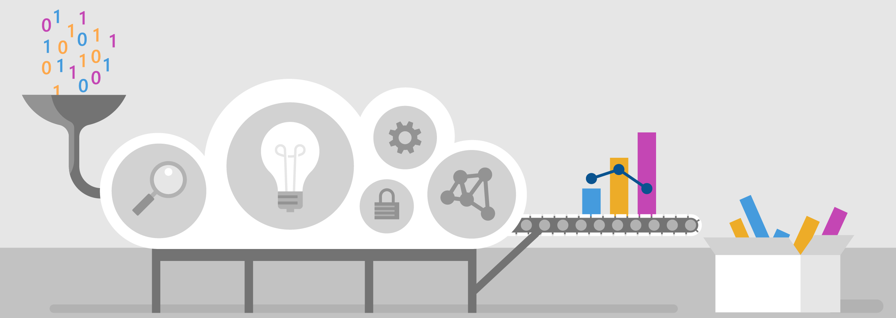
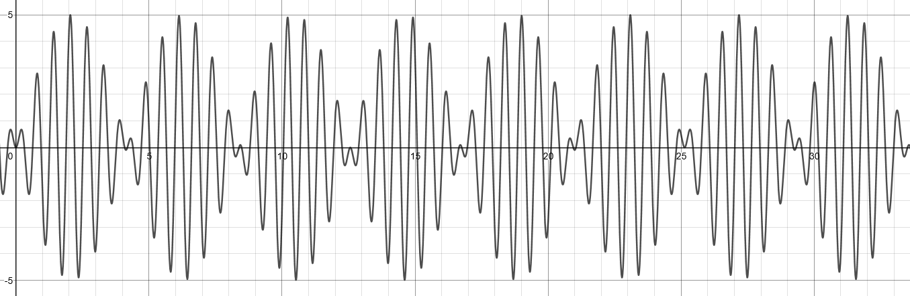
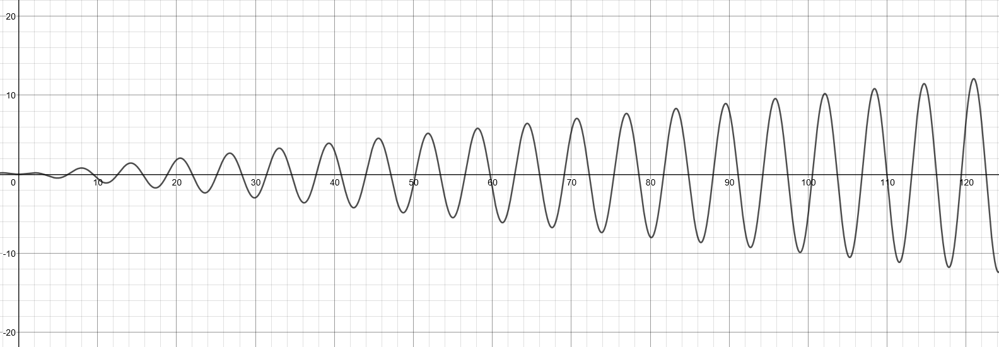

An Azure IoT Hub can direct the telemetry messages from one, or millions, of devices. The messages can be directed to services for analysis, for storage, for visualization. Or for any combination of these objectives. 

In this module, you'll learn about Azure IoT Hub, IoT Hub message routing, Azure storage, Azure Stream Analytics, and how to call a built-in ML model. You'll achieve this knowledge by creating an IoT system to monitor and detect vibration anomalies in a conveyor belt. You'll learn a little about vibration, and a lot more about Azure IoT services!

## Learning objectives

In this module you will:

- Create an Azure IoT Hub, using the Azure portal
- Create an Azure IoT Hub device identity, using the Azure portal
- Build a C# app to send device telemetry to the IoT Hub, using Visual Studio or Visual Studio code
- Define a message route, through to blob storage, using the Azure portal
- Define a second message route, through to an Azure Analytics job, using the Azure portal
- Create a query to apply a built-in ML model for anomaly detection, using SQL
- Create a dashboard to visualize data anomalies, using Power BI

## Prerequisites

- An introductory knowledge of Azure IoT
- Ability to navigate the Azure IoT portal
- Ability to use C#, at the beginner level
- Experience using Visual Studio, or Visual Studio Code, at the beginner level
- A Microsoft account, to log into Office Power BI

## Learn the scenario

Suppose you manage a packaging facility. Packages are assembled for shipping, then placed on a conveyor belt that takes the packages and drops them off in mailing bins. Your metric for success is the number of packages leaving the conveyor belt.

The conveyor belt is a critical link in your process, and is monitored for vibration. The conveyor belt has three speeds: _stopped_, _slow_, and _fast_. The number of packages being delivered at slow speed is less than at the faster speed, though the vibration is also less at the slower speed. If the vibration becomes excessive, the conveyor belt has to be stopped and inspected. A broken conveyor wheel, for example, can exacerbate the vibrations, in a cyclical fashion.

There are a number of different types of vibration. _Forced vibration_ is vibration caused by an external force. Such a force as the broken wheel example, or a weighty package placed improperly on the conveyor belt. There's also _increasing vibration_, which might happen if a design limit is exceeded.

Vibration is typically measured as an acceleration (meters per second squared, m/s2).

The goal here is preventive maintenance. Detect that something is wrong, before any damage is caused.

It's not always easy to detect abnormal vibration levels. For this reason, you're looking to Azure IoT Hub to detect data anomalies. You plan to have a vibration detection sensor on the conveyor belt, sending continuous telemetry to an IoT Hub. The IoT Hub will use Azure Stream Analytics, and a built-in ML model, to give you advance warning of vibration anomalies. You also plan to archive all the telemetry data, just in case it's ever needed.

You decide to build a prototype of the planned system, initially using simulated telemetry.

## The first step

The first step to building this system is to create a custom IoT Hub.
