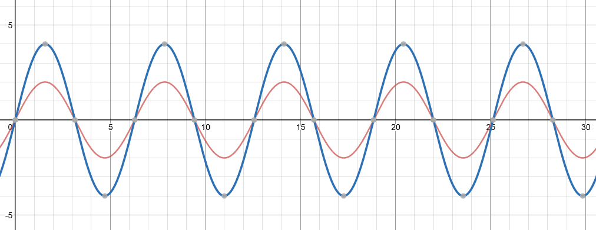
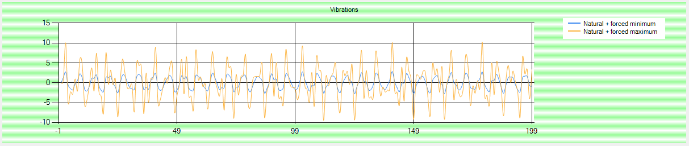
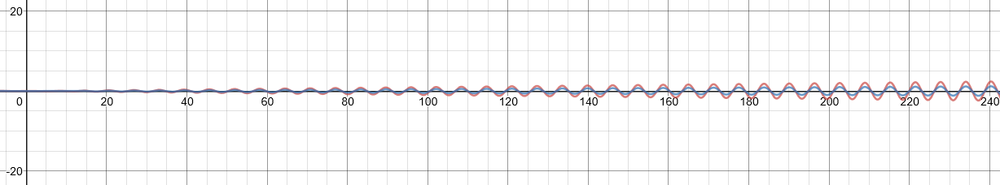
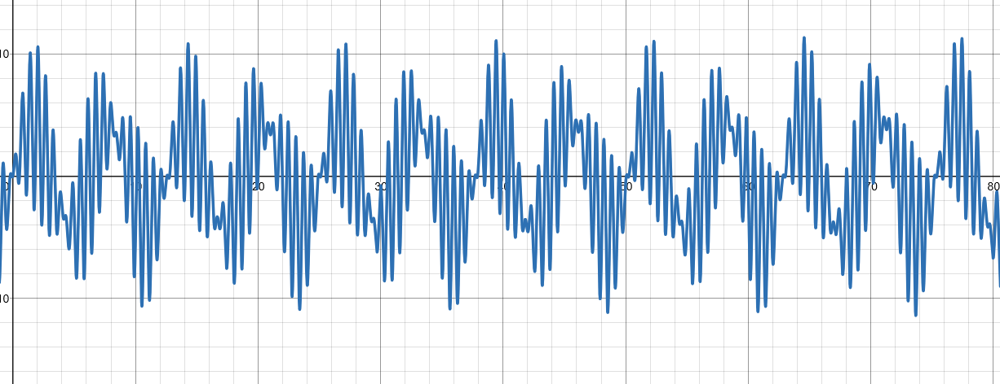

The key to monitoring our conveyor belt is the output of vibration telemetry. Vibration is usually measured as an acceleration (m/s2), although sometimes it's measured in g-forces, where 1 g = 9.81 m/s2. There are three types of vibration.

* _Natural vibration_, which is just the frequency a structure tends to oscillate.
* _Free vibration_, which occurs when the structure is impacted, but then left to oscillate without interference.
* _Forced vibration_, which occurs when the structure is under some stress.

Forced vibration is the dangerous one for our conveyor belt. Even if it starts at a low level this vibration can build so that the structure fails prematurely. There's less of a case for free vibration in conveyor belt operation. Most machines, as we all know, have a natural vibration.

## Simulate a vibration sensor device

The code sample we'll write has a conveyor belt running at a range of speeds (stopped, slow, fast). The faster the belt is running, the more packages are delivered, but the greater the effects of vibration. We'll add natural vibration, based on a sine wave with some randomization. It's possible our anomaly detection system will falsely identify a spike or dip in this sine wave as an anomaly. We'll then add two forms of forced vibration. The first has the effect of a cyclic increase in vibration (see the images below). And secondly, an increasing vibration, where an additional sine wave is added, starting small but growing.

The natural vibration will vary from a minimum to a maximum level, similar to the following diagram.

Forced cyclic vibration will also vary from a minimum to a maximum level.

When forced vibration is added to natural vibration, the resulting vibration wave gets more complicated.

Increasing vibration starts almost undetectable.

When we add all three vibrations, notice how the extreme highs and lows slowly increase.

We assume that our conveyor belt has just one sensor, and it also pumps out some other data (packages delivered, ambient temperature, and similar metrics). These extra values are just to give us something to archive!

## Code the simulator and telemetry messages

Almost all the coding in this module is in the next unit. We build the conveyor belt simulator, and send telemetry messages to the IoT Hub created in the previous unit. In later units, there's a small amount of SQL coding.

You can select your preferred development environment (Visual Studio Code, or Visual Studio). The simulator is written in C#.
