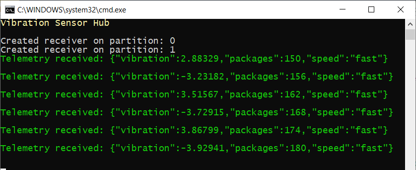

At the end of this unit, you'll be sending and receiving telemetry.

## Create an app to send telemetry

::: zone pivot="vscode"

1. To use C# in Visual Studio Code, ensure both [.NET Core](https://dotnet.microsoft.com/download), and the [C# extension](https://marketplace.visualstudio.com/items?itemName=ms-vscode.csharp) are installed.

1. Open a terminal in Visual Studio Code, and create a folder called "vibrationdevice" (enter `mkdir vibrationdevice`). Navigate to the vibrationdevice folder.

1. Enter the following command in the terminal: `dotnet new console`. This command creates a **Program.cs** file in your folder, along with a project file.

1. Enter `dotnet restore` in the terminal. This command gives your app access to the required .NET packages.

1. In the terminal, install the required libraries. Enter:
    * **dotnet add package Microsoft.Azure.Devices.Client**
    * **dotnet add package Microsoft.Azure.Devices.Shared**
    * **dotnet add package Newtonsoft.Json**

1. From the **File** menu, open up the **Program.cs** file, and delete the default contents.

1. After you've entered the code below into the **Program.cs** file, you can run the app with the command `dotnet run`. This command will run the **Program.cs** file in the current folder, so ensure you are in the vibrationdevice folder.

::: zone-end

::: zone pivot="vstudio"

1. Open Visual Studio, and create a new **Visual C#/Windows Desktop** project. Select **Console App (.NET Framework)**.

1. Give the project a friendly name, such as "VibrationDevice".

1. Under **Tools/NuGet Package Manager**, select **Manage NuGet Packages for Solution**. Install the following libraries:
    * **Microsoft.Azure.Devices.Client**
    * **Microsoft.Azure.Devices.Shared**
    * **Newtonsoft.Json**

1. Delete the default contents of the **Program.cs** file.

1. Add all the code that follows to the **Program.cs** file.

::: zone-end

> [!NOTE]
> This module doesn't require you to download any code. However, all of the code is available from [GitHub/MicrosoftDocs/mslearn-remotely-monitor-and-control-devices-with-iot-hub](https://github.com/MicrosoftDocs/mslearn-remotely-monitor-and-control-devices-with-iot-hub), if needed.

### Add code to send telemetry

This section adds code to send telemetry from a simulated device. The device sends temperature (in degrees fahrenheit) and humidity (in percentages), regardless of whether any back-end app is listening or not.


1. Open the **Program.cs** file for the device app.

1. Copy and paste the following code.

    ```cs
    
    ```

    > [!NOTE]
    > Read through the comments in the code, noting how the temperature and humidity settings from the description of the scenario in the introduction have worked their way into the code.

1. Replace the &lt;your device connection string&gt; with the device connection string you saved off in the previous unit. No other lines of code need to be changed.

1. Save the **Program.cs** file.

### Test your code to send telemetry

1. Run the app.
1. You should quickly get a console screen, similar to the following image. Note the use of green text, to show things are working as they should! If you don't get a screen similar to this image, check your device connection string carefully.

    

1. Watch the telemetry for a short while, checking that is it giving temperatures and humidity in the expected ranges.
1. You can leave this app running, as it's needed for the next section.


## Create a second app to receive telemetry

Now we have a device pumping out telemetry, we need to listen for that telemetry with a back-end app, also connected to our IoT Hub.

::: zone pivot="vscode"

1. Open a terminal in Visual Studio Code, and create a folder called "vibrationoperator" (enter `mkdir vibrationoperator`). Navigate to the vibrationoperator folder.

1. Enter the following command in the terminal: `dotnet new console`. This command creates a **Program.cs** file in your folder, along with a project file.

1. Enter `dotnet restore` in the terminal. This command gives your app access to the required .NET packages.

1. In the terminal, enter the following commands:
    * **dotnet add package Microsoft.Azure.EventHubs**
    * **dotnet add package Microsoft.Azure.Device**
    * **dotnet add package Newtonsoft.Json**.

1. From the **File** menu, open up the **Program.cs** file, and delete the default contents.

1. After you've entered the code below into the **Program.cs** file, run the code with the command `dotnet run`. This command will run the **Program.cs** file in the current folder, so ensure you are in the correct folder.

::: zone-end
::: zone pivot="vstudio"

1. Open Visual Studio, and create a new **Visual C#/Windows Desktop** project. Select **Console App (.NET Framework)**.

1. Give the project a friendly name, such as "VibrationOperator".

1. Under **Tools/NuGet Package Manager**, select **Manage NuGet Packages for Solution**. Install the following libraries:
    * **Microsoft.Azure.Devices**
    * **Microsoft.Azure.EventHubs**
    * **Newtonsoft.Json**

1. Delete the default contents of **Program.cs**.

1. Add all the code that follows to the **Program.cs** file.

::: zone-end

### Add code to receive telemetry

1. Open the **Program.cs** file for the back-end app.

    ```cs

    ```

    > [!NOTE]
    > Our implementation only reads messages after the back-end app has been started. Any telemetry sent prior to this isn't handled.

1. Replace the &lt;your service connection string&gt; with the _service_ connection string you saved off in a text file, in the previous unit.

1. Replace the &lt;your event hub endpoint&gt;, &lt;your event hub path&gt;, and the &lt;your event hub Sas key&gt; with the strings you saved off to your text file.

1. Save the **Program.cs** file.

### Test your code to receive telemetry

This test is important, checking whether your back-end app is picking up the telemetry being sent out by your simulated device. Remember your device app is still running, and sending telemetry.

1. Run the service app.
1. A second console window should open up, and immediately respond if it successfully connects to IoT Hub. If not, carefully check your IoT Hub service connection string, noting that this string should be the _service_ connection string, and not any other.

    

1. Visually compare the telemetry sent and received. Is there an exact match? Is there much of a delay? If it looks good, close both the console windows for now.

Completing this unit is great progress. you've an app sending telemetry from a device, and a back-end app acknowledging receipt of the data. This unit covers the _monitoring_ side of our scenario. The next step handles the _control_ side - what to do when issues arise with the data. Clearly, there are issues, we're getting temperature and humidity alerts!
