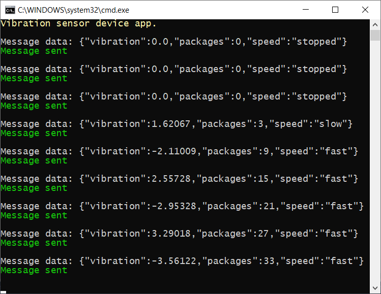
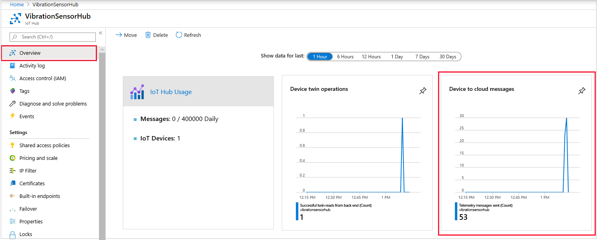

At the end of this unit, you'll be sending and receiving telemetry.

## Create an app to send telemetry

::: zone pivot="vscode"

1. To use C# in Visual Studio Code, ensure both [.NET Core](https://dotnet.microsoft.com/download), and the [C# extension](https://marketplace.visualstudio.com/items?itemName=ms-vscode.csharp) are installed.

1. Open a terminal in Visual Studio Code, and create a folder called "vibrationdevice" (enter `mkdir vibrationdevice`). Navigate to the vibrationdevice folder.

1. Enter the following command in the terminal: `dotnet new console`. This command creates a **Program.cs** file in your folder, along with a project file.

1. Enter `dotnet restore` in the terminal. This command gives your app access to the required .NET packages.

1. In the terminal, install the required libraries. Enter:
    * **dotnet add package Microsoft.Azure.Devices.Client**
    * **dotnet add package Newtonsoft.Json**

1. From the **File** menu, open up the **Program.cs** file, and delete the default contents.

1. After you've entered the code below into the **Program.cs** file, you can run the app with the command `dotnet run`. This command will run the **Program.cs** file in the current folder.

::: zone-end

::: zone pivot="vstudio"

1. Open Visual Studio, and create a new **Visual C#/Windows Desktop** project. Select **Console App (.NET Framework)**.

1. Give the project a friendly name, such as "VibrationDevice".

1. Under **Tools/NuGet Package Manager**, select **Manage NuGet Packages for Solution**. Install the following libraries:
    * **Microsoft.Azure.Devices.Client**
    * **Newtonsoft.Json**

1. Delete the default contents of the **Program.cs** file.

1. Add all the code that follows to the **Program.cs** file.

::: zone-end

> [!NOTE]
> This module doesn't require you to download any code. However, all of the code is available from [GitHub/MicrosoftDocs/mslearn-data-anomaly-detection-using-azure-iot-hub](https://github.com/MicrosoftDocs/mslearn-data-anomaly-detection-using-azure-iot-hub), if needed.

### Add code to send telemetry

The following app simulates a conveyor belt, and reports vibration sensor data every two seconds.

1. Open the **Program.cs** file for the device app.

1. Copy and paste the following code.

    ```cs
    // Copyright (c) Microsoft. All rights reserved.
    // Licensed under the MIT license. See LICENSE file in the project root for full license information.
    
    using System;
    using Microsoft.Azure.Devices.Client;
    using Newtonsoft.Json;
    using System.Text;
    using System.Threading.Tasks;
    
    namespace vibration_device
    {
        class SimulatedDevice
        {
            // Telemetry globals.
            private const int intervalInMilliseconds = 2000;                                // Time interval required by wait function.
            private static readonly int intervalInSeconds = intervalInMilliseconds / 1000;  // Time interval in seconds.
    
            // Conveyor belt globals.
            enum SpeedEnum
            {
                stopped,
                slow,
                fast
            }
            private static int packageCount = 0;                                        // Count of packages leaving the conveyor belt.
            private static SpeedEnum beltSpeed = SpeedEnum.stopped;                     // Initial state of the conveyor belt.
            private static readonly double slowPackagesPerSecond = 1;                   // Packages completed at slow speed/ per second
            private static readonly double fastPackagesPerSecond = 2;                   // Packages completed at fast speed/ per second
            private static double beltStoppedSeconds = 0;                               // Time the belt has been stopped.
            private static double temperature = 60;                                     // Ambient temperature of the facility.
            private static double seconds = 0;                                          // Time conveyor belt is running.
    
            // Vibration globals.
            private static double forcedSeconds = 0;                                    // Time since forced vibration started.
            private static double increasingSeconds = 0;                                // Time since increasing vibration started.
            private static double naturalConstant;                                      // Constant identifying the severity of natural vibration.
            private static double forcedConstant = 0;                                   // Constant identifying the severity of forced vibration.
            private static double increasingConstant = 0;                               // Constant identifying the severity of increasing vibration.
    
            // IoT Hub global variables.
            private static DeviceClient s_deviceClient;
    
            // The device connection string to authenticate the device with your IoT hub.
            private readonly static string s_deviceConnectionString = "<your device connection string>";
    
            private static void colorMessage(string text, ConsoleColor clr)
            {
                Console.ForegroundColor = clr;
                Console.WriteLine(text);
                Console.ResetColor();
            }
            private static void greenMessage(string text)
            {
                colorMessage(text, ConsoleColor.Green);
            }
    
            private static void redMessage(string text)
            {
                colorMessage(text, ConsoleColor.Red);
            }
    
            // Async method to send simulated telemetry.
            private static async void SendDeviceToCloudMessagesAsync(Random rand)
            {
                // Simulate the vibration telemetry of a conveyor belt.
                double vibration;
    
                while (true)
                {
                    // Randomly adjust belt speed.
                    switch (beltSpeed)
                    {
                        case SpeedEnum.fast:
                            if (rand.NextDouble() < 0.01)
                            {
                                beltSpeed = SpeedEnum.stopped;
                            }
                            if (rand.NextDouble() > 0.95)
                            {
                                beltSpeed = SpeedEnum.slow;
                            }
                            break;
    
                        case SpeedEnum.slow:
                            if (rand.NextDouble() < 0.01)
                            {
                                beltSpeed = SpeedEnum.stopped;
                            }
                            if (rand.NextDouble() > 0.95)
                            {
                                beltSpeed = SpeedEnum.fast;
                            }
                            break;
    
                        case SpeedEnum.stopped:
                            if (rand.NextDouble() > 0.75)
                            {
                                beltSpeed = SpeedEnum.slow;
                            }
                            break;
                    }
    
                    // Set vibration levels.
                    if (beltSpeed == SpeedEnum.stopped)
                    {
                        // If the belt is stopped, all vibration comes to a halt.
                        forcedConstant = 0;
                        increasingConstant = 0;
                        vibration = 0;
    
                        // Record how much time the belt is stopped, in case we need to send an alert.
                        beltStoppedSeconds += intervalInSeconds;
                    }
                    else
                    {
                        // Conveyor belt is running.
                        beltStoppedSeconds = 0;
    
                        // Check for random starts in unwanted vibrations.
    
                        // Check forced vibration.
                        if (forcedConstant == 0)
                        {
                            if (rand.NextDouble() < 0.1)
                            {
                                // Forced vibration starts.
                                forcedConstant = 1 + 6 * rand.NextDouble();             // A number between 1 and 7.
                                if (beltSpeed == SpeedEnum.slow)
                                    forcedConstant /= 2;                                // Lesser vibration if slower speeds.
                                forcedSeconds = 0;
                                redMessage($"Forced vibration starting with severity: {Math.Round(forcedConstant, 2)}");
                            }
                        }
                        else
                        {
                            if (rand.NextDouble() > 0.99)
                            {
                                forcedConstant = 0;
                                greenMessage("Forced vibration stopped");
                            }
                            else
                            {
                                redMessage($"Forced vibration: {Math.Round(forcedConstant, 1)} started at: {DateTime.Now.ToShortTimeString()}");
                            }
                        }
    
                        // Check increasing vibration.
                        if (increasingConstant == 0)
                        {
                            if (rand.NextDouble() < 0.05)
                            {
                                // Increasing vibration starts.
                                increasingConstant = 100 + 100 * rand.NextDouble();     // A number between 100 and 200.
                                if (beltSpeed == SpeedEnum.slow)
                                    increasingConstant *= 2;                            // Longer period if slower speeds.
                                increasingSeconds = 0;
                                redMessage($"Increasing vibration starting with severity: {Math.Round(increasingConstant, 2)}");
                            }
                        }
                        else
                        {
                            if (rand.NextDouble() > 0.99)
                            {
                                increasingConstant = 0;
                                greenMessage("Increasing vibration stopped");
                            }
                            else
                            {
                                redMessage($"Increasing vibration: {Math.Round(increasingConstant, 1)} started at: {DateTime.Now.ToShortTimeString()}");
                            }
                        }
    
                        // Apply the vibrations, starting with natural vibration.
                        vibration = naturalConstant * Math.Sin(seconds);
    
                        if (forcedConstant > 0)
                        {
                            // Add forced vibration.
                            vibration += forcedConstant * Math.Sin(0.75 * forcedSeconds) * Math.Sin(10 * forcedSeconds);
                            forcedSeconds += intervalInSeconds;
                        }
    
                        if (increasingConstant > 0)
                        {
                            // Add increasing vibration.
                            vibration += (increasingSeconds / increasingConstant) * Math.Sin(increasingSeconds);
                            increasingSeconds += intervalInSeconds;
                        }
                    }
    
                    // Increment the time since the conveyor belt app started.
                    seconds += intervalInSeconds;
    
                    // Count the packages that have completed their journey.
                    switch (beltSpeed)
                    {
                        case SpeedEnum.fast:
                            packageCount += (int)(fastPackagesPerSecond * intervalInSeconds);
                            break;
    
                        case SpeedEnum.slow:
                            packageCount += (int)(slowPackagesPerSecond * intervalInSeconds);
                            break;
    
                        case SpeedEnum.stopped:
                            // No packages!
                            break;
                    }
    
                    // Randomly vary ambient temperature.
                    temperature += rand.NextDouble() - 0.5d;
    
                    // Create two messages:
                    // 1. Vibration telemetry only, that is routed to Azure Stream Analytics.
                    // 2. Logging information, that is routed to an Azure storage account.
    
                    // Create the telemetry JSON message.
                    var telemetryDataPoint = new
                    {
                        vibration = Math.Round(vibration, 2),
                    };
                    var telemetryMessageString = JsonConvert.SerializeObject(telemetryDataPoint);
                    var telemetryMessage = new Message(Encoding.ASCII.GetBytes(telemetryMessageString));
    
                    // Add a custom application property to the message. This is used to route the message.
                    telemetryMessage.Properties.Add("sensorID", "VSTel");
    
                    // Send an alert if the belt has been stopped for more than five seconds.
                    telemetryMessage.Properties.Add("beltAlert", (beltStoppedSeconds > 5) ? "true" : "false");
    
                    Console.WriteLine($"Telemetry data: {telemetryMessageString}");
    
                    // Send the telemetry message.
                    await s_deviceClient.SendEventAsync(telemetryMessage);
                    greenMessage($"Telemetry sent {DateTime.Now.ToShortTimeString()}");
    
                    // Create the logging JSON message.
                    var loggingDataPoint = new
                    {
                        vibration = Math.Round(vibration, 2),
                        packages = packageCount,
                        speed = beltSpeed.ToString(),
                        temp = Math.Round(temperature, 2),
                    };
                    var loggingMessageString = JsonConvert.SerializeObject(loggingDataPoint);
                    var loggingMessage = new Message(Encoding.ASCII.GetBytes(loggingMessageString));
    
                    // Add a custom application property to the message. This is used to route the message.
                    loggingMessage.Properties.Add("sensorID", "VSLog");
    
                    // Send an alert if the belt has been stopped for more than five seconds.
                    loggingMessage.Properties.Add("beltAlert", (beltStoppedSeconds > 5) ? "true" : "false");
    
                    Console.WriteLine($"Log data: {loggingMessageString}");
    
                    // Send the logging message.
                    await s_deviceClient.SendEventAsync(loggingMessage);
                    greenMessage("Log data sent\n");
    
                    await Task.Delay(intervalInMilliseconds);
                }
            }
    
            private static void Main(string[] args)
            {
                Random rand = new Random();
                colorMessage("Vibration sensor device app.\n", ConsoleColor.Yellow);
    
                // Connect to the IoT hub using the MQTT protocol.
                s_deviceClient = DeviceClient.CreateFromConnectionString(s_deviceConnectionString, TransportType.Mqtt);
    
                // Create a number between 2 and 4, as a constant for normal vibration levels.
                naturalConstant = 2 + 2 * rand.NextDouble();
    
                SendDeviceToCloudMessagesAsync(rand);
                Console.ReadLine();
            }
        }
    }
    ```

    > [!IMPORTANT]
    > Take a few minutes, and read through the comments in the code. Notice how the vibration math from the description of the scenario in the introduction has worked its way into the code. The most important section of code for learning about IoT messages, starts with the "Create two messages:" comment.

1. Replace the &lt;your device connection string&gt; with the device connection string you saved off in the previous unit. No other lines of code need to be changed.

1. Save the **Program.cs** file.

### Test your code to send telemetry

::: zone pivot="vscode"

1. Run the app in the terminal, with the command `dotnet run`. This command will run the **Program.cs** file in the current folder.

::: zone-end
::: zone pivot="vstudio"

1. Run the app by selecting **Debug/Start Without Debugging**.

::: zone-end

1. You should quickly get a console screen, similar to the following image. Note the use of green text, to show things are working as they should. And red text when bad stuff is happening. If you don't get a screen similar to this image, start by checking your device connection string.

    [](../media/vibration-telemetry.png#lightbox)

1. Watch the telemetry for a short while, checking that it's giving vibrations in the expected ranges.
1. You can leave this app running, as it's needed for the next section.

## Verify the IoT Hub is receiving telemetry

1. To verify that your IoT Hub is receiving the telemetry, open the **Overview** page for the hub. Scroll down to the bottom of the page. Change the time range to one hour. The **Device to cloud messages** plot should show some activity.

    [](../media/vibration-hub-overview.png#lightbox)

1. If no activity is shown, wait a short while, as there's some latency.

With your device pumping out telemetry, and your hub receiving it, the next step is to route the messages to their correct endpoints.
