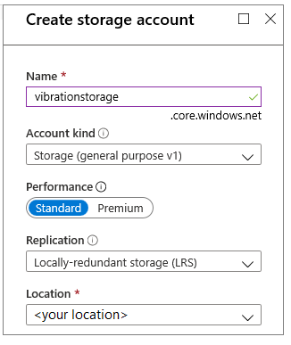
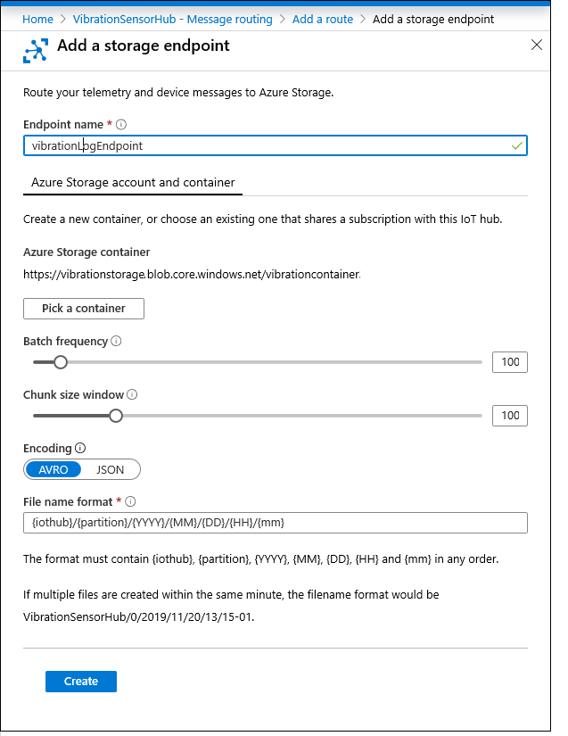
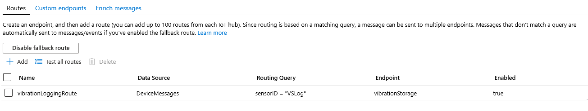
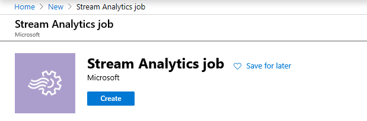
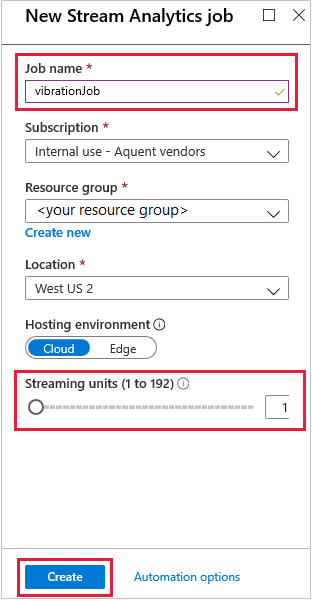
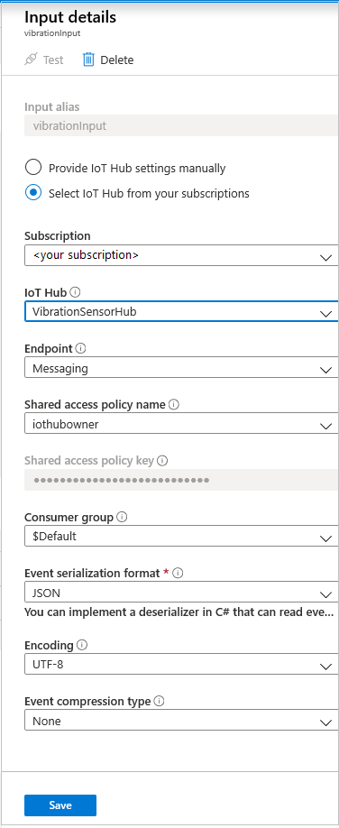
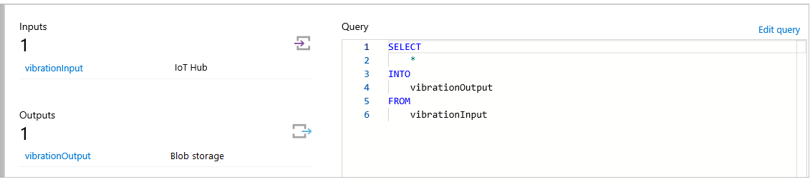
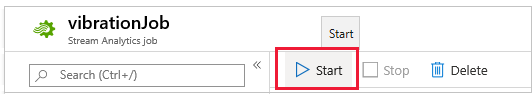
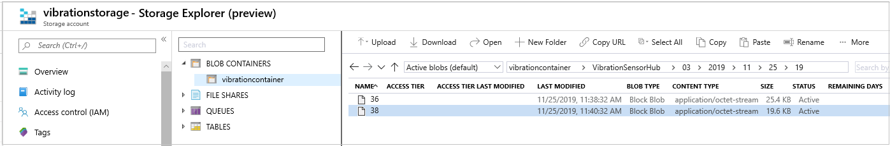

In this unit, we'll create and test the logging route.

## Route the logging message to Azure storage

1. In the Azure portal, ensure the **Overview** page for the **VibrationSensorHub** is open.

1. In the left-hand menu, select **Message routing**.

1. Click **+ Add** to add the first route.

1. Name the route "VibrationLoggingRoute".

1. Click **+ Add endpoint**, and select **Storage** from the drop-down list.

1. Give the endpoint a descriptive name, such as "VibrationLogEndpoint".

1. Click the **Pick a container** box.

1. First, we need to create the storage account, to contain the container! So, click **+ Storage account**.

1. On the right-hand side of the screen, enter the name for your storage account, say "vibrationstorage". This field can only contain lower-case letters and numbers.

1. Change the **Location** to the location nearest you, and leave the other fields as they are.

    [](../media/vibration-storage-account.png#lightbox)

1. Click **Ok**. Wait until the resource is validated. Validation can take a few minutes.

1. In the **Storage accounts** screen that now appears, search for "vibrationstorage", and select it. A screen named **Containers** should appear.

1. Click **+ Container**.

1. In the **New container** screen, enter a name such as "vibrationcontainer" (again, only lower-case letters and numbers are accepted).

1. Leave the **Public access level** as private, and click **OK**. Wait for your container to be available. Highlight the container in the list, and click **Select**.

1. The **Add a storage endpoint** page should reappear. Notice the URL under the **Azure Storage container** title.

1. Leave the other fields at their default values, and click **Create**.

    [](../media/vibration-storage-endpoint.png#lightbox)

1. You should now see the **Add a route** screen. Leave the **Data source** parameter as **Device Telemetry Messages**, as that is exactly what we want.

1. You've nearly finished the logging route. One last step, change the **Routing query** from **true** to the following.

    ```sql
    sensorID = "VSLog"
    ```

    This query is an important step, determining which messages are to follow this route.

1. Click **Save**. Wait for the **Success** message.

1. Verify that your route has the following settings:

    [](../media/vibration-logging-route.png#lightbox)

Before creating the second route, let's verify that the logging route is working. This step requires creating the Stream Analytics job.

## Create an Azure Stream Analytics job

1. In the Azure portal **Home** page, select **Create a resource**. Search for and select **Stream Analytics job**. Click **Create**.

    [](../media/vibration-hub-new-job-create.png#lightbox)

1. Enter "vibrationJob" for the name. Select one of the subscriptions available to you, and select, or create, a resource group.

    [](../media/vibration-stream-job.png#lightbox)

1. Select the location nearest to you.

1. Reduce the number of **Streaming units** from 3 to 1. No need to have more capability than we need.

1. Click **Create**. Wait for the **Deployment succeeded** message. Open the new resource.

    > [!TIP]
    > If you miss the message to go to the new resource, or need to find a resource at any time, select **Home/All resources**. Enter enough of the resource name for it to appear in the list of resources.

1. You'll now see the empty job, no inputs or outputs, and a skeleton query. The next step is to populate these entries. Click on **Inputs**.

1. Click **+ Add stream input**, and select **IoT Hub** from the drop-down list.

1. On the right-hand side of the window, enter "vibrationInput" for the **Input alias**.

1. Ensure **Select IoT Hub from your subscriptions** is selected.

1. For **IoT Hub**, select **VibrationSensorHub**. The **Endpoint** must have **Messaging** selected. The **Shared access policy name** should have **iothubowner**. No need to change the other fields from their defaults.

    [](../media/vibration-log-stream-input.png#lightbox)

1. Click **Save**.

1. Select your job again, easily done from the breadcrumb trail, top left. You should now see your job has an input. Select **Outputs**.

1. Select **Add**, to add an output, then **Blob storage/Data Lake** from the drop-down list.

1. For **Output alias**, enter "vibrationOutput".

1. Ensure **Select storage from your subscriptions** is selected.

1. Locate **vibrationstorage** in the list for **Storage account**.

1. For **Container**, you should now select **vibrationcontainer**, the container you created in the previous section.

1. No need to change any of the other fields, so click **Save**.

1. Use the breadcrumbs to select your job.

1. Click **Edit query**, and change it to:

    ```sql
    SELECT
        *
    INTO
        vibrationOutput
    FROM
        vibrationInput
    ```

1. Click **Save query**, and return to your job.

    [](../media/vibration-stream-query.png#lightbox)

## Test the logging route

Now for the fun part. Does the telemetry your device app is pumping out work its way along the route, and into the storage container?

1. Ensure your device app is running.

1. In the **vibrationJob** page, click **Start**. Then again in the **Start job** box.

    [](../media/vibration-job-start.png#lightbox)

1. Select **Home** in the Azure portal. If the **vibrationstorage** resource isn't available in the **Recent resources** list, then search for it under **All resources**.

1. Select **vibrationstorage**. Change the time range to **1 hour**. You should see activity in the charts.

1. For added reassurance that all the data is getting to the account, select **Storage Explorer**. Under **BLOB CONTAINERS**, select **vibrationcontainer**.

    > [!NOTE]
    > The Storage Explorer is currently in preview mode, so its exact mode of operation may change.

1. You'll need to navigate down a number of folder style entries, that make up dates and times. You should eventually see a text screen of all the telemetry data.

    [](../media/vibration-storage-explorer.png#lightbox)

1. Navigate your way back to your job home page, and select **Stop**, to end the job for now.

You've traced the activity from the device app, to the hub, down the route, and to the storage container. Great progress!

Now, we need to add the second route, sending the telemetry data to an updated Azure Stream Analytics query.
