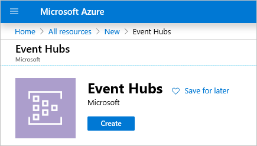
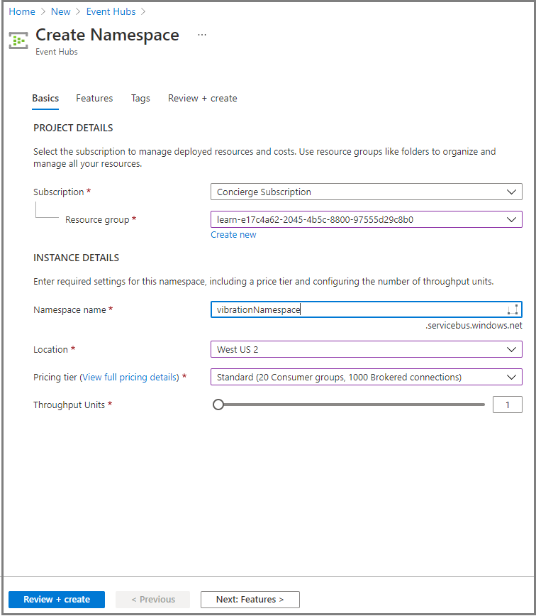
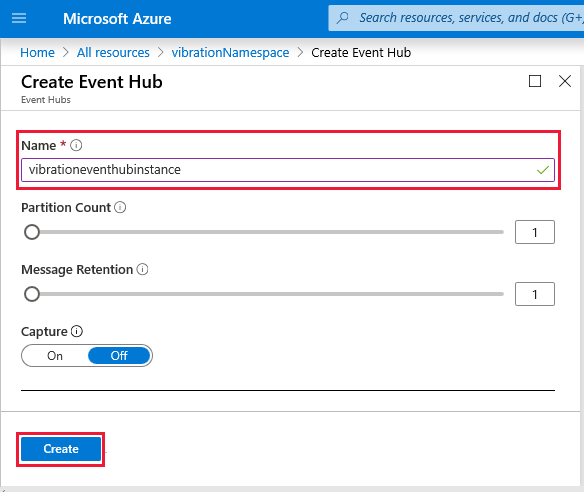
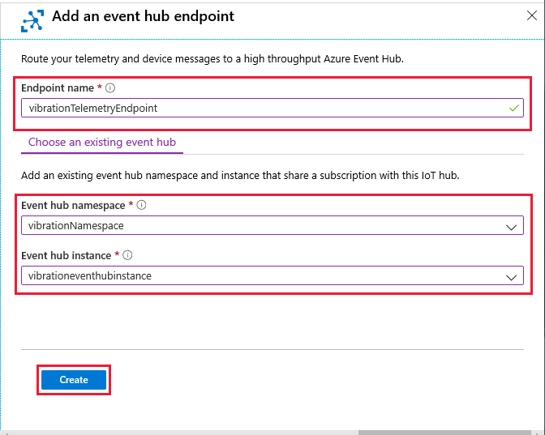
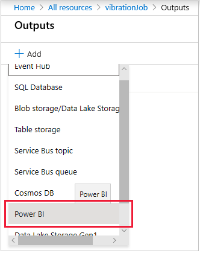
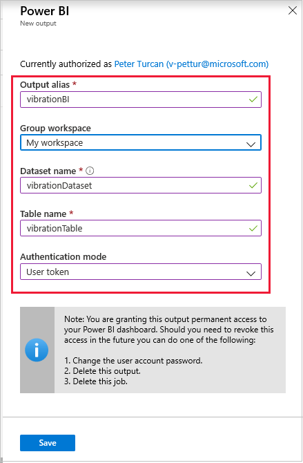
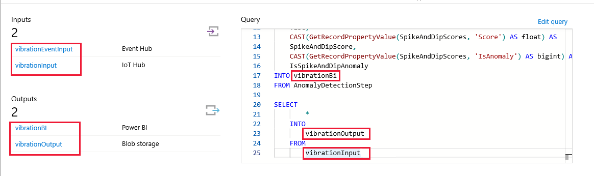
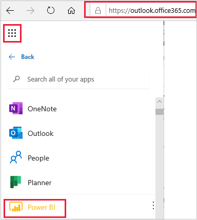
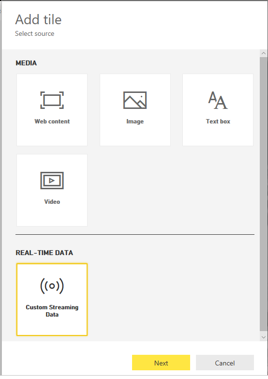
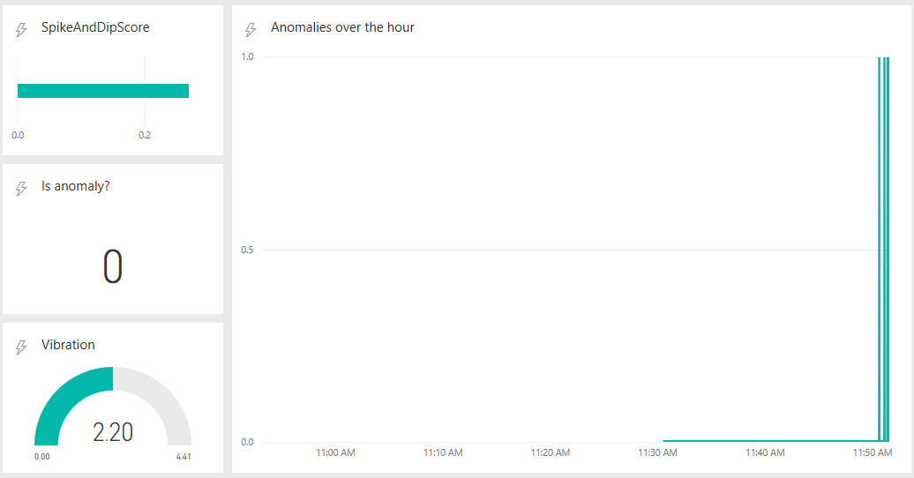

In this exercise, we're going to add a query to the Stream Analytics job, and then use Microsoft Power BI to visualize the output from the query. The query searches for spikes and dips in the vibration data, reporting anomalies. We must create the second route, after first creating an instance of an Event Hubs namespace.

## Create an Event Hubs namespace

1. From the Azure portal home page, select **Create a resource**. Search for *Event Hubs*, and select **Create**.

    [](../media/vibration-create-event-hubs.png#lightbox)

    The **Create Namespace** pane appears.

1. On the **Basics** tab, enter the following values for each setting.

    | Setting | Value  |
    |---------|---------|
    | **PROJECT DETAILS** |
    | Subscription  | Concierge Subscription  |
    | Resource group  |  <rgn>[sandbox resource group name]</rgn> |
    | **INSTANCE DETAILS** |
    | Namespace name | Enter *vibrationNamespace* |
    | Location | Select a geographical region closest to you |
    | Pricing tier | Standard |
    | Throughput Units | 1 |

    [](../media/vibration-create-namespace.png#lightbox)

1. Select **Review + create**, and when validation succeeds, select **Create**. This may take a few minutes.

### Create an Event Hubs instance

1. On the Overview pane of the namespace you just created, select **Go to resource**. The **Event Hubs Namespace** pane appears.

1. Select **Event Hub**. We need to create an instance of this namespace. Notice the **NAMESPACE CONTENTS** section has zero entries.

    [](../media/vibration-add-event-hub.png#lightbox)

    The **Create Event Hub** pane appears.

1. In the **Name** field, enter *vibrationeventhubinstance*. Leave the other fields at their defaults, and select **Create**.

    [](../media/vibration-create-event-hub-instance.png#lightbox)

1. Wait for the resource to be deployed. When deployment completes, we can start to build the route itself.

## Create a route to an Event Hub

1. Locate the **VibrationSensorHub** overview page.

1. Select **Message routing** from the left menu pane, then select **Add** to add a route.

1. Name the route *vibrationTelemetryRoute*, and then select **Add endpoint**. This time, select **Event Hubs** for the type of endpoint. The **Add an event hub endpoint** pane appears.

1. Enter *vibrationTelemetryEndpoint*, for the **Endpoint name**.

1. For **Event hub namespace**, select your entry from the previous section, **vibrationNamespace**.

1. For **Event hub instance**, select **vibrationeventhubinstance**.

    [](../media/vibration-event-hub-endpoint.png#lightbox)

1. Select **Create**, and wait for the success message.

1. The **Add a route** pane appears. Remember that "VSTel" is a string we used in the device app. Change the **Routing query** to the following.

    ```sql
    sensorID = "VSTel"
    ```

1. Select **Save**, and verify that your two message routes look like the following image.

    [](../media/vibration-two-routes.png#lightbox)

## Update the Azure Stream Analytics job query

With this new route in place, now we need to update our Stream Analytics job.

### Add a new input to the job

1. In your Azure portal, select **vibrationJob** from your list of resources.

1. Select the **Inputs** section, and select **Add stream input**, and then select **Event Hub**.

1. In the **Input details** box, enter *vibrationEventInput* as the **Input alias**. Ensure **Select Event Hub from your subscriptions** is selected, as is your working subscription.

1. In **Event Hub namespace**, select the namespace you entered in the previous section. Also, select the instance you created for **Event Hub name**. You can leave the other fields at their default values.

1. Select **Save**.

### Add a new output to the job

1. In the top path, go back to your job. You should now see two inputs. Select the icon to add an output.

1. Select **Add**, then select **Power BI**.

    [](../media/vibration-hub-new-output.png#lightbox)

1. Authorize the connection. You might need to sign up for a free Microsoft account if you don't have one already.

1. Complete the **Power BI** entry. For **Output alias**, enter *vibrationBI*.

1. For **Dataset name**, enter *vibrationDataset*. For **Table name**, enter *vibrationTable*.

1. For **Group workspace**, search for **My workspace**.

1. For **Authentication mode**, ensure **User token** is selected.

    [](../media/vibration-hub-new-bi.png#lightbox)

1. Select **Save**.

1. Again, use the top path to go back to the job.

### Update the SQL query for the job

1. Select **Edit query** to the right of the window.

1. Copy and paste the following SQL query, *before* the existing short query.

   ```sql
    WITH AnomalyDetectionStep AS
    (
        SELECT
            EVENTENQUEUEDUTCTIME AS time,
            CAST(vibration AS float) AS vibe,
            AnomalyDetection_SpikeAndDip(CAST(vibration AS float), 95, 120, 'spikesanddips')
                OVER(LIMIT DURATION(second, 120)) AS SpikeAndDipScores
        FROM vibrationEventInput
    )
    SELECT
        time,
        vibe,
        CAST(GetRecordPropertyValue(SpikeAndDipScores, 'Score') AS float) AS
        SpikeAndDipScore,
        CAST(GetRecordPropertyValue(SpikeAndDipScores, 'IsAnomaly') AS bigint) AS
        IsSpikeAndDipAnomaly
    INTO vibrationBI
    FROM AnomalyDetectionStep
   ```

    > [!NOTE]
    > This first section of this query takes the vibration data, and examines the previous 120 seconds worth. The `AnomalyDetection_SpikeAndDip` function will return a `Score` parameter, and an `IsAnomaly` parameter. The score is determined by how certain the ML model is that the given value is an anomaly, specified as a percentage. If the score exceeds 95%, the `IsAnomaly` parameter has a value of 1; otherwise, `IsAnomaly` has a value of 0. Notice the 120 and 95 parameters in the first section of the query. The second section of the query sends the time, vibration, and anomaly parameters to `vibrationBI`.

1. Select **Save query**, and go back to the home page of the job.

1. Carefully verify you've used the same names in the SQL query as you've in the **Inputs** and **Outputs**.

    [](../media/vibration-two-query.png#lightbox)

1. If all looks good, start the job again.

For a user to make much sense of the output from this query, we need to visualize the data in a friendly way. One way of doing this visualization is to create a Power BI dashboard.

## Create a dashboard to visualize the query using Microsoft Power BI

1. In your browser, go to `outlook.office365.com`. This URL will take you to the mail inbox. You may have to enter your Microsoft Account login information.

1. Use the nine dots icon (top left) to display a dropdown list. Select **All apps**. Scroll down and select **Power BI**.

    [](../media/vibration-outlook-power-bi.png#lightbox)

1. Open **My workspace**.

1. Under **Datasets**, verify that **vibrationDataset** appears. If not, you might have to wait a short time for this list to populate.

1. On the top right, select **Create**, and then select **Dashboard** from the dropdown list.

1. Give the dashboard a friendly name, for example, *Vibration dash*.

1. In the blank screen that follows, select **Add tile**. Select **Custom Streaming Data**, **Next**, and then select the **vibrationDataset** from the list of datasets.

    [](../media/vibration-dashboard-add-tile.png#lightbox)

1. For the first card, select **Visualization Type** as **Gauge**; and **Value** as **vibe**. Select **Next**, then enter *Vibration* in the **Tile details** box.

1. Select **Apply**.

1. Use the bottom-right corner icon on the tile to shrink it to the smallest allowable size.

1. Repeat the process with the same dataset and tile source for a second tile. This time, select **Clustered bar chart** as the **Visualization Type**, and **SpikeAndDipScore** as the **Value**. There's no need to add a title. Select **Next**, and then select **Apply**.

1. Again, shrink this tile to the smallest possible.

1. Create a third tile. This time, select **Card** as the **Visualization Type**, and **IsSpikeAndDipAnomaly** under **Fields**. Again, select **Apply**, and shrink the tile.

1. Now create a fourth tile. This time, it's a bit more complex. Select **Line chart** for the **Visualization Type**, and then select **time** for the **Axis**. Under **Values**, again select **IsSpikeAndDipAnomaly**. For the time window, select the last 60 minutes. Enter *Anomalies over the hour* for the tile title. Select **Apply**.

1. This time, expand the tile to a size three times larger than the smallest tiles, and arrange your dashboard similar to the following image.

    [](../media/vibration-anomalies-detected.png#lightbox)

    There's a latency with so many routes and connections, but are you now seeing the vibration data coming through?

1. Let the job run for several minutes at least before the ML model will start. Compare the console output of the device app with the Power BI dashboard. Are you able to correlate the forced and increasing vibrations to a run of anomaly detections?

If you're seeing an active Power BI dashboard, similar to the previous one, you've just about completed this module. Great work.

Finish the module with a short knowledge check.
