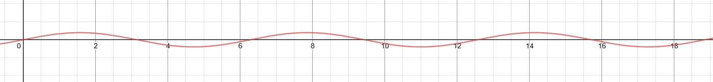

In this module, you learned how to:

- Create an Azure IoT Hub, using the Azure portal
- Create an Azure IoT Hub device identity, using the Azure portal
- Build a C# app to send device telemetry to the IoT Hub, using Visual Studio or Visual Studio code
- Define a message route, through to blob storage, using the Azure portal
- Define a second message route, through to an Azure Analytics job, using the Azure portal
- Create a query to apply a built-in ML model for anomaly detection, using SQL
- Create a dashboard to visualize data anomalies, using Power BI

## Clean up

Stop the job, and your device app.

All resources created using the sandbox will be automatically deleted. If you created any resources outside of the sandbox, delete them from your Azure portal.

No need to delete your project code though, keep it for future reference!

## Next steps

Take your interest further with:

- [IoT Hub message routing query syntax](/azure/iot-hub/iot-hub-devguide-routing-query-syntax/)
- [Azure Stream Analytics portal](https://azure.microsoft.com/services/stream-analytics/)
- [Azure Stream Analytics documentation](/azure/stream-analytics/)
- [Azure Certified for IoT device catalog](https://catalog.azureiotsolutions.com/)

And look out for additional Learn modules on IoT Hub, and Stream Analytics

## Learn more with a Channel 9 video series

- [IoT 101](https://channel9.msdn.com/Series/IoT-101/?&WT.mc_id=EducationalIoT-c9-niner&azure-portal=true)

To complete this module, and earn your just rewards, complete a final knowledge check.