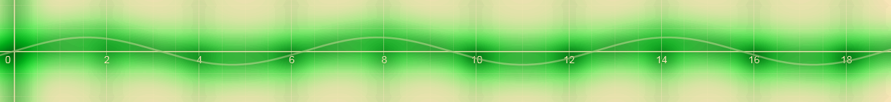

In this module, you learned how to:

- Create an Azure IoT Hub, using the Azure portal
- Create an Azure IoT Hub device identity, using the Azure portal
- Build a C# app to send device telemetry to the IoT Hub, using Visual Studio or Visual Studio code
- Define a message route, through to blob storage, using the Azure portal
- Define a second message route, through to an Azure Analytics job, using the Azure portal
- Create a query to apply machine learning for anomaly detection, using SQL
- Create a dashboard to visualize data anomalies, using Power BI

## Clean up

When you're satisfied you don't need to return to the VibrationSensorHub, delete the device, then delete the hub. These options are available in your [Azure portal](https://ms.portal.azure.com/#home).

All resources created using the sandbox will be automatically deleted.

No need to delete your project code though, keep it for future reference!

## Next steps

Take your interest further with:

- [Azure IoT Hub Documentation](https://docs.microsoft.com/azure/iot-hub//)
- [Azure Stream Analytics portal](https://azure.microsoft.com/services/stream-analytics/)
- [Azure Stream Analytics documentation](https://docs.microsoft.com/azure/stream-analytics/)
- [Azure Certified for IoT device catalog](https://catalog.azureiotsolutions.com/)

And look out for additional Learn modules on IoT Hub, and Stream Analytics.

To complete this module, and earn your just rewards, complete a final knowledge check.
