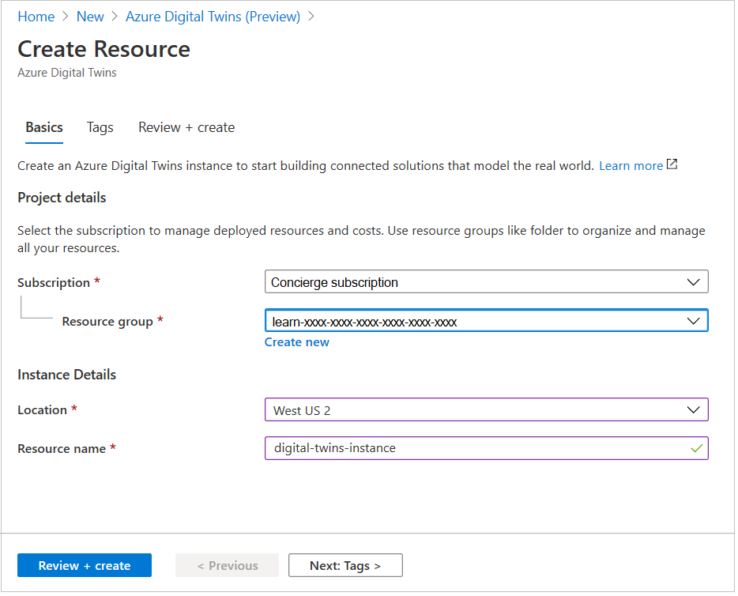
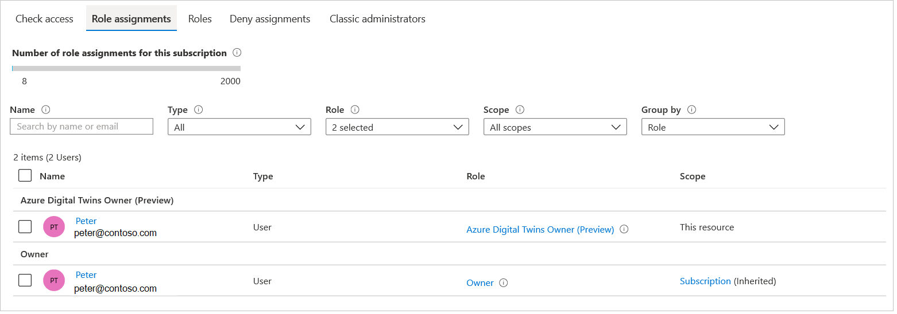

In this unit, you create an instance of a digital twins resource, and collect the connection data you need to access the instance.

## Create an instance of a Digital Twin resource

1. Right-click on [Azure portal](https://portal.azure.com/#home/?azure-portal=true), and select **Open in new window**.

1. Click **+ Create a resource**.

1. In the **Search the marketplace** text box, enter "digital twins".

1. Select **Azure Digital Twins (Preview)**, when the option appears. Click **Create**.

1. In the **Create Resource** pane that appears, you should see the **Concierge subscription** for the **Subscription** entry. Select the resource group that is associated with the sandbox resource. 

1. For **Location**, select the region nearest to you.

1. For **Resource name**, enter a friendly name, say "digital-twins-instance".

    [](../media/adt-create-digital-twins-instance.png#lightbox)

1. Click **Review + create**. Then click **Create**. 

1. Wait a few moments whilst **Deployment in progress** appears, then click **Go to resource**. You should see a screen with the title **Get started with Azure Digital Twins**.

The next step is to save some important data, used to connect other resources to your digital twins instance.

### Save the connection data

1. It's a good idea to create a text file to store, and work with, connection string data. Using a tool, such as Notepad, create a file called "twins connections.txt", or something similar.

1. Copy the name of your digital twins instance, **digital-twins-instance** to the text file.

1. Locate the **Resource group** field, near the top left of your screen. Notice that if you hover the mouse pointer over the name, a copy icon appears. Copy the name of your resource group to your text file.

1. Locate the **Host name**. Again, hover the mouse over the name, and use the icon to copy the host name to your text file.

1. The host name forms the bulk of a connection url to your digital twins instance. Complete the url by adding **https://** to the start of the host name, in your text file.

### Specify a role

> [!Important]
> Normally you would need to go through the following procedure to add a role. However, the Learn sandbox should automatically add an **Azure Digital Twins Data Owner** role, which will provide the permissions you need to complete this module. So, for the purposes of completing this module, you can skip directly to the **Register a new client app** section. This section here is available for future reference, if you take your involvment in Azure Digital Twins to the next level!

1. Locate, and select, the **Access control (IAM)** entry, in the left menu.

1. If you click on **Role assignments**, you should see your name with the **Owner** role. This is _not_ the role that you need to access the resource. The role you need is **Azure Digital Twins Owner (Preview)**.

    > [!Note] If you get the following warning message, ignore it, you don't need to see other role assignments.
    [](../media/adt-aad-permission-error.png#lightbox)


1. Click **+ Add**, then select **Add role assignment**.

1. In the **Role** field, search for **Azure Digital Twins Owner**, and select it.

1. The **Assign access to** field should say **Azure AD user, group, or service principal**. 

1. In the **Select** field, enter enough of your name, or email, so that your full name and email address appears in the search results list.

1. Select your entry, and notice that your details now appear under a **Selected members:** title.

1. Click **Save**. After a few seconds, you should see your details added to the role assignments, but now with the correct role.


    [](../media/adt-create-role-assignment.png#lightbox)


## Register a new client app

The next step is to create an app registration with Azure Active Directory. This enables us to interact with Azure Digital Twins through a client app.

1. Open a text editor (Visual Studio, Notepad, or similar), and create a new Json file. 

1. Enter the following code to your file.
    ```json
    [{
        "resourceAppId": "0b07f429-9f4b-4714-9392-cc5e8e80c8b0",
        "resourceAccess": [
        {
        "id": "4589bd03-58cb-4e6c-b17f-b580e39652f8",
        "type": "Scope"
        }
        ]
    }]
    ```

1. Save the file, with the name **manifest.json**.

1. Open an Azure Cloud Shell screen, by selecting the icon top right of your Azure portal.

    [](../media/adt-cloud-shell-icon.png#lightbox)

1. Select the Upload/Download icon for the Azure Cloud Shell, and click **Upload**.

    [](../media/adt-cloud-shell-upload-icon.png#lightbox)

1. Navigate to the **manifest.json** file you created, and click **Open**.

1. Run the following command. This command creates an app registration.

    ```json
    az ad app create --display-name chocolate-app --native-app --required-resource-accesses manifest.json --reply-url http://localhost
    ```

1. To verify success, in the Azure portal, navigate to the app registration overview page. Do this by selecting the **Azure Active Directory** icon, in the Microsoft Azure home page. Then, click **App registrations** in the left menu. Finally, locate **chocolate-app** in the list of registrations, and select it. This process should take you to the **Overview** page for the app.

1. Find **Manifest** in the left menu of the **Overview** page, and check that the **requiredResourceAccess** entry matches the manifest file you created earlier.

    [](../media/adt-chocolate-app-manifest.png#lightbox)

If the manifest file looks correct, this is good progress.

### Verify API permissions

Read/Write access to the Azure Digital Twins API is required. Verify this access is available.

1. Select **API permissions** in the left menu for the **chocolate-app**.

1. You should see that **Read/Write** access is granted.

1. Click on the **Read.Write** link, to verify that admin consent is _not_required. It will certainly not be required if you're using a sandbox subscription. If you're using an organization’s subscription, and admin access _is_ required, you would have to approach the admin for the subscription, to approve the access.

1. In the left menu, click **Overview**.

## Save the connection data

The two important pieces of information for your app are the **Application (client) ID**, and **Directory (tenant) ID**.

1. Locate these two values, which are near the top of the **Overview** page for the app.

    [](../media/adt-chocolate-app-ids.png#lightbox)

1. Hover your mouse over each one in turn, select the copy icon, and paste the ID into your text file. Adding a note that one is the "client ID", and the other the "tenant ID".

Great work. You have completed the bulk of the setup for this module. Let's change pace for a bit, and go over the format and purpose of the digital twin models.


