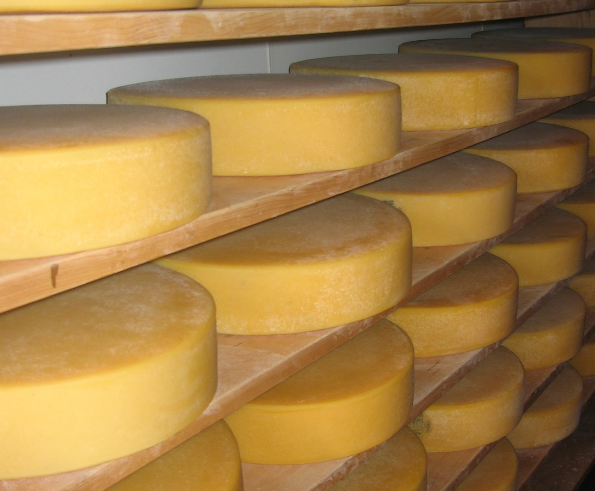

Internet of Things (IoT) devices are usually generating a massive volume of data to analyze. 
A decent part of them are time sensitive. Even if you can store them in a traditional SQL
database, time-series databases are better suited for this type of data.

## What is Time Series Insights?

Azure Time Series Insights is a managed service that allows to store, visualize, and query a large amount of time series data.

When developers or architects wants to create a service to store and query data from IoT devices, they may think about a classic architecture. A worker and a SQL database may suffice, right? IoT architectures have specific challenges that require specialized products like Time Series Insights.

Such system should first integrate with cloud gateways like Azure IoT Hub and Azure Event Hubs. It requires parsing JSON from messages and structures in clean rows and columns. You may also need to join metadata with IoT device-generated data. All these features are available with a few clicks with Time Series Insights.

As IoT devices can generate millions of events per minutes, storing them is a challenging task. Time Series Insights is managing events data storage for you. With a column-store database, and both warm and cold storage, you can interactively query billions of events in seconds–on demand.

With Time Series Insights, you can query your data directly in the Time Series Insights explorer. You can also use APIs that are easy to integrate to embed your time series data into custom applications.

## Learning objectives

In this module, you will:

- Create an IoT Hub and generating data from simulated devices, using the Azure CLI and a .NET application
- Create a Time Series Insights (TSI) Environment, using the Azure IoT portal
- Connect to IoT Hub with Time Series Insights (TSI), using the Azure IoT portal
- Use Ad Hoc queries to gain insights, using Time Series Explorer

## Prerequisites

- An introductory knowledge of Azure IoT
- Basic understanding of the Azure CLI tool from the **Control Azure services with the CLI** module.
- Ability to use C#, at the beginner level (all the code will be written).

## Learn the scenario

Suppose you work for Contoso. It offers a solution to maintain and monitor cheese caves' temperature and humidity at optimal levels. You have been working with gourmet cheese making companies for a long time.
You've rolled out their "Asset Condition Tracking System" that monitors the environmental conditions of cheese containers during shipment.

Your team decides that further improvements to the monitoring system will require near real-time data exploration and root-cause analysis.

## What you will do in this module

In the following units you'll go through these steps:

- Set up an Azure IoT environment and execute code simulating the devices.
- Set up a Time Series Insights environment and collect data from IoT Hub.
- Create ad-hoc queries to explore data available

> [!NOTE]
> This module is targeting _Azure Time Series Insights Preview_. We will closely monitor 
> the release of this version and update the content of this module accordingly.
> Meanwhile, do not hesitate to report an issue with the link at the bottom of the page.
