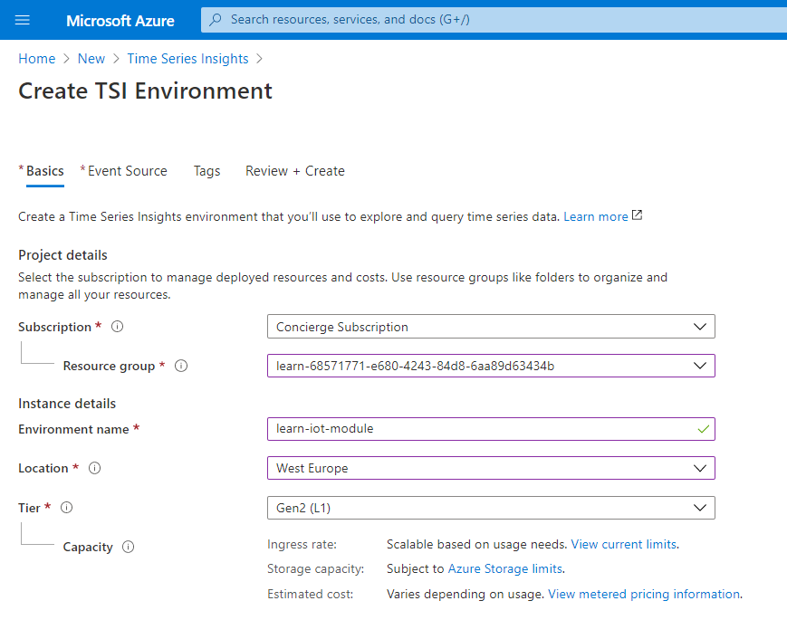
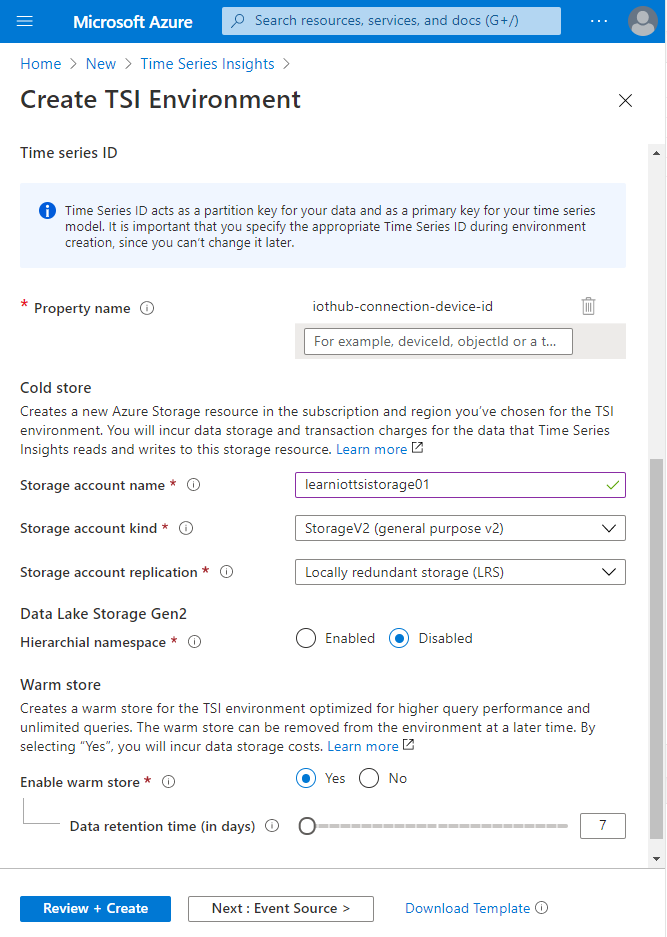
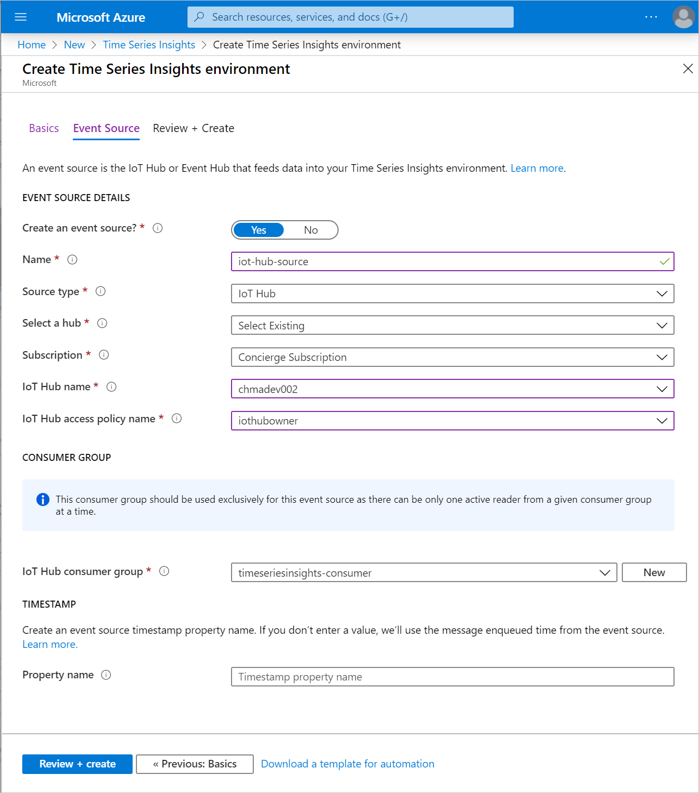

In this unit, you'll create a Time Series Insights (TSI) environment and configure ingesting events from IoT Hub.

## Create Time Series Insights

1. Once it's activated, sign into the [Azure portal for sandbox](https://portal.azure.com/learn.docs.microsoft.com?azure-portal=true). Make sure to use the same account you activated the sandbox with.
1. Click on **Create a resource**
1. Type _Time Series Insights_ in the Search box and press **Enter**, then click on **Create** button

You'll now have to specify necessary information for creating a new information: 

1. In the **Subscription** dropdown, you should already have one subscription selected, _Concierge Subscription_.
1. In the **Resource group** dropdown, select the resource group created by the sandbox, <rgn>[sandbox resource group name]</rgn>.
1. In the **Environment name** field, specify a unique name.
1. In the **Location** dropdown, select the location closest to you.
1. In the **Tier** dropdown, select **Gen 2** to use Time Series Insights V2.


## Configure Storage options

Time Series Insights needs a way to partition your data, with a value contained
in your messages. That's the name of the property containing your value that you need to specify next. As messages are coming from IoT Hub, specify the value below in **Property name** field.

```
iothub-connection-device-id
```

Time Series Insights allows you to store your data in two different stores:

- **A cold store**, for long-term durable storage. It's the default storage option.
- **A warm store**, managed by Time Series Insights, optimized for higher query performance, and unlimited queries. It's an optional feature that can be enabled at creation time or later on.

For this module, we'll enable both. Let's start with configuring the cold store. We'll have to create a new storage account.

1. In the **Storage account name** field, specify a unique value.
1. In the **Storage account kind**, leave _StorageV2_ selected.
1. In the **Storage account replication** dropdown, for this course, leave _Locally redundant storage (LRS)_.
1. In the **Enable warm store** selector, select _Yes_. Leave the default **data retention time** as is.
1. Click on **Next: Event Source >>** button.



## Setup event source

We'll now configure the data source used by Time Series Insights to populate the database. On **Event Source** tab of the **Create Time Series Insights environment**:

1. In the **Source type** selector, Select _IoT Hub_.
1. In the **Name** field, type a unique name.
1. In the **Subscription** dropdown, leave the default value _Concierge Subscription_.
1. In the **IoT Hub name** dropdown, select the IoT Hub created at the previous step.
1. In the **IoT Hub access policy name** dropdown, select _iothubowner_.

> [!NOTE]
> The _iothubowner_ access policy gives a lot of rights.
> In a production environment, it's best practice to create a new Access Policy within Azure IoT Hub to use for configuring Time Series Insights access. This will enable the security of TSI to be managed independently of any other services connected to the same Azure IoT Hub. We are not doing that here for convenience reasons.

We'll now create a dedicated consumer group for the IoT Hub. It allows you to have several applications - including TSI - to process messages from IoT Hub without interfering with each other.

1. In the **Consumer group** section, click on the **New** Button.
1. In the **New consumer group name** field, type `tsi-consumer`, and click the **Add** button.
1. Under the **TIMESTAMP** section, leave the **Property Name** blank.
1. Click on the **Review + create** button at the bottom-left of the page.
1. Click on **Create** button.



Deployment of Time Series Insights will take a couple of minutes to complete. Once your Time Series Insights deployment is complete, you've completed this unit.

In the next unit, we'll explore data gathered in Time Series Insights.