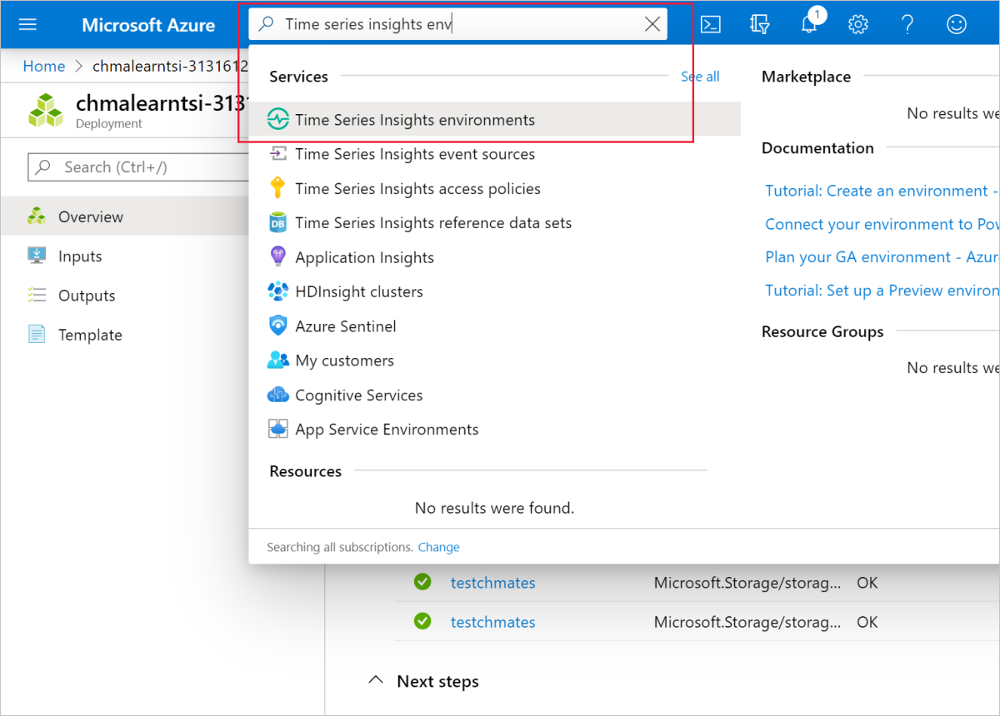
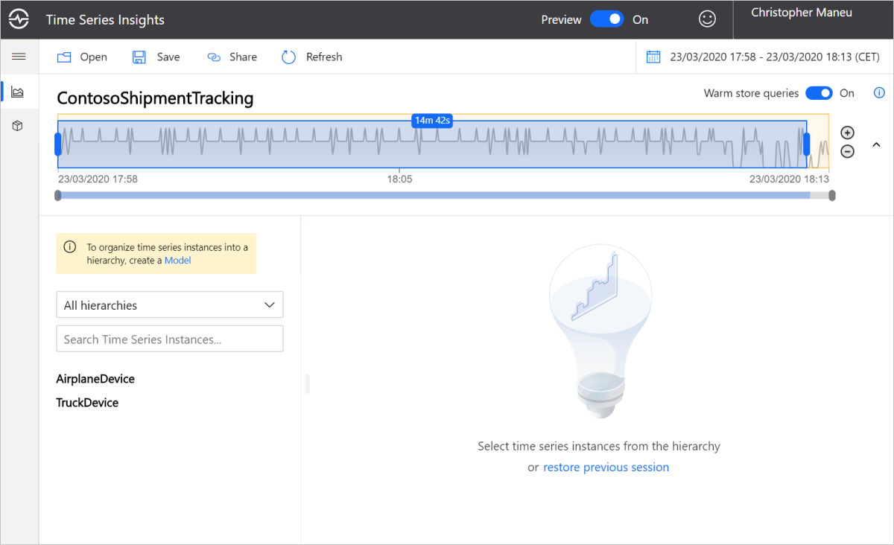
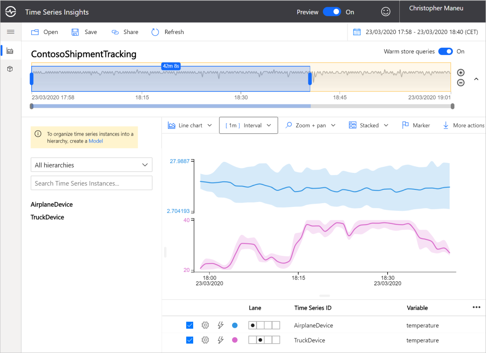
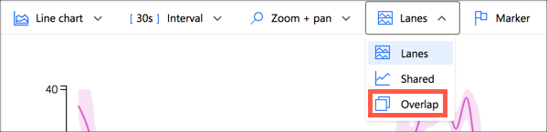
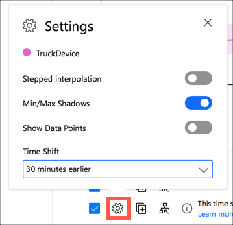
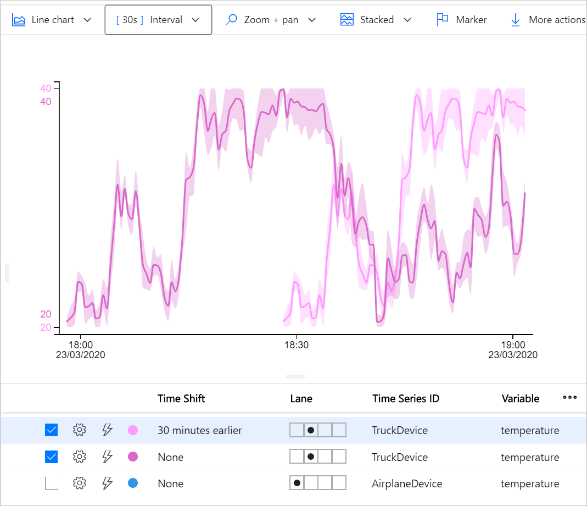

In this unit, we'll explore data gathered by Time Series Insights. 

## Access Time Series Insights Explorer

1. Once it's activated, sign into the [Azure portal for sandbox](https://portal.azure.com/learn.docs.microsoft.com?azure-portal=true). Make sure to use the same account you activated the sandbox with.
1. In the search box at the top of the portal, type **Time Series Insights** and click on the appropriate result in the _Services_ category.

1. Click on the name of your Time Series Insights environment you've created in the previous unit.
1. In the Time Series Insights page, click on *Go to TSI Explorer* button at the top.

Your browser will now open a new window with Time Series Insights main page.

> [!TIP]
> In a real project, you can bookmark this link for future usages, so you can explore your data without having to go through Azure Portal First.

## Explore Data ingested by Time Series Insights

One of the first actions you'll want to do is to explore the data now easily available.

1. On the left pane, click on **AirplaneDevice**, check the *temperature* property and then click **Add**
1. On the left pane, click on **TruckDevice**, check the *temperature* property and then click **Add**

You can now see two different graphs showed in the center of the page. If you hover your cursor over it, you can see detailed values.

IoT devices may send a large number event within a short period of time. For better readability, you may want to digest data over a time interval. You can adjust the interval by clicking down the **Interval** selector above the graph area.

You should now have a similar view, with the graph lines that may be different depending on the data generated by the simulator.

> [!TIP]
> When you found something interesting, you can save your setup by clicking the **Save** button at the top of the screen. You can also export your graph or your data by clicking the **More actions** button on the right of the screen.

## Compare time-sensitive data

Providing a visualization of your timed data is interesting. Depending on the context, you'll also need to compare them with data from a previous time frame. For example, is the data from today is similar to data from last week?

You can achieve Time comparative analysis with Time Series Insights.

> [!NOTE]
> In order to execute the next steps, you'll need to leave the simulator code run for at least one hour.

1. Un-check the *AirplaneDevice* row to remove the data from the chart
1. Change the chart options from **Lanes** to **Overlap** to make it easier to compare the time series data

    

1. Click on the **Duplicate time Series** button at the bottom of the page () on the *TruckDevice* row. This will add a duplicate row for the *TruckDevice*.
1. On the new row, click the *Settings* button.
1. In the popup, you can change the time frame you're using for comparing data. You can select **30 minutes earlier** and click on **Apply** button.

    

1. The default color for the new time series is similar to the original time series color. Click the color option and select a different color for the new time series.

You'll now see two lines on your graph for the *TruckDevice*, with a different shade of color. As you can see in the screenshot below, there's quite a difference between the actual temperature and the temperature 30 minutes ago.

You have now successfully displayed data ingested by Time Series Insights.
