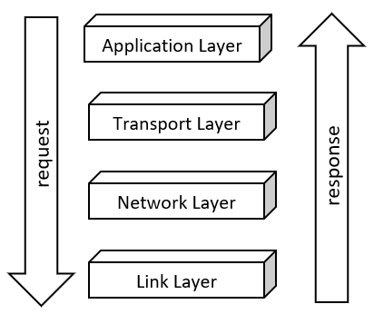

Welcome to networking and Azure RTOS NetX Duo (from now on, NetX). In this module, you'll be introduced to NetX, which is a high-performance real-time implementation of the TCP/IP stack (or protocol suite) designed exclusively for embedded ThreadX-based applications.

When you complete this series of modules, you'll have acquired a solid foundation of NetX concepts and techniques. You'll be prepared to apply what you have learned, and you'll be ready to expand your knowledge about the wonderful world of networking.

## Learning objectives

In this module, you will:

- Learn the basic components of NetX
- Learn about the purpose of the protocols
- Learn about the four layers of the TCP/IP model

## Prerequisites

- Completion of the [Azure RTOS ThreadX learning path](/learn/paths/azure-rtos-threadx/).
- Set up your [GitHub Codespaces](https://github.com/features/codespaces) development environment for your projects in this learning path.
- Working knowledge of C or C++, and GitHub

## TCP/IP Stack

The TCP/IP stack is where everything happens. Do you want to send a message? Do you want to send a photo? If so, the TCP/IP stack is where these activities happen. The TCP/IP stack uses a four-layer model as illustrated in the following image.

This illustration is an overview of the TCP/IP model, and we’ll get into more detail later. This four-layer model consists of a series of protocols, each performing a specific operation. Requests originate at the application layer and are processed through each successive layer until they reach the link layer. Responses to requests originate at the link layer and proceed through the successive layers until they reach the application layer. A request can take many different forms, such as sending an email, transmitting a photo, or requesting a web page.

## Protocols

There are millions of computers, phones, tablets, and other devices that use the Internet to communicate and share information. For these devices to use the Internet, they must observe a set of established rules and procedures that are called protocols. You'll use many different protocols as we study the TCP/IP model, which is actually a protocol suite.

## Application layer

The application layer establishes the connection between data and the application. Following is a table describing several typical protocols.

| Protocol                                    | Description                                                                                               |
| ------------------------------------------- | --------------------------------------------------------------------------------------------------------- |
| `Hyper Text Transfer Protocol (HTTP)`       | Underlying protocol for the world wide web; defines how hypermedia messages are formatted and transmitted |
| `File Transfer Protocol (FTP)`              | Client-server based protocol for transfer of files between client and server over the network             |
| `Simple Mail Transfer Protocol (SMTP)`      | Rules and semantics for sending and receiving emails                                                      |
| `Domain Name System (DNS)`                  | Naming system for devices in networks; provides services for translating domain names to IP addresses     |
| `TELNET`                                    | Provides bi-directional text-oriented services for remote login to the hosts over the network             |
| `Simple Network Management Protocol (SNMP)` | Manages and monitors the network; organizes information about the networked devices                       |

## Transport layer

The transport layer is responsible for managing the flow of data between hosts on the network. The data is divided into numbered segments and ensures that all segments are received correctly. Following is a table describing the more commonly used protocols.

| Protocol                              | Description                                                                                      |
| ------------------------------------- | ------------------------------------------------------------------------------------------------ |
| `Transmission Control Protocol (TCP)` | Provides reliable connection-oriented service between two hosts                                  |
| `User Datagram Protocol (UDP)`        | Provides best-effort sending and receiving of data between two hosts in a connection-less manner |

## Network layer

The network layer is sometimes called the Internet layer and it's responsible for sending and receiving simple packets across the network. Following is a table describing some of the more commonly used protocols.

| Protocol                                     | Description                                                                                                                |
| -------------------------------------------- | -------------------------------------------------------------------------------------------------------------------------- |
| `Internet Protocol (IP)`                     | Provides a best effort delivery service and transports data packets that travel over different paths across multiple nodes |
| `Address Resolution Protocol (ARP)`          | Maps the logical address or the Internet address of a host to its physical address                                         |
| `Reverse Address Resolution Protocol (RARP)` | Finds the Internet address of a host when its physical address is known                                                    |
| `Internet Control Message Protocol (ICMP)`   | Monitors the sending of the requests and the error messages                                                                |
| `Internet Group Message Protocol (IGMP)`     | Allows the transmission of a message to a group of recipients simultaneously                                               |

## Link layer

The link level is handled by the network driver. This level is typically targeted towards Ethernet, but it could also be fiber, serial, or virtually any physical media.

## Reference documentation for NetX Duo

We cover the basics of NetX in this learning path, but detailed information about NetX protocols and services can be found in the [NetX Duo user guide](/azure/rtos/netx-duo/).
