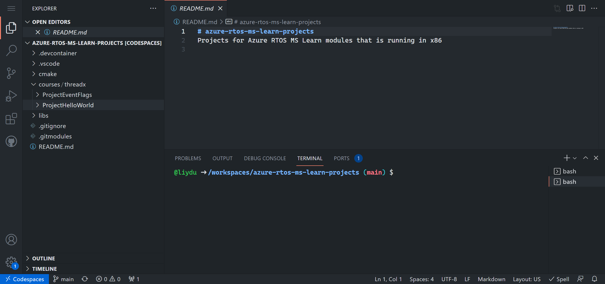
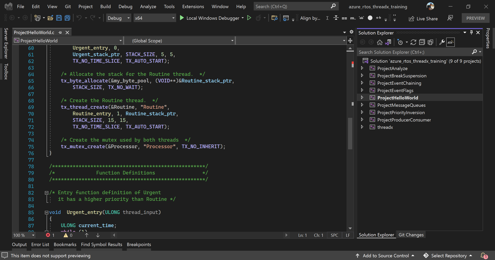

## Introduction

This unit provides instructions for how to set up your development environment so that you can complete the exercises in this learning path.

We provide two ways for setting up your environment:

- Use [GitHub Codespaces](https://github.com/features/codespaces). This feature is the preferred way because you won't need to install the toolchain on your PC.

- Use [Visual Studio](https://visualstudio.microsoft.com/). Use Visual Studio if you either don't have Codespaces access yet for your GitHub account or you prefer to use a local environment on your Windows PC.

## Use GitHub Codespace

1. Open the [azure-rtos-learn-samples](https://github.com/Azure-Samples/azure-rtos-learn-samples) GitHub repo in browser.

1. From the repo page, create a new codespace. Wait until the codespace is set up.

1. The VSCode web opens and you can see the projects in the Explorer view under `courses/threadx`. Follow the instructions of the unit to build and run the project.

    

> [!TIP]
> If you are using macOS or Linux and do not have the access to Codespaces in GitHub, then you can use [local devcontainer](https://code.visualstudio.com/docs/remote/containers) with the same repo.

1. Follow the *Build and debug* unit in each module for detailed steps.

## Use Visual Studio

1. Download and install latest [Visual Studio](https://visualstudio.microsoft.com/) with the **Desktop development with C++** workload. You can use the Community version, which is free of charge.

1. Download and unzip latest [sample projects for Visual Studio](https://github.com/Azure-Samples/azure-rtos-learn-samples/releases/tag/vs).

1. Open `training_projects\azure_rtos_threadx_training.sln` in Visual Studio and follow the instructions of the unit to build and run the project.

    

1. Follow the *Build and debug* unit in each module for detailed steps.

## Reference documentation

- [Azure RTOS ThreadX documentation](/azure/rtos/threadx)
- [Azure RTOS ThreadX User Guide](/azure/rtos/threadx/about-this-guide)
- [Azure RTOS GitHub repositories](https://github.com/azure-rtos)
