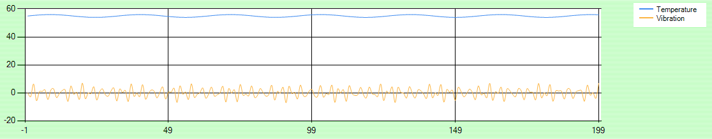

Taking a first step into building an Azure IoT app, even a short test app, is going to require you to think about your storage options. If you're new to Azure, the range of resources available can be bewildering. This module introduces the architectural concepts of cloud storage solutions, and how they relate to IoT applications. The most common storage options are described at a high level. You won't be asked to do any coding, nor build an app using the portal. To complete the module you'll have to read the units, and pass a few knowledge checks along the way!

The purpose of this module is to give you enough info on Azure storage for IoT, that you can make an informed decision when you do build your first IoT app.

## Learning objectives

In this module you will:

- Learn about the hybrid lambda architecture of IoT
- Learn when to use Azure Blob storage, and when to upgrade to Azure Data Lake storage
- Learn when to create a Cosmos DB database
- Learn the purpose of Time Series Insights

## Prerequisites

- An introductory knowledge of Azure IoT

## Learn the basics of Azure IoT

The concept of the Internet of Things (IoT) is that one or more, could be thousands, of remote sensor devices are pumping out telemetry values. These values are received by an IoT Hub, an Azure resource designed to handle telemetry readings from all these devices. The IoT Hub routes the data to the storage, or analysis, processes that you specify.

There are several distinct purposes of recording telemetry readings:

- To be analyzed for anomalies, as part of a preventive maintenance process.
- For visualization by a remote human operator, to help in decision making.
- To be archived, perhaps for later analysis.

These distinct purposes have conflicting storage requirements. This module discusses the various Azure storage solutions specifics, and gives some introductory advice for newcomers to Azure IoT.
