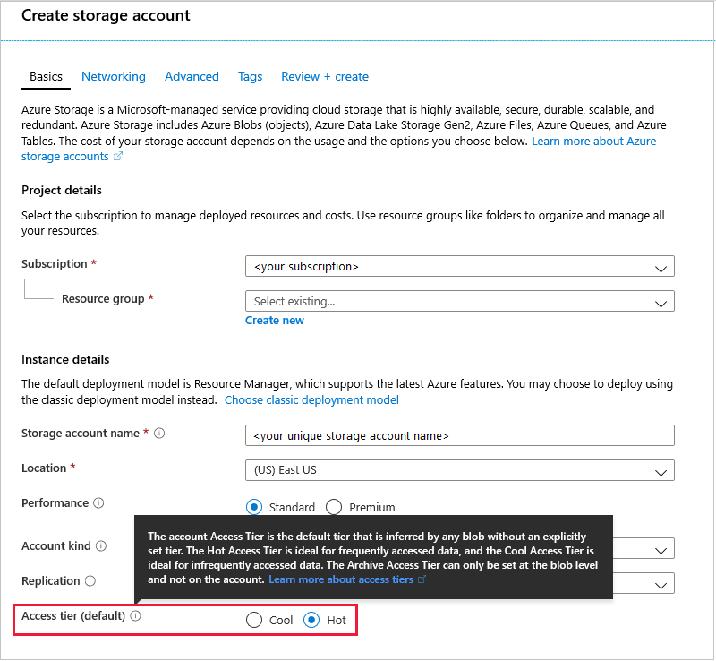
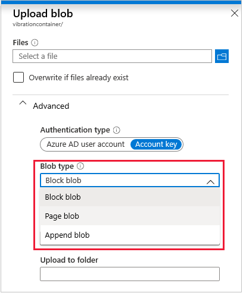

_Blob storage_ is a fun term, but isn't as unstructured as it sounds. It's referred to as _unstructured_ storage, but that means each entry in the storage doesn't conform to any particular model. For example, one entry might be video, another an audio recording, a third a group of text files, and so on. Blob storage is similar to the files and folders structure you're used to on your laptop or desktop computer.

An example of _structured_ storage would be a large database, each entry in the database containing similar information, and each entry accessible by a set of similar API calls. Blob storage isn't suitable for storing volumes of well-ordered data. For that kind of data, consider the Cosmos DB resource, described in the next unit.

When you create a _storage account_ via the Azure portal, Blob storage is the default option. In the following image, note the use of the hot and cool metaphors to identify the purpose of the storage.

### Specify the type of Blob storage

Blob storage, by default, has a _general purpose_ setting applied. Whatever data you route to the account is stored with reasonable access settings.

You can improve the efficiency of your Blobs by specifying a role for them, when uploading data. There are three roles: _Block blob_, _Page blob_, and _Append blob_.

Let's start with the append blobs as it's the easiest to describe. An append blob, as its name implies, can  _only_ be appended to, and is ideal for log files. A log file is never edited, and just grows and grows! There's plenty of space in the cloud.

Page blobs are there for data that needs frequent read/write access. Consider a page blob to be like a remote hard disk. For any data that is a work-in-progress, a page blob is the ideal cloud storage. High performance, and low latency, are the key assets of page blobs.

Block blobs are a bit more complex. When you have a large volume of data, it can be more efficient to access that data if it's divided into blocks. Each block has a unique ID. You have access to this ID, and can use it to read from, and write to, a specific block. Block blobs can be written to in parallel, and can be uploaded in any order. Basically, block blobs are for handling large amounts of data over a network. There isn't really an equivalent type of storage on your personal PC.

There are upper limits to Blob storage page and block sizes, but these limits are high (hundreds of Gigabytes, or even Terabytes). These limits have been increased over time. Refer to the documentation links, given in the summary of this module, to educate yourself on the current limits. As limits are reached, you'll need to increase your storage allocation. For text-based telemetry data though, the limits may not be reached for years, if ever!

### Use APIs to access Blob storage

Blob storage can be accessed via API calls. Developers can write apps, of any complexity, to read and write data held in Blob storage. The APIs are available via REST calls, Azure PowerShell, or the Azure CLI. Client libraries are available for .NET, Java, Python, Node.js, and other languages.

### Consider data security

Azure Blob storage is automatically encrypted, at no extra cost and with no extra setup. The system used is called _Storage Service Encryption_, or SSE. In addition, data can be secured _in transit_, between an app and Azure, using _Client-Side Encryption_, HTTPS, or SMB 3.0.

## Upgrade to Data Lake Storage Gen2

The time to consider upgrading from Azure Blob to Azure Data Lake storage comes when you have an enormous amount of data, _big data_ in cloud terminology. Blob storage is easily accessible, secure, and low-cost. However, with big data, data organization becomes an issue. A Data Lake provides additional features to help organize, and secure, vast amounts of data.

To help organize data, a concept called _hierarchical namespaces_ is available in a Data Lake. A hierarchical namespace can be used to encapsulate a collection, large or small, of data objects and files. It basically adds another level of reference, that is used to make access to the data more efficient.

Security in Azure Data Lake is on the file, or folder, level, or greater granularity if needed. All the security, and API access, features of Blob storage apply to Data Lake storage.

Finally, Data Lake analytics, available through REST APIs, are optimized for big data. Your queries should still run in a decent amount of time, even if they're trawling through a sea of data.

## Best practices

Blob storage is your _go to_ solution for cloud IoT storage. Blob storage is almost always the right starting point for any venture into Azure IoT. You may never need to look at other storage options. However, for _big data_ there's the option of upgrading to a Data Lake. Upgrade if organization, security, or analytics performance, become an issue with your Blob storage.

In the next unit, we'll look at the solution for _structured_ storage, when your data is more akin to a database, than a collection of files and folders.

You're half way through this module, time for a quick knowledge check!
