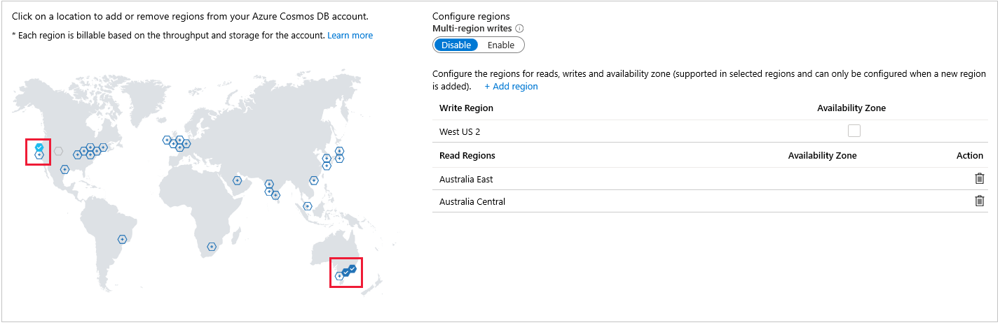
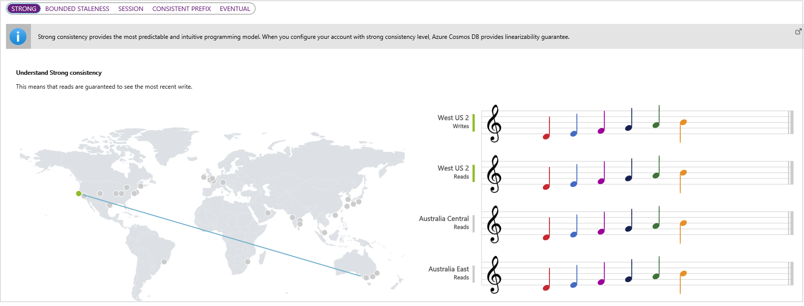
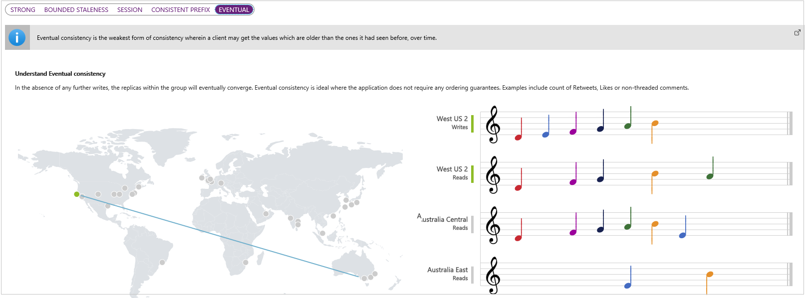
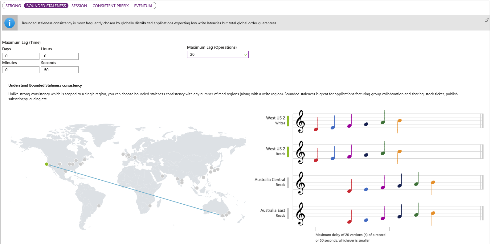
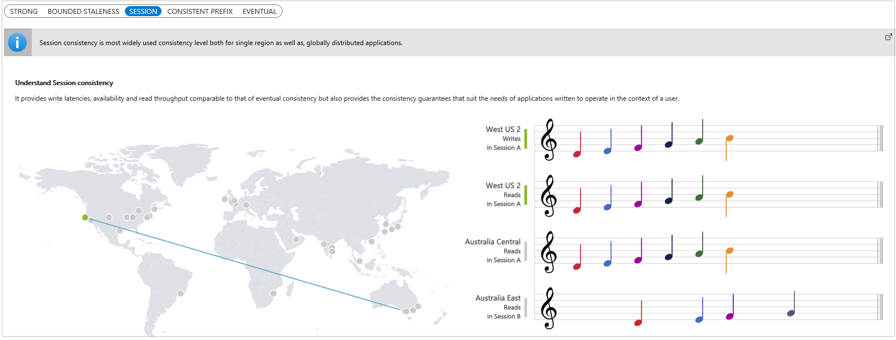
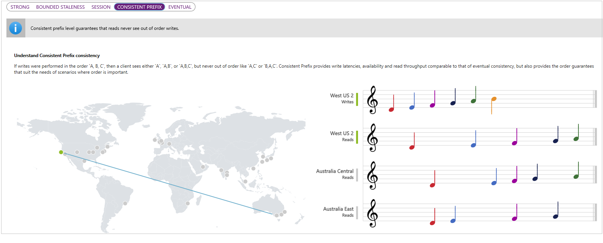

Cosmos, another word for "universe", implies that Cosmos DB is the solution for world-wide applications. Another feature of the Cosmos DB resource is that it's well structured. Not the collection of stuff that can be stored in a Blob. The obvious example is a database, where each entry in the database has a consistent set of fields.

Access to the data in a Cosmos DB resource is made through queries built from API calls. Cosmos DB supports a range of APIs, including SQL API, Mongo API, Gremlin (graph) API, Azure Table API, and the Cassandra API. At the lowest level, a Cosmos DB consists of JSON objects.

A Cosmos DB resource is about big data, and world-wide access. An example might help.

## Consider a worldwide scenario

Suppose you run a company that packages and ships products from one location in the US. The packages run along a conveyor belt, which, like most machinery, vibrates. If the vibration gets out of hand, you have to stop the belt and your business grinds to a halt. Sensors on that conveyor belt detect vibration, and the vibration telemetry is sent to an Azure Cosmos DB database in the West US region, for real-time analysis. However, you have two partners in Australia. One partner reads your telemetry data for a deep analysis. The second partner is a university, and you provide your data for research purposes. Each location has its own copy of all the data.

You might define the following **Write Region** and **Read Regions**, when you set up your Cosmos DB database.

The reason that there are local versions of the data, is that there will be less latency when your partners access the data. And, important to your partners, it's less costly to work from local cloud storage.

Whenever new telemetry values are set in the US West location, that update is automatically propagated to all read locations. You _can_ have multiple write locations, but as that complicates the explanation of data consistency, we'll leave it out for now.

### Prepare for the worst

Secondary read locations shouldn't be confused with _failover_ locations. A failover location, which is also set in the Azure portal, specifies the region which should take over when something bad happens in your primary region. Something bad could be a natural disaster, power outages, or civil disturbance. Or anything else that might bring the reliability of servers in the primary region into question. Sometimes a cloud user will specify a _manual failover_, where human operator intervention is needed to trigger the failover. Sometimes _automatic failover_ is specified, where the responsiveness of a region is constantly tested, and a failover occurs if the tests fail. Leaving things entirely up to automated tests though, can be a bit daunting.

Having set up your database, you have to consider how important it is that everyone the world over gets exactly the same data at exactly the same time.

## Set the data consistency

In our scenario, there are three company data locations: US West, Australia East, and Australia Central. Only US West writes to the data, but all three locations can read it. Data consistency answers the following question: After US West writes an update to the data, what should all read locations get when they read the data? If there's zero latency, then this question would be moot. However, latency is a real issue in the cloud, and it needs to be addressed.

When a write is made to update data in US West, that change will be propagated automatically to the other locations. However, the update will exist in an inaccessible state, until the go-ahead is received that the update can now be read. This inaccessible state exists in all three locations, even the write location.

If all locations, including US West, should get the same result after a read, then _Strong_ consistency should be applied. In this case, the system waits for an acknowledgment from all locations that they've received the update, before giving the all clear to make the data readable. This process ensures worldwide consistency, but comes at the cost of all locations having to wait for the slowest to receive the update. This latency may only be seconds, but the latency exists so should be considered.

In _Strong_ consistency, every location will get identical data on every read. Note, in the following image, how all locations get exactly the same notes (updates) at the same time, but that there's a short delay before any location can read an update.

At the other end of the spectrum, there's _Eventual_ consistency. In this scenario, each location gets the update when it arrives. This process clearly means some locations might have stale data for a short while, before the local data is updated. Notice too, in the following image, that if the latency is long enough, several writes might be replaced by a single value in a read location. This anomaly occurs if the writes arrived at about the same time, and only the latest of these writes is stored in that locale. Notice too, that updates can arrive out of order.

These two consistency strategies are the most established in the data propagation world. However, three other variations are available in Cosmos DB.

With _Bounded_ consistency, you set a time threshold, or version update count threshold. This threshold is the tolerance of each location for stale data. If a location reads data, only to find the data is outside of the threshold, then the system will wait until a value is available that is within the threshold. For example, if a threshold is set at 20 seconds, then only data that is stale by 20 seconds or less, is acceptable. Set this threshold to zero, and you have _Strong_ consistency.

The default consistency is given the name _Session_ consistency. In this scenario, the write location has immediate access to the updated data. The read locations get the data in the right order, but there will be a different latency for each read location.

The last of the five options is called _Prefix_ consistency. With this setting, all locations receive the updates in the correct order, with no update being skipped over. The _Session_ consistency level described earlier, uses this _Prefix_ consistency for all read locations.

After a Cosmos DB resource has been set up, you get to choose the default consistency level in your Azure portal.

So what consistency level would be right for our vibration data example?  _Strong_ consistency would unnecessarily delay the US West location's real-time analysis. _Eventual_ consistency might provide unwanted skipped data for deeper analysis. Probably the default _Session_ consistency would work well.

A more complex scenario exists if your IoT devices are in multiple regions. You would have to enable multiple write regions. Keeping the data in sync is a likely priority, if running analysis on the combined data. In this case, set a stronger consistency level such as Strong, or Bounded.

In the scenario where the read regions are only storing the data, or performing cold analysis, the Prefix consistency level would work too. Given the order of telemetry readings is important for analysis, the lowest consistency level, Eventual, is unlikely to be appropriate for most IoT applications.

### Consider the response time to time-critical data

Another issue you need to consider in your choice of IoT cloud services, is the speed of response to an apparent issue in the data. In our conveyor belt example, there's analysis of vibrations to give early warning of failure. How much lag can there be after data anomalies are detected, before preventive maintenance is required? The kind of services you'll need depends on whether this answer is days, hours, minutes, or seconds. Mechanical systems lean towards the longer time spans, high-energy systems might need quick intervention!

## Best practices

A Cosmos DB resource is usually a more expensive option than Blob storage. Create a Cosmos DB resource when you have a mass of well-structured, time critical data. The case for a Cosmos DB is stronger still, if the data needs to be available in several locations across the globe.
