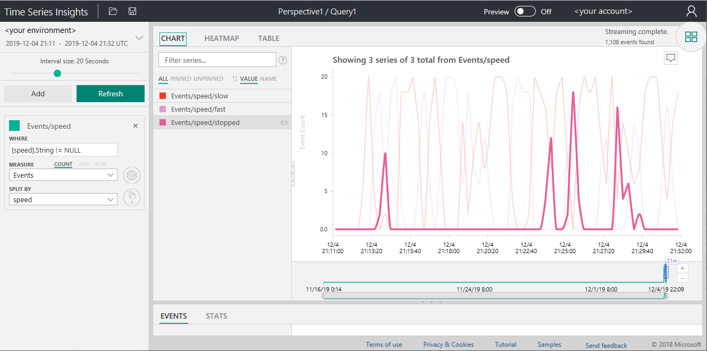
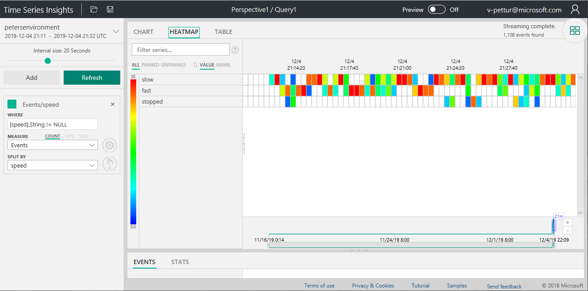
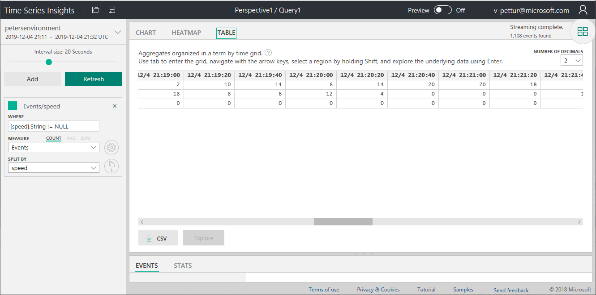

With IoT telemetry data streaming in hot from your IoT devices, you might wish to visualize that data quickly, and run some analytics. A key feature of telemetry is that it's time-stamped: time and order are critical elements of the data.

The basis of an IoT solution is the IoT Hub, the cloud service built to handle millions of telemetry readings, and channel that data somewhere useful. The data can be routed for some real-time analytics. And routed to Blob storage for archive, or for a colder deeper analysis.

The first place to look for time-based analytics is the built-in _Time Series Insights_ service. This service both enables you to visualize your data without writing any code, and enables you to perform regular expression-based analytics. The routing, visualization, and analytics, can all be done via the Azure portal. For simpler analytics, the UI can be used to create the expressions. For deeper analysis, and for integration with programming languages, there's a REST-based API.

Using the portal, you create the required resources, and route the data stream. Then you navigate to the Time Series Insights resource. Now you can start looking at some charts.

In the image below, conveyor belt data is being read and displayed. The chart shows when the belt is running fast, slow, or stopped. We usually don't want our delivery conveyor belt to stop, so checking this chart might indicate something is wrong.

The second display option is to visualize the data using a _heat map_. The time chunks show the various speeds the conveyor belt is running at, using a color code. The times when the belt is stopped are obvious here too.

The third option is a table of results, again divided up into time chunks. A table isn't as fun to look at as the chart or heat map. But, depending on your application, this format might indeed be a helpful way of visualizing your data.

## Best practices

The key point here is that the three visualization methods shown above are easily made available through an Azure Time Series Insights resource. Set up time is measured in minutes, and off you go! Multiple charts can be displayed on one page. Precise queries can be constructed, either by using the user interface, or by typing in some regular expressions.

It makes sense to check out the out-of-the-box abilities and features of Time Series Insights, before engaging in more costly options. If the resource works well with your data, consider developing your own dashboards, or analytics tools, using the API.
