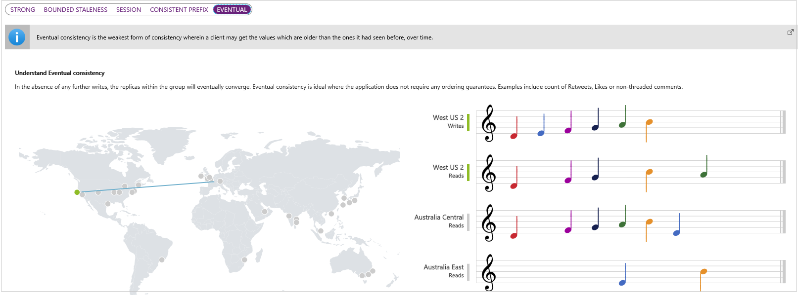

Cosmos, another word for "universe", implies that this is the solution for world-wide applications. Another feature of the Cosmos DB resource is that it is well structured, not the collection of stuff that can be stored in a blob. The obvious example is a database, where each entry in the database has a similar set of entries.

Access to the data in a Cosmos DB resource is made through queries built from API calls. Cosmos DB supports a range of APIs, including, SQL API, Mongo API, Graph API, Table API, and the Cassandra API.

A Cosmos DB resource is about big data, and world-wide access. An example of the issues this raises might help.

## A worldwide scenario

Suppose you run a company that sells products from one location in the US, and two in Australia. Each location has its own copy of the pricing data. The price data is set only by the US location.

You might define the following regions when you set up your Cosmos DB database.

The reason that there are local versions of the data, is that there will be little latency when your local customers and sales staff are accessing the price data. Let's not leave any customers waiting!

Whenever a new price is set in the US West 2 location, that update is automatically propagated to all read locations. You _can_ have multiple write locations, but as that complicates the explanation of data consistency, we will leave it out for now!

Having set up your price database, you have to consider how important it is that everyone the world over gets exactly the same price at exactly the same time.

## Set the data consistency

In our scenario, there are three company data locations: US West, Australia East and Australia Central. Only US West writes to the data, but all three locations can read it. Data consistency answers the following question. After US West writes an update to the data, what should all read locations get when they read the data. If there was zero latency, then this question would be mute. However, latency is a real issue in the cloud and it needs to be addressed.

When a write is made to update data in US West, that change will be propagated automatically to the other locations. However, the update will exist in an inaccessible state, until the go-ahead is received that the update can now be read. This inaccessible state exists in all three locations, even the write location.

If all locations, including US West, should get the same result after a read, then _Strong_ consistency should be applied. In this case, the system waits for an acknowledgement from all locations that they have received the update, before giving the all clear to make the data readable. This ensures worldwide consistency, but comes at the cost of all locations having to wait for the slowest to receive the update. This latency may only be seconds, but the latency exists so should be considered.

In _Strong_ consistency, every location will get identical data on every read. Note, in the following image, how all locations get exactly the same notes (updates) at the same time, but that there is a short delay before any location can read an update.

At the other end of the spectrum, there is _Eventual_ consistency. In this scenario, each location gets the update when it arrives. This clearly means some locations might have stale data for a short while, before the local data is updated. Notice too, in the following image, that if the latency is long enough, several writes might be replaced by a single value in a read location, as the writes arrived at about the same time, and only the latest of these writes would be visible in that locale.

These two consistency strategies are the most established in the data propagation world. However, three variations are available in Cosmos DB.

With _Bounded_ consistency you set a time threshold, or version update count threshold. This threshold is the tolerance of each location for stale data. If a location reads data, only to find the data is outside of the threshold, then the system will wait till a value is available that is within the threshold. For example, if a threshold is set at 20 seconds, then only data that is stale by 20 seconds or less, is acceptable. Set this threshold to zero, and you have _Strong_ consistency.

The default consistency is given the name _Session_ consistency. In this scenario, the write location has immediate access to the updated data. The read locations get the data in the right order, but there will be a different latency for each read location.

The last of the five options is called _Prefix_ consistency. With this setting, all locations receive the updates in the correct order, with no update being skipped over. The _Session_ consistency level described earlier, uses this _Prefix_ consistency for all read locations.

After a Cosmos DB resource has been set up, you get to choose the default consistency level in your Azure portal.

## In summary

A Cosmos DB resource is usually a more expensive option than Blob storage. Create this resource when you have a mass of time critical data that needs to be available in several locations across the globe. And quick access from any of these locations is important. And when this mass of data is well structured, typically in the form of a traditional database.

