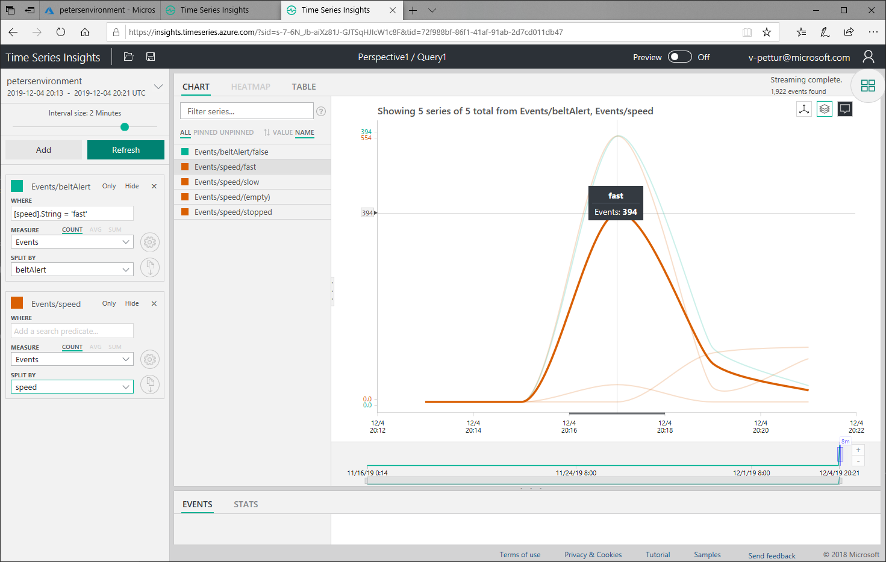
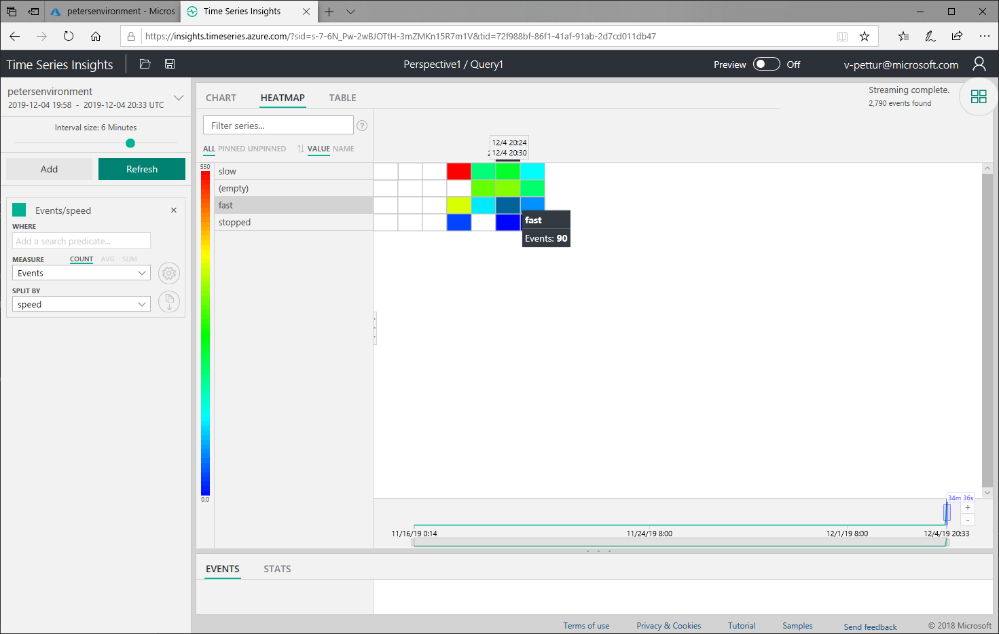
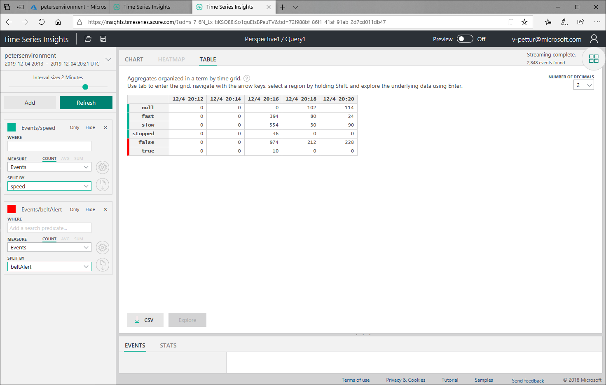

With streams of IoT telemetry data coming in hot from your IoT devices, you might well like to visualize that data quickly and easily.

The basis of an IoT solution is often the IoT Hub, the cloud service built to handle millions of telemetry readings, and channel that data someplace useful. Perhaps to blob storage for archive, perhaps to blob storage for a colder deeper analysis. Also, the data can be routed to some immediate queries, for some warmer analytics to be run.

Another option, is to route the data to the built-in _Time Series Analytics_ services. These services enable you to visualize your data without writing any SQL queries, or doing any dirty work. This routing and visualization can all be done via the Azure portal.

Using the portal, you can route the data and start looking at some charts.

In the image below, conveyor belt data is being read and displayed. The chart shows when the belt is running fast, slow, or stopped. In a commercial environment, we usually don't want our delivery conveyor belt to be stopped, so checking on this gives us a clear indication when something is wrong.

The second display option is to visualize the data using a _heat map_. The time chunks show the various speeds the conveyor belt is running at, using a color code. The times when the belt is stopped are pretty obvious here too.

The third option is a table of results, again divided up into time chunks. A table is not as fun to look at as the chart or heat map. But, depending on your application, this might indeed be a helpful way of visualizing your data.

### In summary

The key point here is that the three visualization methods shown above are easily made available through an Azure Time Series Insights resource. Set up time can be measured in minutes, and off you go! Multiple charts can be displayed on one page, and quite complex queries can be built up, either using the user interface, or typing in some SQL conditions. More complex visualizations of IoT data can be built, using the Time Series Insights portal, or API, but for some applications simplest is best.

It makes sense to check out the abilities and features of Time Series Insights, before engaging in more costly options.