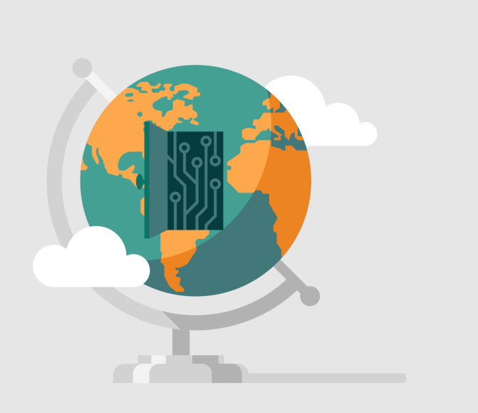

In this module, you learned about:

- The hybrid lambda architecture of IoT, best described as hot and cold paths
- Blob storage and data lake storage
- Cosmos DB databases
- The charts available in Time Series Insights

And you learned that Azure IoT can have a worldwide reach!

## Next steps

Take your interest further with:

- [Simplify IoT development](https://azure.microsoft.com/free/iot/)
- [Azure Blob storage documentation](https://docs.microsoft.com/azure/storage/blobs/)
- [Azure Time Series Insights documentation](https://azure.microsoft.com/services/time-series-insights/)
- [Azure Cosmos DB documentation](https://docs.microsoft.com/azure/cosmos-db/)
- [Azure Certified for IoT device catalog](https://catalog.azureiotsolutions.com/)

And look out for additional Learn modules on IoT.

To finish this module, complete a final knowledge check.
