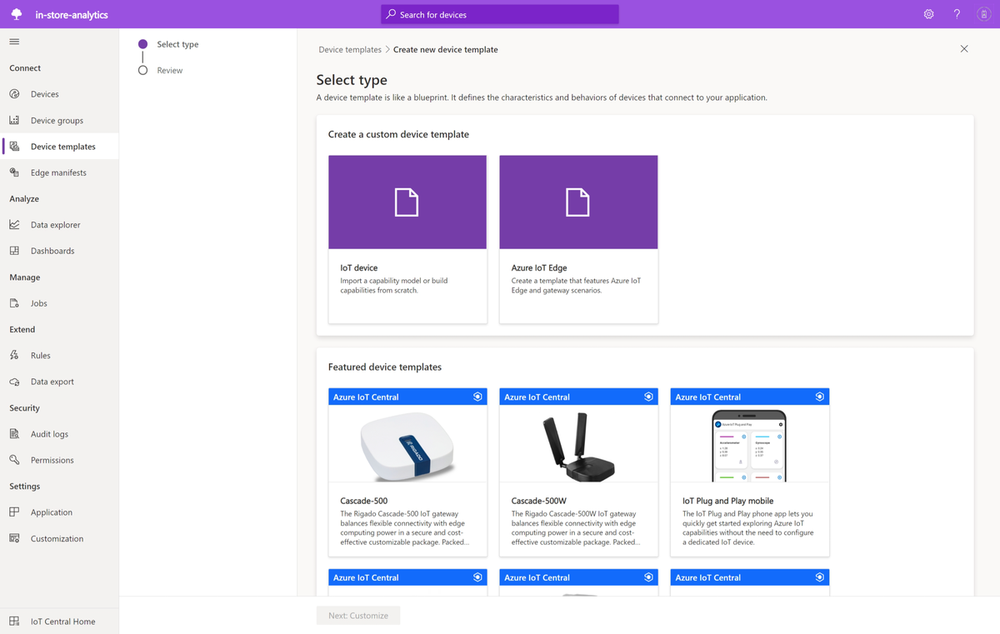

Azure IoT Central is an IoT application platform as a service (aPaaS) that reduces the burden and cost of developing, managing, and maintaining IoT solutions. Use IoT Central to quickly evaluate your IoT scenario and assess the opportunities it can create for your business. IoT Central streamlines the development of a complex and continually evolving IoT infrastructure, by letting you to focus your efforts on determining the business impact you can create by using an IoT solution.

The web UI lets you quickly connect devices, monitor device conditions, create rules, and manage devices and their data throughout their life cycle. Furthermore, it enables you to act on device insights by extending IoT intelligence into line-of-business applications. Once you've used IoT Central to evaluate your IoT scenario, you can then build your enterprise ready solutions by using the power of Azure IoT platform.

## Create an IoT Central application

You can quickly deploy a new IoT Central application and then customize it to your specific requirements. Application templates in Azure IoT Central are a tool to help you kickstart your IoT solution development. Use an application template to preconfigure your application with features such as dashboards, device templates, and analytics. You can use application templates for everything from getting a feel for what is possible, to fully customizing your application to fit your scenario.

The following screenshot is an IoT Central application using the *In-store Analytics - Checkout* application template:

## Connect devices

Every device connected to IoT Central uses a *device template*. A device template is the blueprint that defines the characteristics and behavior of a type of device such as the:

- Telemetry it sends. Examples include temperature and humidity. Telemetry is streaming data.
- Cloud properties that an operator can modify. Examples include a store address and a last serviced date.
- Device properties that are set by a device and are read-only in the application. For example, the state of a fan as either on or off.
- Properties that are set by an operator and that determine the behavior of the device. For example, a target temperature for the device.
- Commands that are called by an operator and that run on a device. For example, a command to remotely reboot a device.

You can create your own custom device templates or connect an [IoT Plug and Play](/azure/iot-develop/overview-iot-plug-and-play) certified device by using a device template provided by the manufacturer:

## Manage devices

The IoT Central application allows you to easily manage the devices in your IoT Central solution. Operators do tasks such as:

- Monitoring the devices connected to the application.
- Troubleshooting and remediating issues with devices.
- Provisioning new devices.

You can define custom rules and actions that operate over data streaming from connected devices. An operator can enable or disable these rules at the device level to control and automate tasks within the application.

The following video walks you through monitoring device connectivity status:

> [!VIDEO 75d0de58-9cc0-4505-9fa1-a0a7da8bb466]

## Integrate with other services

As an application platform, IoT Central lets you transform your IoT data into the business insights that drive actionable outcomes. Rules, data export, and the REST API are examples of how you can integrate IoT Central with line-of-business applications:

You can generate business insights, such as determining machine efficiency trends or predicting future energy usage on a factory floor, by building custom analytics pipelines to process telemetry from your devices and store the results. Configure data exports in your IoT Central application to export telemetry, device property changes, and device template changes to other services where you can analyze, store, and visualize the data with your preferred tools.