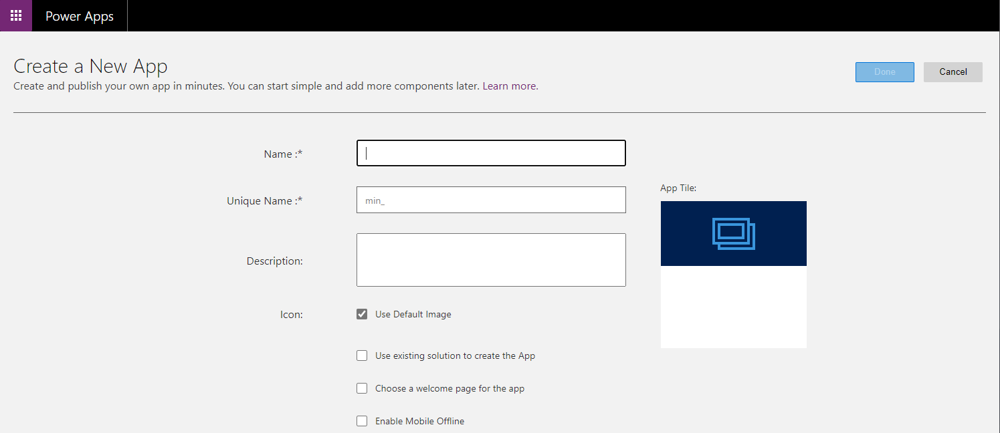
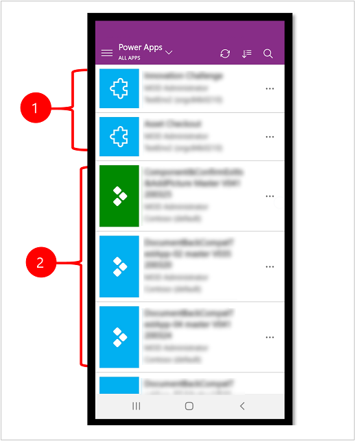

Let's go over some of the concepts behind Microsoft PowerApps.

## Introduction to Microsoft PowerApps

Using PowerApps, you build your application without any coding. A web portal is used to select components, inputs, outputs, and so on. Your app is built almost as a drag-and-drop process. You might select a _template_, if one of the available templates matches your ideas. If there is no suitable template, you can build your app from scratch.

PowerApps can be built to ingest data either from an underlying data platform, known as the Common Data Service. Or, as we would need in our scenario, from an external data source. This data source can be SharePoint, Excel, Office 365, and many others. Of course, for our scenario we need to use the Azure Blob Storage for our data source. Fortunately, this option is available.

PowerApps have a number of interesting uses, they can be run on tablets, or smartphones. You can imagine a manager, or operator, of an IoT solution, being pleased they can check on the state of their IoT solution. All while on the move, using a small device such as their smartphone. Also, PowerApps will run in browsers, on a PC or laptop.

The key concept to PowerApps is _rapid development_. You can build a functional, useful app in just a few minutes. We will put this to the test in the next unit!

First though, lets drill down a little further into the types of PowerApp. There are three: Canvas apps, Portal apps, and Model-driven apps.

### Understanding Canvas apps

The name should give the idea away. You drag and drop components onto a _cavnas_. An easy way to start may be to select **All templates**, after signing into to [Power Apps](https://make.preview.powerapps.com/environments/). Alternatively, it may be more fun to select **Canvas app from blank**, and educate yourself on the power of PowerApps by dragging in a mix of components.

You are given the option of specifying **Tablet** or **Phone** for your canvas app. Then you get a powerful, but slightly intimidating, user-interface. Lots of options:

The key to canvas apps is clearly that they are user-interface driven. Canvas apps start with your user experience, selecting a target of phone, tablet, or web. Data, from over 200 different sources, can then be selected and connected.

### Understanding Portal apps

Portal apps are external-facing. You can build a web portal that allows users outside of your organization to sign in, view, and create, data using the Common Data Service. 

pic here

### Understanding Model-driven apps

Model-driven apps are fascinating. You _start_ by selecting your data model, and source. Model-driven apps automatically create a user-interface that matches the format of your data. Forms, views, dashboards, charts, and other components are built without your having to specify anything!

When PowerApps are developed, the jigsaw icon is used for model driven apps, and the tiled triangle for canvas apps.

## Next steps

Given the range of PowerApps, and our scenario of monitoring refrigerated trucks, which type of PowerApp do you think we should build?

Given that a UI is built for us for free, with the Model-driven option, it seems like that would be a great place to start. In the next unit, we give this a try!

