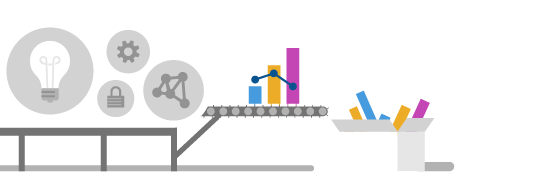

With an Azure IoT Hub potentially receiving many thousands of telemetry messages, we want to make it easy for a human operator to see what is going on.

In this module, you'll learn about Azure IoT Hub monitoring. Monitoring encompasses a number of features: logging, diagnostics, metrics, and alerts. Of these features, the alerts are probably the most important. Alerts signal "red flags" to a human operator. Alerts fire when one or more conditions are met. Alerts can also signal more mundane events, information, or warnings, rather than errors. Metrics, diagnostics, and logs, do their job, providing different ways of reporting on current activities.

This module uses the same scenario, and code base, as the [Identify anomalies by routing data via IoT Hub to a built-in ML model in Azure Stream Analytics](https://docs.microsoft.com/learn/modules/data-anomaly-detection-using-azure-iot-hub/). It isn't necessary to complete the anomalies module to complete this one on monitoring. You'll gain valuable insights to the features of Azure IoT Hub by completing both modules, in any order. If you've completed the anomalies module, and still have the IoT Hub resource, you can start from unit 4 of this module.

The scenario we're using is that of a conveyor belt, monitored for vibration.

## Learning objectives

In this module you will:

- Create an Azure IoT Hub and device identity, using the IoT Hub portal
- Create a device app to send telemetry to the IoT Hub, using Visual Studio or Visual Studio Code
- Learn about metrics, alerts, diagnostics, and logs, to monitor the telemetry sent to the IoT Hub
- Create an email alert, using the IoT Hub portal
- Create an Azure Function, using the IoT Hub portal
- Create an action to trigger the Azure Function, using the IoT Hub portal

## Prerequisites

- An introductory knowledge of Azure IoT
- Ability to navigate the Azure IoT portal
- Ability to use C#, or Node.js, at the beginner level
- Experience using Visual Studio, or Visual Studio Code, at the beginner level

## Learn the scenario

Suppose you manage a packaging facility. Packages are assembled for shipping, then placed on a conveyor belt that takes the packages and drops them off in mailing bins. Your metric for success is the number of packages leaving the conveyor belt.

The conveyor belt is monitored for vibration. The conveyor belt has three speeds: _stopped_, _slow_, and _fast_. The number of packages being delivered at slow speed is less than at the faster speed, though the vibration is also less at the slower speed. If the vibration becomes excessive, the conveyor belt has to be stopped and inspected. A broken conveyor wheel, for example, can exacerbate the vibrations, in a cyclical fashion.

There are a number of different types of vibration. _Natural vibration_, which is just the frequency a structure tends to oscillate. _Forced vibration_ is vibration caused by an external force. Such a force as the broken wheel example, or a weighty package placed improperly on the conveyor belt. There's also _increasing vibration_, which might happen if a design limit is exceeded.

Forced vibration is the dangerous one for our conveyor belt. Even if it starts at a low level this vibration can build so that the structure fails completely.

Vibration is typically measured as an acceleration (meters per second squared, m/s2), though sometimes vibration is measured in g-forces.

With the goal of preventive maintenance, you decide to use Azure IoT Hub to manage the vibration telemetry.

## The first step

The first step to building this system is to create a custom IoT Hub.

### Remaining jobs

1. image alt text - done
1. lightbox utility - done
1. read end to end - done1
1. remove unused images - done
1. check images for PI - done
1. acrolinx again - done1 - done2
1. read code comments for irrelevant stuff - done
1. knowledge check text - done1
1. remove en-us - done
1. check heading capitalization (Email?) - done
1. image line cleanup - done

1. test and read, end to end - done1 -failed
1. verify/change choice of action group names - done
1. add node.js option - done
1. Upload new code to Github - C# and Node.js - done

1. badge artwork
1. test with sandbox
1. verify use of IoT Hub v IoT hub (lower case)
