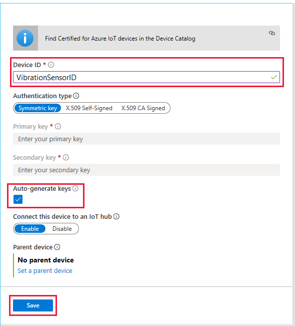

In this unit, we first create an IoT Hub, and then add a single device to that hub. To complete the unit, we record the connection strings needed for the coding part of this module.

## Create a custom IoT Hub

1. Make sure you've activated the sandbox, using the button above. The sandbox creates a free temporary resource.
1. Sign into the [Azure portal](https://portal.azure.com/learn.docs.microsoft.com?azure-portal=true). Using this link will ensure you're using the sandbox.
1. Select **+ Create a resource**, from the top of the left-hand menu. In the **Search the Marketplace** search box, enter "IoT Hub".
1. Select **IoT Hub** from the search results, and click **Create**.
1. You'll be required to enter a **Subscription** from the selection offered to you. A sandbox subscription will be **Concierge Subscription**, so choose that. For **Resource Group**, select <rgn>[sandbox resource group name]</rgn>.
1. The **Region** should be the geographical region closest to you.
1. Enter a unique friendly name (say "VibrationSensorHub-&lt;your ID&gt;") for **IoT Hub Name**.
    >[!IMPORTANT]
    >Your hub names are publicly discoverable, so take this into account when entering names. Hub names must also be unique, as they form part of the Azure URL.
1. Select **Next: Networking** to view the capabilities of your hub, noting all the services we need are enabled. 
1. Open up **Management** to see the number of partitions. You can leave all entries at their default settings. Or, for peace of mind, you can change **Pricing and scale tier** to **F1: Free tier**, although you'll not be charged if you leave the tier at **S1: Standard tier**, as sandbox resources are free.
1. Now, select **Review + create**, this option gives you a chance to verify your choices before clicking **Create**, and building the hub. Building your hub can take a few minutes.
1. Click **Go to resource**, when this option is available, to go to the home page for your temporary hub. If you miss this alert, you can search for your resource from your home page.
1. It's a good idea to bookmark the home page of your IoT Hub.

## Create an IoT Hub device identity

Now we need to create a single device identity, the sensor monitoring the conveyor belt vibration.

1. With the home page of your hub open, locate and select the **IoT devices** entry in the left-hand menu.
1. Click **+ New**.
1. In the **Create a device** screen that follows, enter a **Device ID**, such as "VibrationSensorID". Ensure **Auto-generate keys** is enabled, as is **Connect this device to an IoT Hub**, and click **Save**.

    

1. You should now see your device in the list of devices for the IoT Hub. Click on the device name. Copy the **Primary Connection String** to a text file (using Notepad, or similar text editor).

    > [!IMPORTANT]
    > The connection string you've just copied is the _device_ connection string. There are many other connection strings.

1. Save off the text file, with a name such as "IDs.txt", for reference in the next units.

The next step is to code the sending of telemetry messages.
