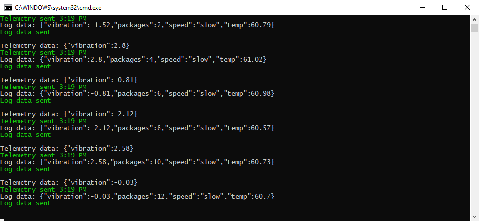

At the end of this unit, you'll be sending and receiving telemetry.

You can select your preferred development environment (Visual Studio Code, or Visual Studio). The device app can be written in C#, or Node.js.

## Create an app to send telemetry

::: zone pivot="vscode-csharp"

1. To use C# in Visual Studio Code, ensure both [.NET Core](https://dotnet.microsoft.com/download), and the [C# extension](https://marketplace.visualstudio.com/items?itemName=ms-vscode.csharp) are installed.

1. Open a terminal in Visual Studio Code, and create a folder called "vibrationdevice" (enter `mkdir vibrationdevice`). Navigate to the vibrationdevice folder.

1. Enter the following command in the terminal: `dotnet new console`. This command creates a **Program.cs** file in your folder, along with a project file.

1. Enter `dotnet restore` in the terminal. This command gives your app access to the required .NET packages.

1. In the terminal, install the required libraries. Enter:

    ```shell
    dotnet add package Microsoft.Azure.Devices.Client
    dotnet add package Newtonsoft.Json
    ```

1. From the **File** menu, open up the **Program.cs** file, and delete the default contents.

1. After you've entered the code below into the **Program.cs** file, you can run the app with the command `dotnet run`. This command will run the **Program.cs** file in the current folder.

::: zone-end

::: zone pivot="vs-csharp"

1. Open Visual Studio, and create a new **Visual C#/Windows Desktop** project. Select **Console App (.NET Framework)**.

1. Give the project a friendly name, such as "VibrationDevice". Then, create the project.

1. Under **Tools/NuGet Package Manager**, select **Manage NuGet Packages for Solution**. In the **Browse** screen, install the following libraries:
    * **Microsoft.Azure.Devices.Client**
    * **Newtonsoft.Json**

1. Delete the default contents of the **Program.cs** file.

1. Add all the code that follows to the **Program.cs** file.

::: zone-end

::: zone pivot="vscode-node"

1. Open Visual Studio Code. From the **Terminal** menu, open a **New Terminal**.

1. In the opened terminal, create an empty folder where you'll develop your code, called "vibrationdevice", by entering `mkdir vibrationdevice`. Then, navigate to that folder with `cd vibrationdevice`.

1. From the **File** menu, create a new file. Insert a single line as a comment, such as `// Vibration device app`. Save the file to the `vibrationdevice` folder (locating this folder might involve a bit of navigation), with the name **app.js**. By using the .js file extension, Visual Studio Code interprets this file as JavaScript and evaluates the contents with the JavaScript language service.

1. Back in the terminal, load the libraries you need with the following commands:

    ```shell
    npm install azure-iot-device
    npm install azure-iot-device-mqtt
    npm install chalk
    ```

1. After you've entered the code below into the app.js file, you can run it from the terminal by entering `node app.js`. Ensure that the `vibrationdevice` folder is the current folder of the terminal, when you run the app.

::: zone-end

::: zone pivot="vs-node"

1. Navigate to the **JavaScript** project types, and create a new **Blank Node.js Console Application** project, called "VibrationDevice".

1. Right-click on the **npm** entry in Solution Explorer, and select **Install New npm Packages....**.

1. In the dialog that follows, search for and install the following libraries:
    * **azure-iot-device**
    * **azure-iot-device-mqtt**
    * **chalk**

1. Delete the default contents of the app.js file.

1. When you've entered the code below, you can run the app with the **Start Without Debugging**, or **Start Debugging**, options. In the latter case you can set breakpoints, examine data, and perform other debugging tasks.

::: zone-end

> [!NOTE]
> This module doesn't require you to download any code. However, all of the code is available from [GitHub/MicrosoftDocs/mslearn-data-anomaly-detection-using-azure-iot-hub](https://github.com/MicrosoftDocs/mslearn-data-anomaly-detection-using-azure-iot-hub), if needed.

### Add code to send telemetry

The following app simulates a conveyor belt, and reports vibration sensor data every two seconds.

::: zone pivot="vscode-csharp,vs-csharp"

1. Open the **Program.cs** file for the device app.

1. Copy and paste the following code.

    ```cs
    // Copyright (c) Microsoft. All rights reserved.
    // Licensed under the MIT license. See LICENSE file in the project root for full license information.
    
    using System;
    using Microsoft.Azure.Devices.Client;
    using Newtonsoft.Json;
    using System.Text;
    using System.Threading.Tasks;
    
    namespace vibration_device
    {
        class SimulatedDevice
        {
            // Telemetry globals.
            private const int intervalInMilliseconds = 2000;                                // Time interval required by wait function.
            private static readonly int intervalInSeconds = intervalInMilliseconds / 1000;  // Time interval in seconds.
    
            // Conveyor belt globals.
            enum SpeedEnum
            {
                stopped,
                slow,
                fast
            }
            private static int packageCount = 0;                                        // Count of packages leaving the conveyor belt.
            private static SpeedEnum beltSpeed = SpeedEnum.stopped;                     // Initial state of the conveyor belt.
            private static readonly double slowPackagesPerSecond = 1;                   // Packages completed at slow speed/ per second
            private static readonly double fastPackagesPerSecond = 2;                   // Packages completed at fast speed/ per second
            private static double beltStoppedSeconds = 0;                               // Time the belt has been stopped.
            private static double temperature = 60;                                     // Ambient temperature of the facility.
            private static double seconds = 0;                                          // Time conveyor belt is running.
    
            // Vibration globals.
            private static double forcedSeconds = 0;                                    // Time since forced vibration started.
            private static double increasingSeconds = 0;                                // Time since increasing vibration started.
            private static double naturalConstant;                                      // Constant identifying the severity of natural vibration.
            private static double forcedConstant = 0;                                   // Constant identifying the severity of forced vibration.
            private static double increasingConstant = 0;                               // Constant identifying the severity of increasing vibration.
    
            // IoT Hub global variables.
            private static DeviceClient s_deviceClient;
    
            // The device connection string to authenticate the device with your IoT hub.
            private readonly static string s_deviceConnectionString = "<your device connection string>";
    
            private static void colorMessage(string text, ConsoleColor clr)
            {
                Console.ForegroundColor = clr;
                Console.WriteLine(text);
                Console.ResetColor();
            }
            private static void greenMessage(string text)
            {
                colorMessage(text, ConsoleColor.Green);
            }
    
            private static void redMessage(string text)
            {
                colorMessage(text, ConsoleColor.Red);
            }
    
            // Async method to send simulated telemetry.
            private static async void SendDeviceToCloudMessagesAsync(Random rand)
            {
                try
                {
                    // Simulate the vibration telemetry of a conveyor belt.
                    double vibration;
    
                    while (true)
                    {
                        // Randomly adjust belt speed.
                        switch (beltSpeed)
                        {
                            case SpeedEnum.fast:
                                if (rand.NextDouble() < 0.01)
                                {
                                    beltSpeed = SpeedEnum.stopped;
                                }
                                if (rand.NextDouble() > 0.95)
                                {
                                    beltSpeed = SpeedEnum.slow;
                                }
                                break;
    
                            case SpeedEnum.slow:
                                if (rand.NextDouble() < 0.01)
                                {
                                    beltSpeed = SpeedEnum.stopped;
                                }
                                if (rand.NextDouble() > 0.95)
                                {
                                    beltSpeed = SpeedEnum.fast;
                                }
                                break;
    
                            case SpeedEnum.stopped:
                                if (rand.NextDouble() > 0.75)
                                {
                                    beltSpeed = SpeedEnum.slow;
                                }
                                break;
                        }
    
                        // Set vibration levels.
                        if (beltSpeed == SpeedEnum.stopped)
                        {
                            // If the belt is stopped, all vibration comes to a halt.
                            forcedConstant = 0;
                            increasingConstant = 0;
                            vibration = 0;
    
                            // Record how much time the belt is stopped, in case we need to send an alert.
                            beltStoppedSeconds += intervalInSeconds;
                        }
                        else
                        {
                            // Conveyor belt is running.
                            beltStoppedSeconds = 0;
    
                            // Check for random starts in unwanted vibrations.
    
                            // Check forced vibration.
                            if (forcedConstant == 0)
                            {
                                if (rand.NextDouble() < 0.1)
                                {
                                    // Forced vibration starts.
                                    forcedConstant = 1 + 6 * rand.NextDouble();             // A number between 1 and 7.
                                    if (beltSpeed == SpeedEnum.slow)
                                        forcedConstant /= 2;                                // Lesser vibration if slower speeds.
                                    forcedSeconds = 0;
                                    redMessage($"Forced vibration starting with severity: {Math.Round(forcedConstant, 2)}");
                                }
                            }
                            else
                            {
                                if (rand.NextDouble() > 0.99)
                                {
                                    forcedConstant = 0;
                                    greenMessage("Forced vibration stopped");
                                }
                                else
                                {
                                    redMessage($"Forced vibration: {Math.Round(forcedConstant, 1)} started at: {DateTime.Now.ToShortTimeString()}");
                                }
                            }
    
                            // Check increasing vibration.
                            if (increasingConstant == 0)
                            {
                                if (rand.NextDouble() < 0.05)
                                {
                                    // Increasing vibration starts.
                                    increasingConstant = 100 + 100 * rand.NextDouble();     // A number between 100 and 200.
                                    if (beltSpeed == SpeedEnum.slow)
                                        increasingConstant *= 2;                            // Longer period if slower speeds.
                                    increasingSeconds = 0;
                                    redMessage($"Increasing vibration starting with severity: {Math.Round(increasingConstant, 2)}");
                                }
                            }
                            else
                            {
                                if (rand.NextDouble() > 0.99)
                                {
                                    increasingConstant = 0;
                                    greenMessage("Increasing vibration stopped");
                                }
                                else
                                {
                                    redMessage($"Increasing vibration: {Math.Round(increasingConstant, 1)} started at: {DateTime.Now.ToShortTimeString()}");
                                }
                            }
    
                            // Apply the vibrations, starting with natural vibration.
                            vibration = naturalConstant * Math.Sin(seconds);
    
                            if (forcedConstant > 0)
                            {
                                // Add forced vibration.
                                vibration += forcedConstant * Math.Sin(0.75 * forcedSeconds) * Math.Sin(10 * forcedSeconds);
                                forcedSeconds += intervalInSeconds;
                            }
    
                            if (increasingConstant > 0)
                            {
                                // Add increasing vibration.
                                vibration += (increasingSeconds / increasingConstant) * Math.Sin(increasingSeconds);
                                increasingSeconds += intervalInSeconds;
                            }
                        }
    
                        // Increment the time since the conveyor belt app started.
                        seconds += intervalInSeconds;
    
                        // Count the packages that have completed their journey.
                        switch (beltSpeed)
                        {
                            case SpeedEnum.fast:
                                packageCount += (int)(fastPackagesPerSecond * intervalInSeconds);
                                break;
    
                            case SpeedEnum.slow:
                                packageCount += (int)(slowPackagesPerSecond * intervalInSeconds);
                                break;
    
                            case SpeedEnum.stopped:
                                // No packages!
                                break;
                        }
    
                        // Randomly vary ambient temperature.
                        temperature += rand.NextDouble() - 0.5d;
    
                        // Create two messages:
                        // 1. Vibration telemetry
                        // 2. Logging information
    
                        // Create the telemetry JSON message.
                        var telemetryDataPoint = new
                        {
                            vibration = Math.Round(vibration, 2),
                        };
                        var telemetryMessageString = JsonConvert.SerializeObject(telemetryDataPoint);
                        var telemetryMessage = new Message(Encoding.ASCII.GetBytes(telemetryMessageString));
    
                        // Add a custom application property to the message. This can be used to route the message.
                        telemetryMessage.Properties.Add("sensorID", "VSTel");
    
                        // Send an alert if the belt has been stopped for more than five seconds.
                        telemetryMessage.Properties.Add("beltAlert", (beltStoppedSeconds > 5) ? "true" : "false");
    
                        Console.WriteLine($"Telemetry data: {telemetryMessageString}");
    
                        // Send the telemetry message.
                        await s_deviceClient.SendEventAsync(telemetryMessage);
                        greenMessage($"Telemetry sent {DateTime.Now.ToShortTimeString()}");
    
                        // Create the logging JSON message.
                        var loggingDataPoint = new
                        {
                            vibration = Math.Round(vibration, 2),
                            packages = packageCount,
                            speed = beltSpeed.ToString(),
                            temp = Math.Round(temperature, 2),
                        };
                        var loggingMessageString = JsonConvert.SerializeObject(loggingDataPoint);
                        var loggingMessage = new Message(Encoding.ASCII.GetBytes(loggingMessageString));
    
                        // Add a custom application property to the message. This can be used to route the message.
                        loggingMessage.Properties.Add("sensorID", "VSLog");
    
                        // Send an alert if the belt has been stopped for more than five seconds.
                        loggingMessage.Properties.Add("beltAlert", (beltStoppedSeconds > 5) ? "true" : "false");
    
                        Console.WriteLine($"Log data: {loggingMessageString}");
    
                        // Send the logging message.
                        await s_deviceClient.SendEventAsync(loggingMessage);
                        greenMessage("Log data sent\n");
    
                        await Task.Delay(intervalInMilliseconds);
                    }
                }
                catch (Exception ex)
                {
                    redMessage(ex.Message);
                }
            }
    
            private static void Main(string[] args)
            {
                Random rand = new Random();
                colorMessage("Vibration sensor device app.\n", ConsoleColor.Yellow);
    
                // Create the IoT hub device client, specifying the MQTT protocol.
                s_deviceClient = DeviceClient.CreateFromConnectionString(s_deviceConnectionString, TransportType.Mqtt);
    
                // Create a number between 2 and 4, as a constant for normal vibration levels.
                naturalConstant = 2 + 2 * rand.NextDouble();
    
                SendDeviceToCloudMessagesAsync(rand);
                Console.ReadLine();
            }
        }
    }
    ```

    > [!IMPORTANT]
    > Take a few minutes, and read through the comments in the code. Notice how the vibration math from the description of the scenario in the introduction has worked its way into the code. The most important section of code for learning about IoT messages, starts with the "Create two messages:" comment.

1. Replace &lt;your device connection string&gt; with the device connection string you saved off in the previous unit. No other lines of code need to be changed.

1. Save the **Program.cs** file.

::: zone-end

::: zone pivot="vs-node,vscode-node"

1. Open the **app.js** file for the device app.

1. Copy and paste the following code.

    ```javascript
    // Copyright (c) Microsoft. All rights reserved.
    // Licensed under the MIT license. See LICENSE file in the project root for full license information.
    'use strict';
    
    const chalk = require('chalk');
    console.log(chalk.yellow.inverse('Vibration sensor device app'));
    
    // The device connection string to authenticate the device with your IoT hub.
    var connectionString = '<your device connection string>';
    
    // The sample connects to a device-specific MQTT endpoint on your IoT Hub.
    var Mqtt = require('azure-iot-device-mqtt').Mqtt;
    var DeviceClient = require('azure-iot-device').Client
    var Message = require('azure-iot-device').Message;
    
    // Create the IoT Hub client.
    var client = DeviceClient.fromConnectionString(connectionString, Mqtt);
    
    // Conveyor belt globals.
    var packageCount = 0;                                   // Count of packages leaving the conveyor belt.
    var speedEnum = Object.freeze({ "stopped": "stopped", "slow": "slow", "fast": "fast" });
    var beltSpeed = speedEnum.stopped;                      // Initial state of the conveyor belt.
    var slowPackagesPerSecond = 1;                          // Packages completed at slow speed/ per second
    var fastPackagesPerSecond = 2;                          // Packages completed at fast speed/ per second
    var beltStoppedSeconds = 0;                             // Time the belt has been stopped.
    var temperature = 60;                                   // Ambient temperature of the facility.
    
    // Vibration globals.
    var sensorID = "VibrationSensorID";
    var intervalInMilliseconds = 2000;                      // Time interval required by setInterval function.
    var intervalInSeconds = intervalInMilliseconds / 1000;  // Time interval in seconds.
    var seconds = 0;                                        // Time conveyor belt is running.   
    var forcedSeconds = 0;                                  // Time since forced vibration started.
    var increasingSeconds = 0;                              // Time since increasing vibration started.
    
    var basicConstant = 2 + 2 * Math.random();              // A number between 2 and 4.
    var forcedConstant;                                     // Constants identifing the severity of the vibration.
    var increasingConstant;
    
    
    function greenMessage(text) {
        console.log(chalk.green(text));
    }
    
    function redMessage(text) {
        console.log(chalk.red(text));
    }
    
    // Create a message and send it to the IoT hub every interval.
    setInterval(function () {
    
        // Simulate the vibration telemetry of a conveyor belt.
        var vibration;
    
        // Randomly adjust belt speed.
        switch (beltSpeed) {
            case speedEnum.fast:
                if (Math.random() < 0.01) {
                    beltSpeed = speedEnum.stopped;
                }
                if (Math.random() > 0.95) {
                    beltSpeed = speedEnum.slow;
                }
                break;
    
            case speedEnum.slow:
                if (Math.random() < 0.01) {
                    beltSpeed = speedEnum.stopped;
                }
                if (Math.random() > 0.95) {
                    beltSpeed = speedEnum.fast;
                }
                break;
    
            case speedEnum.stopped:
                if (Math.random() > 0.75) {
                    beltSpeed = speedEnum.slow;
                }
                break;
        }
    
        // Randomly vary the ambient temperature.
        temperature += Math.random() - 0.5;
    
        // Set vibration levels.
    
        if (beltSpeed == speedEnum.stopped) {
    
            // If the belt is stopped, all vibration comes to a halt.
            forcedConstant = 0;
            increasingConstant = 0;
            vibration = 0;
    
            // Record how much time the belt is stopped, in case we need to send an alert.
            beltStoppedSeconds += intervalInSeconds;
        }
        else {
            // Conveyor belt is running.
            beltStoppedSeconds = 0;
    
            // Check for random starts in unwanted vibrations.
    
            // Check forced vibration.
            if (forcedConstant == 0) {
                if (Math.random() < 0.1) {
    
                    // Forced vibration starts.
                    forcedConstant = 1 + 6 * Math.random();             // A number between 1 and 7.
                    if (beltSpeed == speedEnum.slow)
                        forcedConstant /= 2;                            // Lesser vibration if slower speeds.
                    forcedSeconds = 0;
                }
            } else {
                if (Math.random() > 0.99) {
                    forcedConstant = 0;
                    greenMessage("Forced vibration stopped");
                }
            }
    
            // Check increasing vibration.
            if (increasingConstant == 0) {
                if (Math.random() < 0.05) {
    
                    // Increasing vibration starts.
                    increasingConstant = 100 + 100 * Math.random();         // A number between 100 and 200.
                    if (beltSpeed == speedEnum.slow)
                        increasingConstant *= 2;                            // Longer period if slower speeds.
                    increasingSeconds = 0;
                }
            } else {
                if (Math.random() > 0.99) {
                    increasingConstant = 0;
                    greenMessage("Increasing vibration stopped");
                }
            }
    
            // Apply the vibrations, starting with basic (normal) vibration.
            vibration = basicConstant * Math.sin(seconds);
    
            if (forcedConstant > 0) {
    
                var forcedVibration = forcedConstant * Math.sin(0.75 * forcedSeconds) * Math.sin(10 * forcedSeconds);
    
                // Add forced vibration.
                vibration += forcedVibration;
                forcedSeconds += intervalInSeconds;
                redMessage("Forced vibration = " + forcedVibration.toFixed(2));
            }
    
            if (increasingConstant > 0) {
    
                var increasingVibration = (increasingSeconds / increasingConstant) * Math.sin(increasingSeconds);
    
                // Add increasing vibration.
                vibration += increasingVibration;
                increasingSeconds += intervalInSeconds;
                redMessage("Increasing vibration = " + increasingVibration.toFixed(2));
            }
        }
    
        // Increment the time since the conveyor belt app started.
        seconds += intervalInSeconds;
    
        // Count the packages that have completed their journey.
        switch (beltSpeed) {
            case speedEnum.fast:
                packageCount += fastPackagesPerSecond * intervalInSeconds;
                break;
    
            case speedEnum.slow:
                packageCount += slowPackagesPerSecond * intervalInSeconds;
                break;
    
            case speedEnum.stopped:
                // No packages!
                break;
        }
    
        // Create two messages:
        // 1. Vibration telemetry
        // 2. Logging information
        var telemetryDataPoint = new Message(JSON.stringify({
            vibration: vibration.toFixed(2),
        }));
    
        // Add a custom application property to the message.
        // An IoT hub can filter on these properties without access to the message body.
        telemetryDataPoint.properties.add('sensorID', sensorID);
    
        // Send an alert, if the conveyor belt is stopped for more than five seconds.
        telemetryDataPoint.properties.add('beltAlert', (beltStoppedSeconds > 5) ? 'true' : 'false');
    
        console.log('\nTelemetry data: ' + telemetryDataPoint.getData());
    
        // Send the message.
        client.sendEvent(telemetryDataPoint, function (err) {
            if (err) {
                redMessage('Telemetry send error: ' + err.toString());
            } else {
                var date = new Date();
                greenMessage('Telemetry sent ' + date.toLocaleTimeString());
            }
        });
    
        // Create the logging JSON message.
        var loggingDataPoint = new Message(JSON.stringify({
            vibration: vibration.toFixed(2),
            packages: packageCount,
            speed: beltSpeed,
            temp: temperature.toFixed(2),
        }));
    
        // Add a custom application property to the message.
        // An IoT hub can filter on these properties without access to the message body.
        loggingDataPoint.properties.add('sensorID', sensorID);
    
        // Send an alert, if the conveyor belt is stopped for more than five seconds.
        loggingDataPoint.properties.add('beltAlert', (beltStoppedSeconds > 5) ? 'true' : 'false');
    
        console.log('Logging data:   ' + loggingDataPoint.getData());
    
        // Send the message.
        client.sendEvent(loggingDataPoint, function (err) {
            if (err) {
                redMessage('Log send error: ' + err.toString());
            } else {
                greenMessage('Log sent');
            }
        });
    
        // Set the interval in milliseconds.
    }, intervalInMilliseconds);
    ```

> [!IMPORTANT]
> Take a few minutes, and read through the comments in the code. Notice how the vibration math from the description of the scenario in the introduction has worked its way into the code. The most important section of code for learning about IoT messages, starts with the "Create two messages:" comment.

1. Replace &lt;your device connection string&gt; with the device connection string you saved off in the previous unit. No other lines of code need to be changed.

1. Save the **app.js** file.

::: zone-end

### Test your code to send telemetry

::: zone pivot="vscode-csharp"

* Run the app in the terminal, with the command `dotnet run`. This command will run the **Program.cs** file in the current folder.

::: zone-end

::: zone pivot="vscode-node"

* Run the app in the terminal, with the command `node app.js`. This command will run the **app.js** file in the current folder.

::: zone-end

::: zone pivot="vs-csharp,vs-node"

* Run the app by selecting **Debug/Start Without Debugging**.

::: zone-end

You should quickly get a console screen, similar to the following image. Note the use of green text, to show things are working as they should. And red text when bad stuff is happening. If you don't get a screen similar to this image, start by checking your device connection string.

[](../media/vibration-telemetry.png#lightbox)

> [!NOTE]
> This screen shot is taken from the C# version of the app. The Node.js version will differ slightly.

Watch the telemetry for a short while, checking that it's giving vibrations in the expected ranges.

## Verify the IoT Hub is receiving telemetry

1. To verify that your IoT Hub is receiving the telemetry, open the **Overview** page for your hub. Scroll down to the bottom of the page. Change the time range to one hour. The **Device to cloud messages** plot should show some activity.

    [](../media/vibration-hub-overview.png#lightbox)

1. If no activity is shown, wait a short while, as there's some latency.  

1. Stop the device app for now, by closing the console window. We'll start the app running again when we've some metrics or alerts to test.

The next step is to learn about the monitoring features of an IoT Hub.
