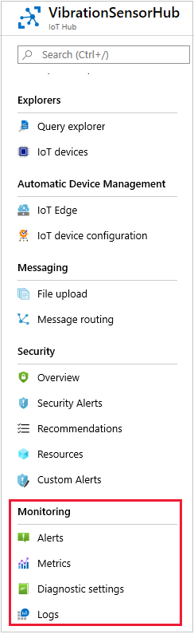
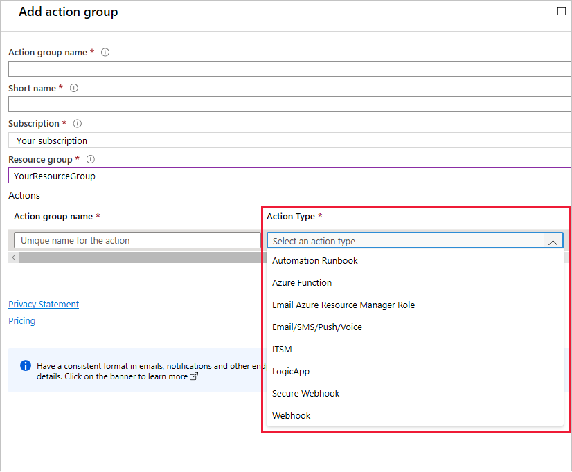
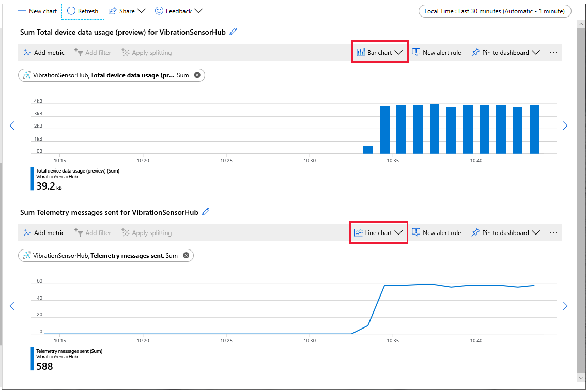
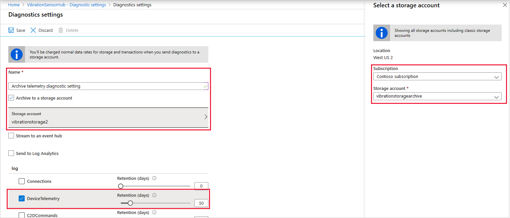
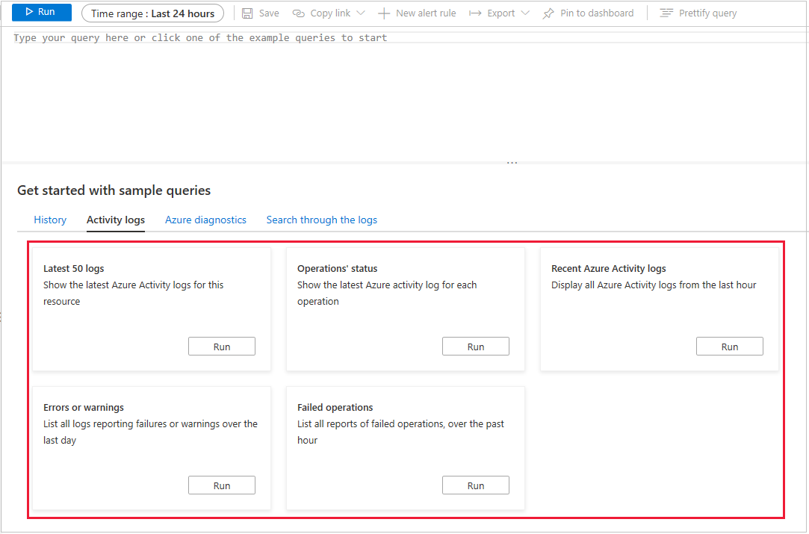
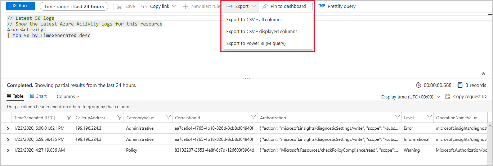

The focus of this module is on the **Monitoring** features of IoT Hub. This unit provides a quick theoretical overview of the four features: Alerts, Metrics, Diagnostic settings, and Logs. The following units will have you create some working alerts and metrics.

Locate the Monitoring section in the left-hand menu.

  

## Alerts

_Alerts_ are one of the more dynamic, and fun, features of an IoT Hub. An alert is triggered when certain conditions are met. The result is one or more actions. You can imagine many types of alerts. For example, the temperature of a device reaches a concerning level, so a warning alert is triggered, and sent to the device operators. Alerts can be sent because an IoT device is overworking in some way, or because too little, or no, telemetry is being received at all. Whereas the most common use of alerts is when a value is outside a range, greater than a maximum, less than a minimum, you might also send a form of alert that everything is in range and working just fine. The advantage of the latter approach, sending a message repeatedly when everything is OK, is that it covers the scenario when the alert system itself fails. If the operator does not receive a message, then investigate.

### Define an action group

  


### Action types

  | Action | Description | More info |
  | -- | -- | -- |
  | Automation Runbook | A series of automation rules | [Getting Started With Azure Automation – Runbook Management](https://azure.microsoft.com/en-us/blog/azure-automation-runbook-management/) |
  | Azure Function | Trigger an Azure Function, which is a specific code function written to a given Azure spec. The Azure Function action is implemented in this module. | [An introduction to Azure Functions](https://docs.microsoft.com/en-us/azure/azure-functions/functions-overview) |
  | Email Azure Resource Manager Role | Send an email to the specific RBAC Resource Manager role. | [RBAC for Azure resources documentation](https://docs.microsoft.com/en-us/azure/role-based-access-control/) |
  | Email SMS/Push/Voice | Send an email, text message, or voice message, to a specific address. | [Create and manage action groups in the Azure portal](https://docs.microsoft.com/en-us/azure/azure-monitor/platform/action-groups) |
  | ITSM (IT Service Management) | The ITSM connector provides a bi-directional connection between Azure and ITSM tools. These tools can help resolve issues faster.| [Connect Azure to ITSM tools using IT Service Management Connector](https://docs.microsoft.com/en-us/azure/azure-monitor/platform/itsmc-overview) |
  | LogicApp | Azure Logic Apps enable automated business-style workflows, without writing any code. | [Logic Apps](https://azure.microsoft.com/en-us/services/logic-apps/) |
  | Secure Webhook | A secure webhook app will, for example, validate ownership of the webhook endpoint before allowing events to be delivered. | [Publish events to Azure Active Directory protected endpoints](https://docs.microsoft.com/en-us/azure/event-grid/secure-webhook-delivery) |
  | Webhook | With webhook actions, an external process is invoked through a single HTTP POST request. The service that's called must support webhooks, and also determine how to use any payload in the message. | [Webhook actions for log alert rules](https://docs.microsoft.com/en-us/azure/azure-monitor/platform/alerts-log-webhook) |

### Azure Functions

An _Azure function_ is a short piece of code that can be run when requested by another Azure resource. Azure functions are typically created using a template, which template you use depending on how the function is to be triggered. The following table shows the most common triggers.

| Template name | Description |
| -- | -- |
| HTTP trigger | Run whenever it receives an HTTP request, responding based on data in the body, or query string. |
| Timer trigger | Run on a specified schedule. |
| Azure Queue Storage trigger | Run whenever a message is added to a specified Azure Storage queue. |
| Azure Service Bus Queue trigger | Run whenever a message is added to a specified Service Bus queue. |
| Azure Service Bus Topic trigger | Run whenever a message is added to a specified Service Bus Topic. |
| Azure Blob storage trigger | Run whenever a blob is added to a specified container. |
| Azure Event Hub trigger | Run whenever an Event Hub receives a new event. |
| IoT Hub trigger | Run whenever an IoT Hub delivers a new message for Event Hub-compatible endpoints. |

There are quite a number of other triggers not listed in the table. The functions can be written in C#, Java, JavaScript, Python, or PowerShell. In addition to creating the functions in the Azure portal, the functions can be written using Visual Studio, Visual Studio Code, or other code editors.

If a function is created using the Azure portal, the correct definition of the function is included, along with a "Hello world" type of processing. For example, if you use the Azure portal to create an HTTP trigger, in C#, the following code is automatically added to your function.

```cs
#r "Newtonsoft.Json"

using System.Net;
using Microsoft.AspNetCore.Mvc;
using Microsoft.Extensions.Primitives;
using Newtonsoft.Json;

public static async Task<IActionResult> Run(HttpRequest req, ILogger log)
{
    log.LogInformation("C# HTTP trigger function processed a request.");

    string name = req.Query["name"];

    string requestBody = await new StreamReader(req.Body).ReadToEndAsync();
    dynamic data = JsonConvert.DeserializeObject(requestBody);
    name = name ?? data?.name;

    return name != null
        ? (ActionResult)new OkObjectResult($"Hello, {name}")
        : new BadRequestObjectResult("Please pass a name on the query string or in the request body");
}
```

You can see how useful these templates are in making sure your function signature is correct. In the following units we will be creating an HTTP trigger function, and specifying it as the action for an IoT alert. We will be keeping things simple, and not altering the default code shown above. It is the mechanism of firing the function when an alert is triggered by some facet of the telemetry data, that we want to enable. And get to work.

## Metrics

Metrics are the mass of values that are recorded by your IoT Hub. For example, the number of telemetry messages sent, the amount of data storage used, the number and type of errors, the number of completed jobs, and so on.

To chart metrics, using the Azure portal, a resource is selected, such as your IoT Hub name. A metric value is chosen from a long drop-down list, and an _aggregation_ is picked from a range that applies to the metric, such as Sum, Average, Minimum, Maximum.

There are various charting options available in the portal, such as line charts, bar charts, and scatter charts. The scope of the chart is set by selecting a time range - from 30 minutes to 30 days, or your own custom time range.

The following image shows a metric for the number of telemetry messages sent being created.

   

The following image shows the number of telemetry messages being sent, shown below a bar chart showing the data usage. A number of charts can be rendered this way, enabling an operator to correlate the values of multiple metrics.

   

In addition to charting, metrics can be used to trigger alerts.

## Diagnostic settings

_Diagnostic settings_ are used to send auditing, and diagnostic, information to one of three destinations: a Log Analytics workspace, an Event Hub, or an Azure storage account.

For example, to archive the data telemetry for a period of 50 days into a storage account, you might set up a Diagnostic setting as follows.

  

We will not be taking this feature any further in this module. However, follow the link in the **Summary** page for more details, if interested.

## Logs

_Logs_ in Azure IoT Hub are formed from SQL queries that are run on the incoming messages. There are a number of sample queries that are available for immediate use.

  

For example, the following sample is named **Latest 50 logs**:

```sql
// Latest 50 logs
// Show the latest Azure Activity logs for this resource
AzureActivity
| top 50 by TimeGenerated desc
```

When the query is run, the output is presented in table or chart form, in the portal. Rendering a chart as output is only possible with certain types of input data. 

A user must select **Pin to dashboard** for the query to be persisted. Columns of a table can be selected or removed, and the resulting output exported if needed.

   

We will not be taking the logs feature any further in this module. Follow the link on the **Summary** page, for more details.

## Next steps

You should now understand the purpose of the four entries in the Monitoring menu. The next step is to create some metrics and alerts, then put them to the test.

