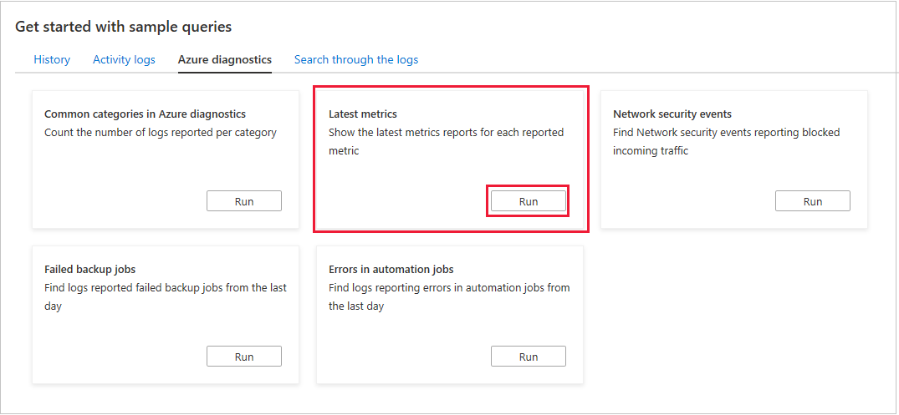

    
    
    
## Define an action group

  

### Action types

  | Action | Description | More info |
  | -- | -- | -- |
  | Automation Runbook | A series of automation rules | [Getting Started With Azure Automation – Runbook Management](https://azure.microsoft.com/en-us/blog/azure-automation-runbook-management/) |
  | Azure Function | Trigger an Azure Function, which is a specific code function written to a given Azure spec. The Azure Function action is implemented in this module. | [An introduction to Azure Functions](https://docs.microsoft.com/en-us/azure/azure-functions/functions-overview) |
  | Email Azure Resource Manager Role | Send an email to the specific RBAC Resource Manager role. | [RBAC for Azure resources documentation](https://docs.microsoft.com/en-us/azure/role-based-access-control/) |
  | Email SMS/Push/Voice | Send an email, text message, or voice message, to a specific address. | [xx](xx) |
  | ITSM (IT Service Management) | The ITSM connector provides a bi-directional connection between Azure and ITSM tools. These tools can help resolve issues faster.| [Connect Azure to ITSM tools using IT Service Management Connector](https://docs.microsoft.com/en-us/azure/azure-monitor/platform/itsmc-overview) |
  | LogicApp | Azure Logic Apps enable automated business-style workflows, without writing any code. | [Logic Apps](https://azure.microsoft.com/en-us/services/logic-apps/) |
  | Secure Webhook | A secure webhook app will, for example, validate ownership of the webhook endpoint before allowing events to be delivered. | [Publish events to Azure Active Directory protected endpoints](https://docs.microsoft.com/en-us/azure/event-grid/secure-webhook-delivery) |
  | Webhook | With webhook actions, an external process is invoked through a single HTTP POST request. The service that's called must support webhooks, and also determine how to use any payload in the message. | [Webhook actions for log alert rules](https://docs.microsoft.com/en-us/azure/azure-monitor/platform/alerts-log-webhook) |

  

   

   

   
