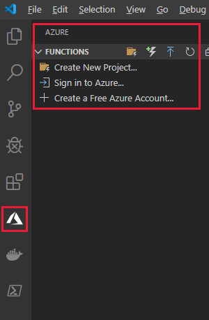

## Create and visualize some metrics

## Create an alert using the metrics and Email action

## Create an Azure Function using the HHTP trigger template

  

## Create an alert using the metics and HTTP trigger action

