The main activity of this unit is creating two different types of alerts: an email alert, and an Azure Function alert. First though, let's have a look at how metrics can be visualized in the IoT Hub dashboard. We'll be reusing the metric again when creating alerts.

## Create and visualize some metrics

1. Start your device app running, so it is pumping out telemetry.

1. In your IoT Hub portal, locate and click **Metrics** in the **Monitoring** section of the left-hand menu.

1. In the bar that starts with the **SCOPE** entry, verify that **SCOPE** is set to the name of your IoT Hub. Leave the **METRIC NAMESPACE** at its default.

1. For **METRIC**, scroll down to near the end of the list, and select **Telemetry messages sent**. Leave the **AGGREGATION** entry as **Sum**.

    [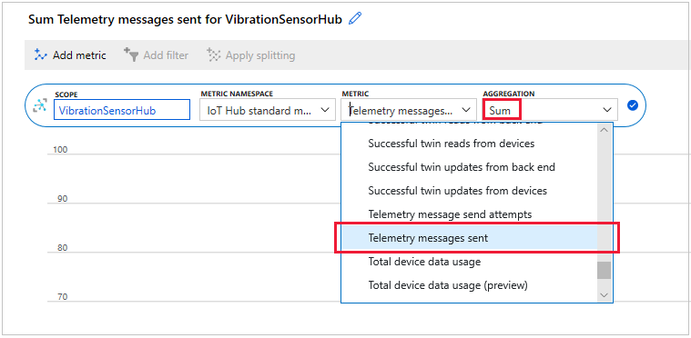](../media/metrics-alerts-telemetry-messages-sent.png#lightbox)

1. In the top-right of the portal, change the **Time range** to **Last 30 minutes**, and click **Apply**.

1. It's important to click **Pin to dashboard**, then **Pin to current dashboard**. If you do not pin a metric to a dashboard, it will not be persisted after you navigate away from the current dashboard. You should get a confirmation notification that the chart has been pinned.

1. There will be a short latency, but do you now see the telemetry data arriving?

    [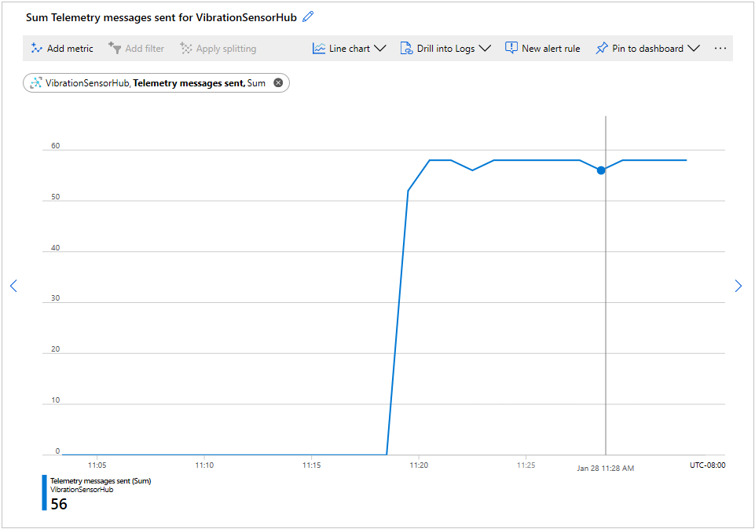](../media/metrics-alerts-metrics-chart.png#lightbox)

1. Click through the range of visualization options, the default is **Line chart**. Consider when a bar chart, or scatter plot, might be a better rendering option.

1. Optionally, click **New chart**, and add a second telemetry metric to your dashboard. Perhaps choose **Total device data usage** as the metric. Then pin the chart to the current dashboard. A number of metrics can be charted and pinned to the current dashboard. This alignment enables easy comparison between two metrics. It's clear that telemetry messages sent, and data usage, correlate closely.

1. That completes our look at metrics on their own. Close the device app for now, by closing the console window, as we build some alerts.

## Create an alert using the metrics and email action

1. In the portal page for your IoT Hub, click **Alerts**.

1. Select **+ New alert rule**. This button will bring up the **Create rule** page.

1. The **RESOURCE** entry should already have your IoT Hub name as the selection.

1. Let's create the action group next. Click **Create**, in the **ACTION GROUPS** section.

1. For **Action group name**, enter a descriptive name, such as "Email alerts for vibration telemetry". For **Short name**, something like "EmailAlert".

1. Verify your **Subscription** is the sandbox **Concierge Subscription**, and select the sandbox **Resource group**.

1. For the **Action group name**, enter something like "EmailActionGroup", and select the **Email/SMS/Push/Voice** for **Action Type**.

    [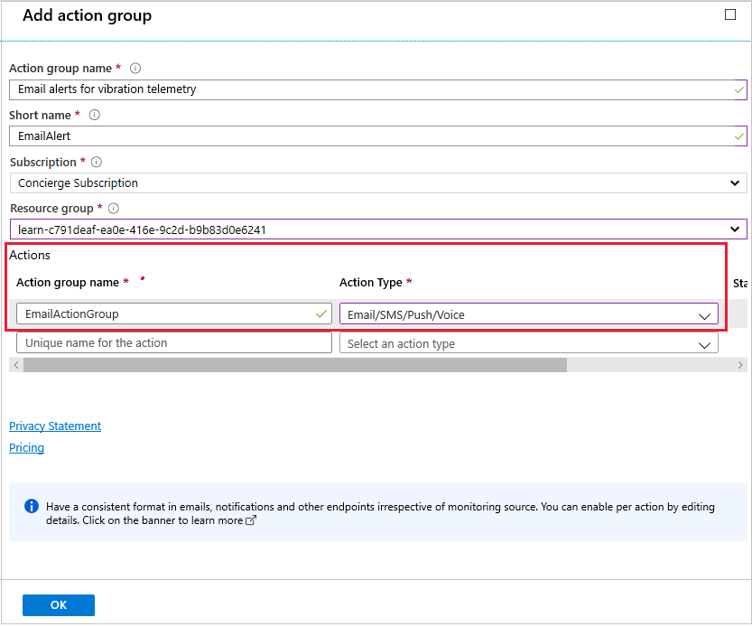](../media/metrics-alerts-email-action-group.png#lightbox)

1. For the **Email/SMS/Push/Voice** entry, click the **Email** checkbox, and enter the email address you want the alerts to go to.

    [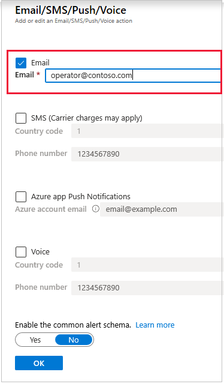](../media/metrics-alerts-email-alert.png#lightbox)

1. Leave the other entries blank, and click **OK**.

1. Click **OK** again, to add the action group. You should now be back at the **Create rule** page. Now, click **Add** under **CONDITION**. In the **Configure signal logic** page, go to the last page of entries, and select **Connected devices (preview)**.

    

1. In the **Configure signal logic** page, locate the **Operator** entry, and change it to **Greater than or equal to**. Change the **Aggregation type** to **Minimum**, and the **Threshold value** to **1**. Change the **Aggregation granularity (Period)** entry to **1 minute**. Clearly what we're doing here is firing off an email when our single device first connects to our IoT Hub.

1. Click **Done**.

    [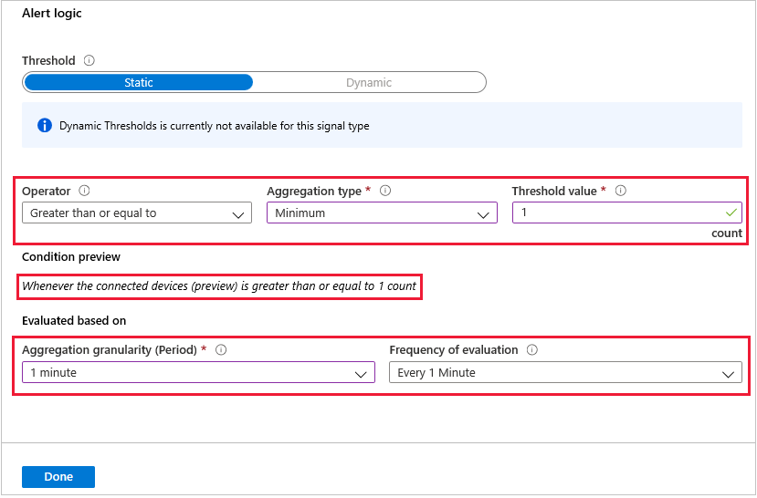](../media/metrics-alerts-email-alert-logic.png#lightbox)

1. Check the email account you are using. Have you received a message that you've been added to an Azure action group?

    [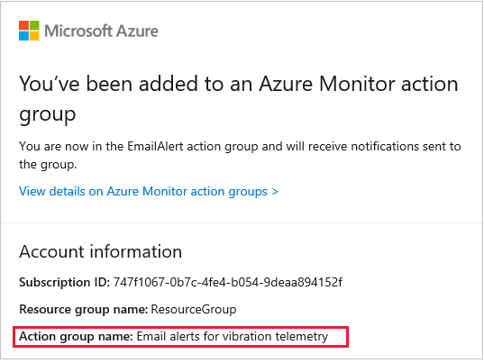](../media/metrics-alerts-email-note.png#lightbox)

1. Add an **Alert rule name**, and a brief **Description**, to complete the **Create rule** page. Leave the **Severity** as **Sev 3**, and leave **Enable rule upon creation** as **Yes**. Now, click **Create alert rule**, noting the message it can take up to 10 minutes for this rule to become active.

This step completes the process of creating an email rule. 

The next rule we want to create calls an Azure Function. So, first, let's create the Azure Function.

## Create an Azure Function using the HTTP trigger template

1. Click on **Home**, in the **Microsoft Azure** portal, so that the **+ Create a resource** icon appears.

1. Click **+ Create a resource**, and you should see **Function App** appear. If not, use the search bar to locate it. Click **Function App**.

1. Verify your sandbox subscription, sandbox resource group, and type an appropriate name into **Function App name**. The name _must_ be unique.

1. For **Runtime stack**, choose **.NET Core**.

    > [!NOTE]
    > For future reference, take note of the other options: Node.js, Python, Java, and PowerShell Core.

    [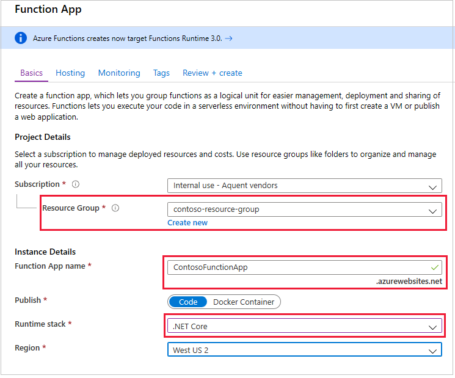](../media/metrics-alerts-function-1.png#lightbox)

1. Select your **Region**, then click **Next: Hosting**.

1. Select the sandbox storage account. For **Operating System**, choose **Windows**, and for **Plan type**, choose **Consumption**.

    

1. Now, click **Review + create**, then **Create**.

1. Wait for the deployment succeeded message, which may take a minute or two, then click **Go to resource**.

    > [!NOTE]
    > There is an Azure resource error that might catch you unawares. Creating resources in all regions is not always possible, due to capacity limits.  You may get the error shown in the following image. If this happens, change your selected region.

    [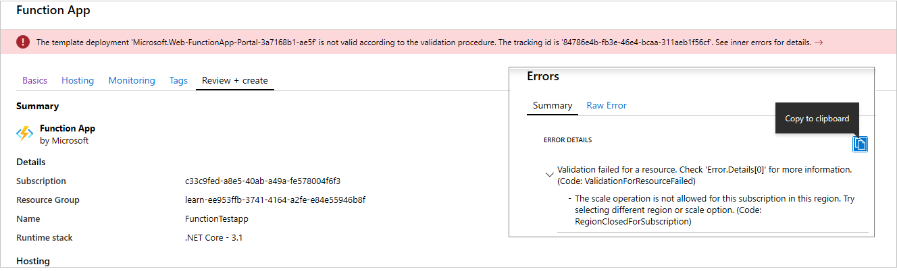](../media/metrics-alerts-region-error.png#lightbox)

1. Click the plus sign to the right of **Functions**.

    [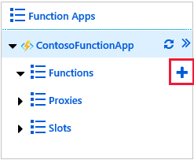](../media/metrics-alerts-function-plus.png#lightbox)

1. Select **In-portal**, and click **Continue**.

    [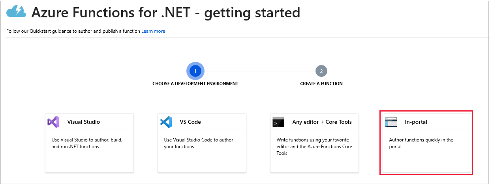](../media/metrics-alerts-function-in-portal.png#lightbox)

1. Select **More templates..**, click **Finish and view templates**, then select **HTTP trigger**.

    [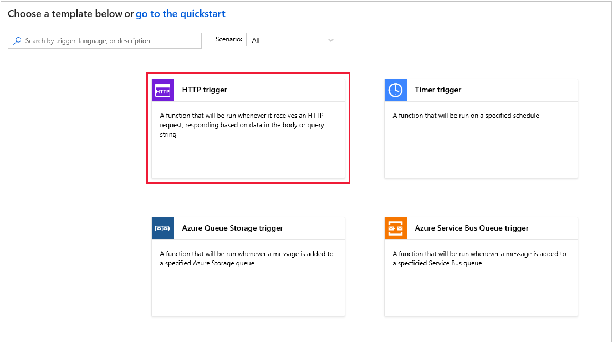](../media/metrics-alerts-function-http.png#lightbox)

1. Leave the **Name** of the new function as **HttpTrigger1**, and click **Create**. You should now see the function code.

    [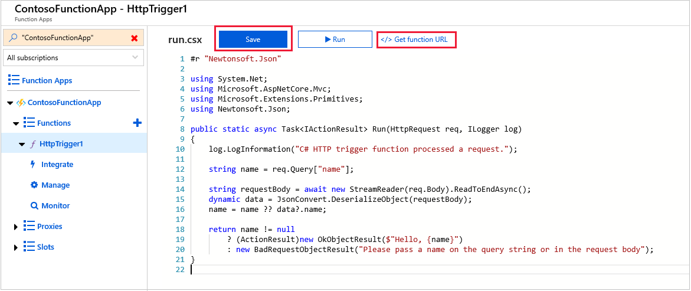](../media/metrics-alerts-function-http-body.png#lightbox)

1. Click the **Get function URL**, and save off the URL to a text file.

    > [!NOTE]
    > To test that the URL is active, add your name in a query parameter to the end of the URL: **?name=&lt;your name&gt;**. Then paste the URL into a browser. You should get the hello message in response.

1. Click **Save**. You've now created an Azure Function.

## Create an alert using the metrics and HTTP trigger action

Create a second alert for your IoT Hub.

1. In the portal page for your IoT Hub, click **Alerts**.

1. Select **+ New alert rule**. This button will bring up the **Create rule** page.

1. The **RESOURCE** entry should already have your IoT Hub name as the selection.

1. Let's create the action group next. Click **Create**, in the **ACTION GROUPS** section.

1. For **Action group name**, enter a descriptive name, such as "Vibration function action group". For **Short name**, something like "Vibration".

1. Verify your **Subscription** is the sandbox **Concierge Subscription**, and select the sandbox **Resource group**.

1. For the **Action group name**, enter something like "VibrationActions", and select the **Azure Function** for **Action Type**. You should be able to locate the Azure Function you created in the previous section, **HttpTrigger1**.

    [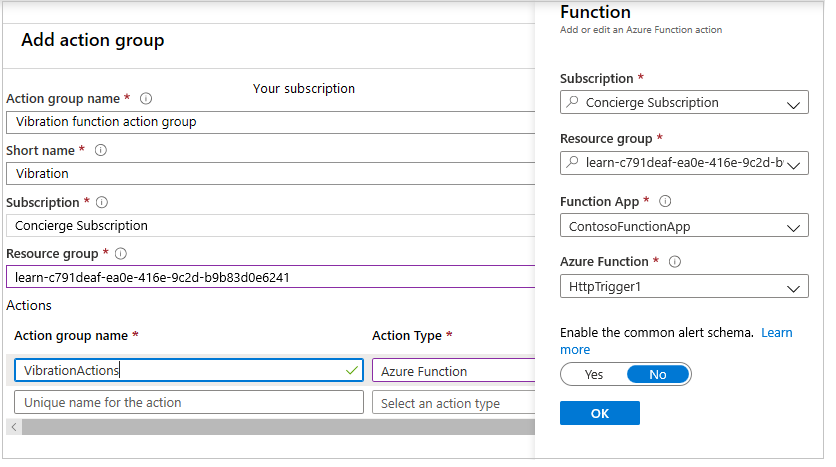](../media/metrics-alerts-function-action-group.png#lightbox)

1. Click **OK** to complete the action group.

1. Back in the **Create rule** page, locate **CONDITION**, and click **Add**. We'll add a condition that will fire when the total number of telemetry messages exceeds 30.

1. In the **Configure signal logic** page, type "telemetry" into the search bar. Select **Telemetry messages sent** from the list under **Signal name**.

1. Now enter the **Alert logic**. As the defaults are mostly what we want, just add **30** as the **Threshold value**.

    [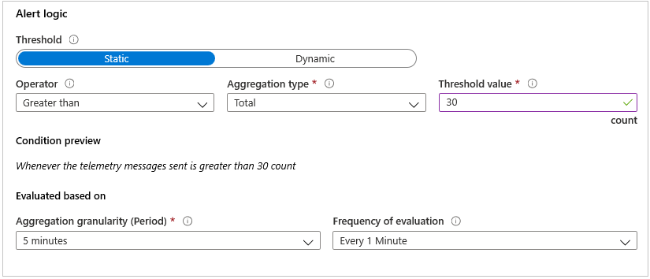](../media/metrics-alerts-function-logic.png#lightbox)

1. Click **Done**.

1. Enter an **Alert rule name**, such as "Telemetry greater than 30", and some text for **Description**.

1. Click **Create alert rule**.

## Next step

Great work. You've now created two alerts, an Azure Function, and should have a good idea of the range of actions and metrics available. The next step is to test the alerts.
