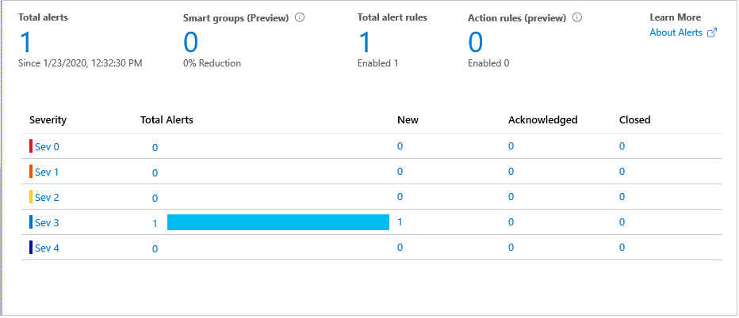
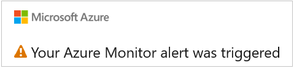

In this penultimate unit, we test that all your good work so far functions as it should.

1. Start by running your device app. As before, you should see a console screen full of telemetry messages.

    

1. Leave the app running.

## Test the HTTP trigger fires

1. In the IoT portal, go to the **Monitoring / Alerts** page. The default message should change to a table showing the status of the alerts received.

    

1. Click on any of the entries in the table, as most of the entries are links. These links will take you to the relevant rules. Remember that we left the rule **Severity** as level 3, when creating the rules. As the operator of the IoT Hub, you can change the status of the alerts from **New** to **Acknowledged** to **Closed**.  

## Test the email alert is sent  

1. Monitor the email account you used for the email alert. Have you received a "triggered" message yet? There's some latency between when the alert is fired to when you receive the email.

    

1. Close the device app. You should get a second email to this effect.

Testing the alert system didn't take long! Let's summarize whet we've achieved in this module, and finish with a knowledge check.
