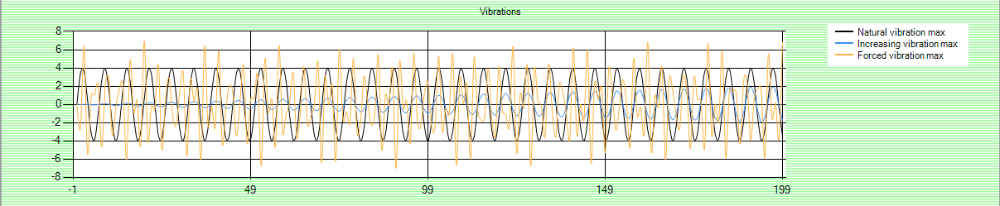

Good work finishing this module. Monitoring isn't an _exciting_ activity, but is an important one. By completing this module you now have a valuable introduction, and operational experience, of the monitoring features of an Azure IoT Hub.

In this module, you learned how to:

- Create an Azure IoT Hub and device identity, using the IoT Hub portal
- Create a device app to send telemetry to the IoT Hub, using Visual Studio or Visual Studio Code
- Create an email alert, using the IoT Hub portal
- Create an Azure Function, using the IoT Hub portal
- Create an action to trigger the Azure Function, using the IoT Hub portal

## Clean up

All resources created using the sandbox will be automatically deleted. If you created any resources outside of the sandbox, delete them from your Azure portal.

No need to delete your project code though, keep it for future reference!

## Next steps

Take your interest further with:

- [Create and manage action groups in the Azure portal](/azure/azure-monitor/platform/action-groups)
- [Azure Monitor documentation](/azure/azure-monitor)
- [Create diagnostic setting to collect platform logs and metrics in Azure](/azure/azure-monitor/platform/diagnostic-settings)
- [Azure Monitor log queries](/azure/azure-monitor/log-query/query-language)
- [An introduction to Azure Functions](/azure/azure-functions/functions-overview)

And look out for additional Learn modules on IoT Hub.

To earn your rewards, pass a final knowledge check.