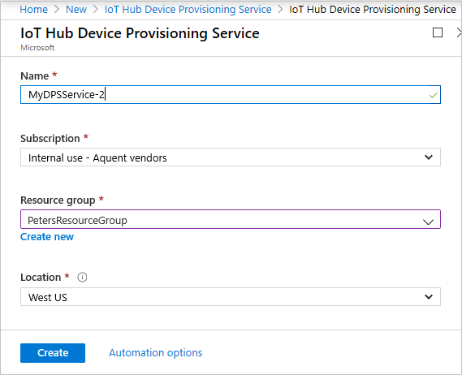
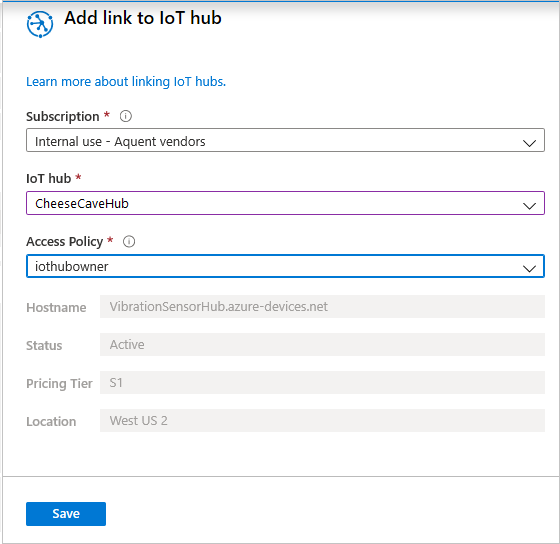

## Unit 1: Intro

An Azure IoT Hub can handle large volumes of telemetry data, sent from many sensor devices. You can individually set up each device, to be certain of its authenticity. However, with many devices, this task would be onerous to say the least. The process of validating the authenticity of a device is known as "provisioning". In this module, we investigate the IoT Device Provisioning Service (DPS). A service that enables the near-automatic provisioning of any number of devices.

This module builds on the [Remotely monitor and control devices with Azure IoT Hub](https://docs.microsoft.com/learn/modules/remotely-monitor-devices-with-azure-iot-hub/) module - a fun introduction to IoT Hub programming, using the example of a temperature and humidity sensor in a cheese cave. It isn't necessary to complete the introductory module before working on this module on security, though completing it will help your understanding of IoT Hub. The introductory module covers such concepts as Device Twins, and Direct Methods. These concepts aren't explained in detail in this module on security.

Security is a gnarly subject. However, it is more logical and understandable than you might think. Completing this module will give you a good foundation for making security decisions for your IoT-based projects.

## Learning objectives

In this module you will:

- Create a custom Azure IoT Hub, using the Azure portal
- Learn about device provisioning, X.509 certificates, and enrollments
- Create a DPS resource and a group enrollment, using the Azure portal
- Create an app to send device telemetry to your IoT Hub, using Visual Studio, or Visual Studio Code
- Test multiple devices are provisioned by your DPS resource

## Prerequisites

- An introductory knowledge of Azure IoT
- Ability to navigate the Azure IoT portal
- Ability to use C#, at the beginner level
- Experience using Visual Studio, or Visual Studio Code, at the beginner level

## The scenario

The [Remotely monitor and control devices with Azure IoT Hub](https://docs.microsoft.com/learn/modules/remotely-monitor-devices-with-azure-iot-hub/) module has one sensor in one cheese cave. The sensor ensures the cheese is maturing nicely to the ideal temperature and humidity for your particular brand.

Suppose you're the manager of the cheese cave maturing process. Your first cheese from the one cave has been a huge success. Your company has expanded rapidly and now has 30 cheese caves. Each cave is used to mature your best-selling cheese, but each cave is also in different locations throughout the country. Some of these caves provide near-ideal conditions without much involvement of a temperature/humidity setting fan. Other caves aren't so perfectly located, and require a fan to adjust the temperature and humidity, based on the telemetry output of a sensor.

If your cheese business carries on growing, you're going to need solutions that scale smoothly and effortlessly.


You decide on a single Azure IoT Hub to process the telemetry from all 30 sensors. You decide that commercial competition requires that your system is secure. You must be certain of each device before accepting its input. You decide to investigate Azure DPS as your security service.

Cheese making is a competitive business, and you want to keep your secrets well wrapped. And maybe your cheese too.


### The first step

The first step is to build an IoT Hub, using the Microsoft Azure portal.

## Unit 2: Create an IoT Hub

In this unit, we'll create an IoT Hub.

## Create a custom IoT Hub

1. Make sure you've activated the sandbox, using the button above. The sandbox creates free temporary resources.
1. Sign into the [Azure portal](https://portal.azure.com/learn.docs.microsoft.com?azure-portal=true).
1. Select **+ Create a resource**, from the top of the left-hand menu. In the **Search the Marketplace** search box, enter "IoT Hub".
1. Select **IoT Hub** from the search results, and click **Create**.
1. You'll be required to enter a **Subscription** from the selection offered to you. A sandbox subscription will be **Concierge Subscription**, so choose that. For **Resource Group**, enter <rgn>[sandbox resource group name]</rgn>. A resource group is like a folder, it's largely there to help you organize your resources.
1. The **Region** should be the geographical region closest to you, and finally enter a friendly name (say "CheeseCaveHub-&lt;your ID&gt;") for **IoT Hub Name**.
    >[!IMPORTANT]
    >Your hub names are publicly discoverable, so take this into account when entering names.
1. Now, select **Review + create**, this option gives you a chance to verify your choices before clicking **Create**, and building the hub. Building your hub can take a few minutes.
1. When the IoT Hub is built, click **Go to resource** to go to the **Overview**** page for your hub. Or search for it in **All Resources**, if you happen to miss the completion message.
1. It's a good idea to bookmark the **Overview**** page of your IoT Hub.

Having created the hub, let's take a step back and go over some theory. You might find this knowledge valuable in understanding the security resources.

## Unit 3: Overview of the DPS service and X.509 certs

This module uses X.509 certificates to validate devices, before the devices are allowed to communicate with the IoT Hub. Let's go over some background information about these certificates.

## Introduction to DPS and X.509 certificates

The basis of the X.509 certificate is the concept of public/private key encryption. A _public_ key enables data to be encrypted. Use of the key distorts the text of the message into incomprehensible characters. A _private_ key is used to decrypt the message, back into its original text. The public key can't be used to decrypt the message. Public/private keys is a form of _asymmetric_ encryption. Asymmetric encryption is more secure than _symmetric_ encryption, where the same key is used to encrypt and decrypt a message. However, the private key needs to be kept secret.

To keep private keys secret, a _public key infrastructure_ (PKI) is needed to prevent the keys becoming lost or stolen. This infrastructure is potentially a disadvantage of the public/private key system. However, using X.509 certificates with the Azure Device Provisioning Service (DPS), a public key infrastructure is built into the service. Users of the service don't even need to know their own private keys. The private keys are generated by helper tools that are publicly available. The keys are stored in the X.509 certificates, and a user doesn't need to do much more than upload them to Azure DPS. A password protects the content of the private key.

To validate the authenticity of X.509 certificates, the certificates need to be _signed_. There are two ways of signing. You can use an organization known as a _Certificate Authority_ (or, CA) that specializes in supplying signed certificates. This approach might be the right way to go in a production environment, though there can be a cost involved. The alternative is known as _self-signed_ certificates, where the user validates their own certificates. There's no cost to this second option, though as you would be relying on publicly available tools, this system isn't recommended for production. For our purposes in this module, self-signed certificates will work fine.

The name "X.509" originates from the format the certificate is stored in.

With the X.509 certificates and the PKI, there's no need to distribute the public keys when creating key pairs. Another advantage is the PKI can maintain a list of invalidated certificates, so authentication can be centrally revoked.

There's a bit more to the X.509 story that you need to know, as it's central to our sample.

### Root, intermediate, and leaf certificates

There's perhaps a third way of signing certificates. That is, a certificate can be used to validate another certificate. Such a certificate is known as a _root certificate_, or sometimes a _trust anchor_. This one certificate isn't used to validate any devices, for example, but is only used to validate a range of subordinate certificates.

These subordinate certificates can be _intermediate certificates_. An intermediate certificate is again not used to validate devices, but only to validate other intermediate certificates, or validate _leaf_ certificates. We'll not be using any intermediate certificates in our sample.

A leaf certificate, as its name suggests, is the end-entity certificate that is used to validate a device. Leaf certificates can't be used to validate other certificates. A root certificate can be used to validate any number of intermediate, or leaf, certificates.

In our sample, we'll generate one root certificate for all our devices. From that root, we'll generate one leaf certificate for _each_ device that we'll be connecting to the IoT Hub.

All these certificates will be self-signed.

Cryptography is a complex technology, that goes deep into mathematics, so isn't for everyone. Follow the links on the **Summary** page of this module, if you're interested in a deeper introduction than we have given here. For the record, X.509 certification is the basis of the secure HTTPS protocol - for secure browsing of the internet.

Suffice to conclude that public/private key technology is state-of-the-art security, and by using X.509 certificates correctly, you can be confident you IoT Hub is secure. Secure against an invalid device supplying invalid data, and secure against a denial-of-service type attack. However, no security is perfect, and doing your own research on certification is recommended.

An Azure Device Provisioning Service can be linked to one, or more, IoT Hubs, and can be thought of as a system for managing your certificates, and managing your enrollments.

### Individual and Group Enrollments

An Azure DPS can contain a number of individual, or group, enrollments. In our scenario, the group enrollment provides the solution we're looking for. One enrollment group works with one root certificate, and any number of leaf certificates signed by this root. An enrollment maintains information on all the devices that have tried to register.

Individual enrollments are best used for devices that have a unique configuration, and require greater security than the connection strings you may have used in other Learn modules or Azure samples. Unique configurations aren't what we're looking for in our scenario, where we have many sensors configured to provide an identical set of telemetry data.

Another concept you'll see when we create an Azure DPS resource, is that of _allocation policy_. This policy isn't something we delve into. Allocation policies only apply when you've multiple IoT Hubs handling telemetry from a huge number of devices, and want to direct the incoming data to one of these hubs based on a policy.

After creating your enrollments, and self-signed root certificate, there's one more process necessary to prove to the provisioning service that you own the root certificate.

### Proof of Possession

When uploading certificates to Azure DPS, you'll be asked to generate a verification code.

_Proof of Possession_ of a certificate is provided to DPS by uploading a _verification_ certificate generated from the root certificate with the verification code that you generated within DPS. The verification certificate is _chained_ to the root certificate.

This process is how you provide proof that you own the root certificate. There's no need to provide proof of possession of the leaf certificates, as, if you own the root, trust has been established.

### Next step

That should be enough theory. For the next step, let’s create an Azure DPS resource, and then all the necessary certificates.

## Unit 4: Create a DPS resource, a root certificate, and a Group Enrollment

A Device Provisioning Service (DPS) can be linked to one, or multiple hubs. So, it's a separate resource, and is independent of any one IoT Hub. You create a DPS resource the same way you create any other Azure resource.

## Create an Azure IoT Hub Device Provisioning Service

1. In your [Azure portal](https://portal.azure.com/learn.docs.microsoft.com?azure-portal=true), select **Create a resource**.

1. Type "provisioning" in the search box, and select **IoT Hub Device Provisioning Service**.

    

1. Specify the resource, with a name such as "CheeseCave-DPS". Use the sandbox subscription and resource group options. And choose your **Location**.

    

1. Create the resource, and wait for it to deploy.

### Link the DPS resource to your IoT Hub

1. In the DPS resource, locate, and select, the **Linked IoT hubs** entry, under **Settings**.

1. Click **+ Add**.

1. In the **Add link to IoT hub** pane, select the sandbox subscription.

1. Locate the name of your IoT hub, and select **iothubowner** as the **Access Policy**. Click **Save**.

    

1. Click **Manage allocation policy**, and verify the policy is set to **Evenly weighted distribution**.

    

1. Perhaps bookmark a link to the **Overview** page of this resource.

Before we can go any further with the DPS resource, by adding enrollments, we must first create a root certificate.

## Create an X.509 root certificate

The first time we create any X.509 certificates, we need to download some tools.

1. Open an Azure Cloud Shell, and select the **Bash** shell option. We need the Bash option, as the helper tools that you'll download next are written for Bash.

1. Run the following script. It creates a certificate directory in the shell storage, and downloads some helper scripts to it.

```azurecli
 # create certificates directory
 mkdir certificates
 # navigate to certificates directory
 cd certificates

 # download helper script files
 curl https://raw.githubusercontent.com/Azure/azure-iot-sdk-c/master/tools/CACertificates/certGen.sh --output certGen.sh
 curl https://raw.githubusercontent.com/Azure/azure-iot-sdk-c/master/tools/CACertificates/openssl_device_intermediate_ca.cnf --output openssl_device_intermediate_ca.cnf
 curl https://raw.githubusercontent.com/Azure/azure-iot-sdk-c/master/tools/CACertificates/openssl_root_ca.cnf --output openssl_root_ca.cnf

 # update script permissions so user can read, write, and execute it
 chmod 700 certGen.sh
```

These helper scripts are downloaded from the Azure/azure-iot-sdk-c open-source project hosted on GitHub. This project is a part of the Azure IoT SDK. The certGen.sh helper script will help demonstrate the purpose of CA Certificates without diving into the specifics of OpenSSL configuration. If you need additional instructions on using these helper scripts, or for instructions on how to use PowerShell instead of Bash, refer to [CACertificateOverview](https://github.com/Azure/azure-iot-sdk-c/blob/master/tools/CACertificates/CACertificateOverview.md).

>[!WARNING]
>Do not use these helper scripts in a production environment, as the scripts contain hard-coded passwords that expire after 30 days. The scripts are provided only for demo purposes.

1. Run the following command to generate root and intermediate certificates. We're only interested in the root certificate, which will be named `azure-iot-test-only.root.ca.cert.pem`.

```azurecli
 ./certGen.sh create_root_and_intermediate
```

1. We need to download the root certificate to your local machine, to then upload it to Azure DPS. Type:

```azurecli
 download ~/certificates/certs/azure-iot-test-only.root.ca.cert.pem
```

### Configure Azure DPS to trust the root certificate

1. In the Azure portal, navigate to the cheese cave DPS resource you created earlier.

1. In the **Settings** section, click **Certificates**.

1. Click **Add**. For the **Certificate Name**, enter an understandable name such as "cheesecave-dps-root". The name doesn't have to be the same as the certificate filename.

1. For **Certificate .pem or .cer file**, navigate to and select the azure-iot-test-only.root.ca.cert.pem file that you downloaded.

1. Click **Save**.

After the root certificate has been uploaded, the **Certificates** pane will display the certificate with the status of **Unverified**. Before this CA Certificate can be used to authenticate devices to DPS, you'll need to verify _Proof of Possession_ of the certificate.

1. In the **Certificates** pane, click on the certificate to open the **Certificate Details** pane.

1. Click **Generate Verification Code**.

1. Copy the **Verification Code** that is displayed above the **Generate Verification Code** button. There's a button to the right of the textbox to copy the code for you. Open a text editor, such as Notepad, and paste in the verification code.

    Proof of Possession of the CA certificate is provided to DPS by uploading a verification certificate generated from the root certificate. The verification certificate contains the verification code you just generated. This process is how you provide proof that you own the CA Certificate.

1. Leave the **Certificate Details** pane open while you generate the verification certificate. If you close the pane, you'll invalidate the verification code, and will need to generate a new one.

1. Copy the following command to the text file containing the verification code, and change the &lt;verification-code&gt; to the actual code.

```azurecli
 ./certGen.sh create_verification_certificate <verification-code>
```

1. Back in the Azure Cloud Shell, and in the **certificates** directory, run the completed command. This command generates a verification certificate that is chained to the root certificate. The generated certificate is named `verification-code.cert.pem`, and is located within the **./certs** directory of the Azure Cloud Shell.

1. Run the following command to download the verification certificate to your local machine.

```azurecli
download ~/certificates/certs/verification-code.cert.pem
```

1. Change focus back to the **Certificate Details** pane of the Azure portal. For **Verification Certificate .pem or .cer file**, navigate to, and select the `verification-code.cert.pem` file.

1. Click **Verify**, and, in the **Certificates** pane, check the status for the certificate is now displayed as **Verified**. You may need to use the refresh button at the top of the pane to see this change.

Great progress, you've created a root certificate, and validated to Azure DPS that you own it. The next step is to create a **Group Enrollment**, and link it to the root certificate.

### Create a Group Enrollment in Azure DPS

1. In the Azure portal, with your DPS resource selected, locate the **Settings** section.

1. Click **Manage enrollments**, then **Add enrollment group**. Make sure you're adding a group, and not an individual, enrollment.

1. For **Group Name**, enter "cheesecave-devices".

1. Ensure the **Attestation Type** is set to **Certificate**, and the **Certificate Type** field is set to **CA Certificate**. These settings are the defaults.

1. In the **Primary Certificate** dropdown, select your CA certificate. This certificate will be **cheesecave-dps-root**, if you used the suggested name.

1. Leave the **Secondary Certificate** dropdown set to **No certificate selected**. You're not required to have a secondary certificate.

1. Leave **Select how you want to assign devices to hubs** as **Evenly weighted distribution**. As you only have one IoT Hub associated with the enrollment, this setting is unimportant.

1. Verify your IoT Hub is selected in the **Select the IoT Hubs this device can be assigned to** field. Leave the reprovisioning settings at their defaults.

1. Finally, click **Save**, and verify your new enrollment group appears in the **Enrollment Groups** pane.

A group enrollment is going to be very useful in handling remote devices at scale. The next unit create multiple leaf certificates.


## Unit 5: Create multiple leaf certs

In this unit, we need to create one leaf certificate for each device that we want to send telemetry to the hub. Two is company, three is a crowd. So, let's create code for a "crowd" of devices. Remember, in our scenario description we stated that there were now 30 cheese caves, requiring 30 sensor devices. Let's limit this number to three for the sake of explanation and testing!

1. In the Azure Cloud Shell, make sure you're in the **certificates** folder.

1. Run the following command:

```azurecli
 ./certGen.sh create_device_certificate cheesecave-device1
```

1. Verify the leaf certificate was created correctly. You should see numerous console messages, ending in something like the following image.

    

1. To download the created certificate to your local machine, enter:

```azurecli
download ~/certificates/certs/new-device.cert.pfx
```

1. Create a new folder in your **Documents** folder, called "cheesecave certs", or something similar.

1. Copy the **new-device-cert.pfx** file from its downloaded location into the **cheesecave certs** folder, and rename it **new-device-cert1.pfx**.

1. In the Azure Cloud Shell, delete the **new-device-cert** files. This step is important so the tools can be used to create further certificates. You can delete the file, in the **certificates/certs** folder, by going through the following procedure:
    1. Type `cd certs`.
    1. Type `rm new*`.
    1. Answer `y` to the question on the protected file.
    1. Type `cd ..`.

1. In the Azure Cloud Shell, create a second leaf certificate:

```azurecli
 ./certGen.sh create_device_certificate cheesecave-device2
```

1. If you get a `Permission denied` response, similar to the following, verify you've deleted the earlier certificates correctly.

    

1. Download the second certificate to your local machine, enter:

```azurecli
download ~/certificates/certs/new-device.cert.pfx
```

1. Copy the **new-device-cert.pfx** file from its downloaded location into the **cheesecave certs** folder, and rename it **new-device-cert2.pfx**.

1. In the Azure Cloud Shell, delete the **new-device-cert** files:
    1. Type `cd certs`.
    1. Type `rm new*`.
    1. Answer `y` to the question on the protected file.
    1. Type `cd ..`.

1. In the Azure Cloud Shell, create a third leaf certificate:

```azurecli
 ./certGen.sh create_device_certificate cheesecave-device3
```

1. Download the third certificate to your local machine, enter:

```azurecli
download ~/certificates/certs/new-device.cert.pfx
```

1. Copy the **new-device-cert.pfx** file from its downloaded location into the **cheesecave certs** folder, and rename it **new-device-cert3.pfx**.

Great, you now have three leaf certificates. The next step is to write some code to simulate each device.


## Unit 6: Create the code for the sensor devices

In this unit, we create the code running on each sensor device.

One of the goals is to make the code as identical as possible for each device, so minimizing human involvement. The code will require one tweak as we prepare it for a second device, the path to the leaf certificate needs to be unique for each device. Unique in this case means changing a "1" to a "2" or "3". This change is so minor it could easily be automated in a production environment.

The code is written in C#, and you can choose Visual Studio, or Visual Studio Code, as your development environment.

## Create a project for a simulated device

 Project stuff
 Code stuff
 COPY FROM CHEESE CAVE CODE SETUP

1. Change the &lt;your leaf path&gt; to the actual path to your leaf certificate.

```csharp
      private static string s_certificateFileName = "C:\\Users\\<your user name>\\Documents\\cheesecave certs\\new-device.cert1.pfx";
```

1. Set the app running. In Visual Studio, select **Debug/Start without Debugging**. In Visual Studio Code, enter `dotnet run` in the terminal.

    

### Create an app for a second device

1. Repeat all the steps in the **Create a project for a simulated device** section, except with a new project name.
1. Change the leaf name from `new-device.cert1.pfx` to `new-device.cert2.pfx`.
1. Set the app running.

    

### Create an app for a third device

1. Repeat all the steps in the **Create a project for a simulated device** section, except with a new project name.
1. Change the leaf path from `new-device.cert1.pfx` to `new-device.cert3.pfx`.
1. Set the app running.

    

Great, a bit of repetitive work, but we now have our crowd of devices. The next, and final, step is to test our DPS resource and IoT Hub handle the assignments and telemetry correctly.

## Unit 7: Test your DPS linked IoT Hub with multiple devices

In this unit, we verify all the pieces we have put in place work as expected. You've already set all the device apps running. First, we check the provisioning service handles the registration correctly. Then we'll check the IoT Hub gets automatic updates to its list of connected IoT devices, and receives the telemetry from the devices. Finally, in the portal, we change a device twin setting for one device, and verify the correct device picks up the change.

## Test the multiple devices are automatically assigned to your IoT Hub

> [!TIP]
> With three console screens running, a Visual Studio instance to initiate the devices, and a browser view of the Azure portal, it can help to have multiple monitors. The more screen real estate you've available for testing, the easier you'll find testing is!

1. Verify all three device apps are still sending telemetry.

    

1. In the Azure portal for your DPS service, locate **Monitoring** in the left-hand menu, and select **Metrics**. Verify all three devices are assigned, by setting **Metric** to **Devices assigned**, and **Aggregation** to **Sum**.

    

1. In the Azure portal, this time for your IoT Hub, select **IoT devices** in the left-hand menu. Verify all three devices are listed, and have **Status** set to **Enabled**.

    

> [!NOTE]
> You'll remember that you did not add any devices using the Azure portal. These devices have been added by the link from your DPS system.

1. For added reassurance, in the left-hand menu select **Metrics** for your hub. Enter **Connected devices** for **Metric**, and set **Aggregation** to **Max**.

    

1. Still in **Metrics**, verify telemetry is received by changing **Metric** to **Telemetry messages sent**, and **Aggregation** to **Sum**.

    

You've now verified that all devices connected automatically to the hub via the DPS resource. You've completed the substance of this module, but let's do one more test, to verify communication in the opposite direction.

### Test the cloud-to-device communication

In this test, let's change one of the device twin properties in the portal, and ensure it's communicated to the device.

1. Select **IoT devices** for your hub, select **cheesecave-device1**.  Then, in the bar, select **Device Twin**.

1. Locate the **desired** section of the **properties** in the code that appears.

1. Change the desired temperature to something different and noticeable: say "50.123". And click **Save**.

    

1. Verify, in the console output, the change is picked up quickly by the selected device.

    

If all this worked as expected, great work. You now know what needs to be done to provision devices at scale. We limited ourselves to three devices, but you can imagine, with some automation and tooling, how you could provision a large number of devices, with minimum human involvement.

To complete the module, let's summarize the goals, and finish with a knowledge check.

## Unit 8: Summary

Completing this module should have given you valuable insight into the dark world of cryptography and message security. If you're new to this world, you'll appreciate the thought and design that has gone into X.509 certificates, and Azure DPS Group Enrollments. You'll see how these technologies neatly map the root and leaf X.509 certificates to an IoT Hub and its range of IoT devices. You'll also appreciate how well these technologies make security user-friendly enough for those of us who don't want to know too much about the underlying math.

In short, you have learnt how to keep your cheese maturing practices a secret!


In this module, you learned how to:

- Create a custom Azure IoT Hub, using the Azure portal
- Create a DPS resource and a group enrollment, using the Azure portal
- Create root and leaf X.509 certificates
- Create an app to send device telemetry to your IoT Hub, using Visual Studio, or Visual Studio Code
- Test multiple devices are provisioned by your DPS service

## Next steps

Learn about storing passwords and certificates:

- [Azure Key Vault](https://azure.microsoft.com/services/key-vault/)
- [Azure Dedicated HSM](https://azure.microsoft.com/services/azure-dedicated-hsm/)

Learn more about IoT Hub:

- [IoT Hub Documentation](https://docs.microsoft.com/azure/iot-hub/)

Learn more about IoT Hub devices:

- [Find your IoT device](https://catalog.azureiotsolutions.com/)

Learn more about X.509 certificates:

- [X.509 Digital Certification](https://docs.microsoft.com/windows/win32/seccrypto/x-509-digital-certification)

To complete this module, there's a slightly harder-than-usual knowledge check. Good luck with it!
