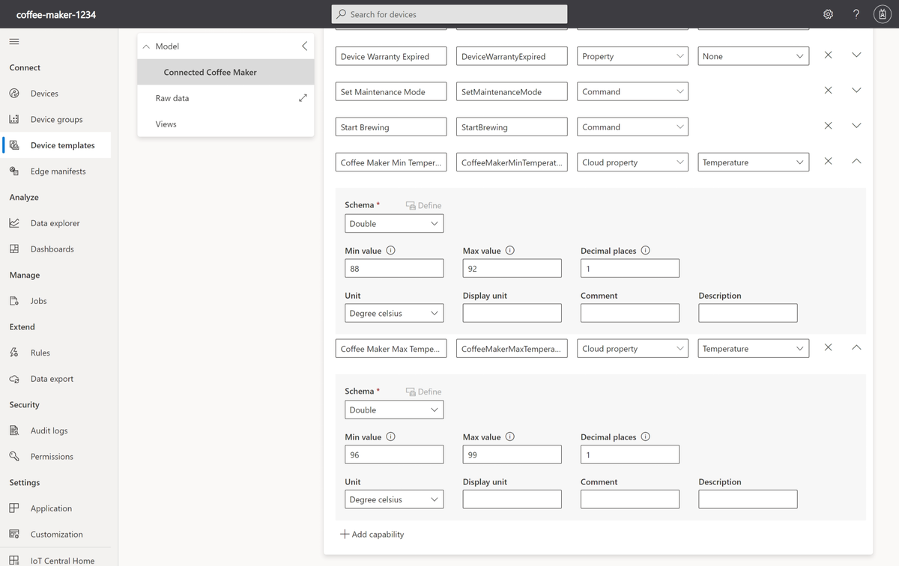

To create a device template, you can either build it from scratch in the IoT Central UI, or get started by importing a device capability model.

Recall that in the IoT enabled coffee machines example, you'll connect a coffee machine simulator to IoT Central for monitoring telemetry such as water temperature and humidity, observe the state of the machine, set optimal temperature, receive warranty status, and send commands.

Here, you'll create and publish the **Connected Coffee Machine** device template defined in the device capability model.

## Create a device template

You already have a device capability model for the coffee machine defined in the _CoffeeMaker.json_, so you'll use that.

1. Browse to the URL for your IoT application that you created in the previous exercise, such as https://coffee-maker-1234.azureiotcentral.com.

1. Select the icon for **Device templates** on the home page of your Azure IoT Central application, and then select **+ New**.

1. On the **Select type** page, select the **IoT device** tile, and then select **Next: Customize**.

1. On the **Customize** page, enter _Connected Coffee Machine_ as the device template name, then select **Next: Review**, and then select **Create**.

1. On the **Create a model** page, select the **Import a model** tile.

1. Browse to the _CoffeeMaker.json_ file you created previously, and select **Open**.

IoT Central displays the **Connected Coffee Maker** capability model that defines the telemetry, properties, and commands that the device supports.

## Add cloud properties

To add the cloud properties that store the ideal water temperature range for the coffee machine:

1. Navigate to the **Connected Coffee Machine** device template you created, and select  **Connected Coffee Maker** capability model.

1. Select **Add capability** and add two cloud properties to the device template using the information in the following table; you might need to select the down icon to expand some of these values:

    | Display name | Name |Capability type | Semantic type | Schema | Min value | Max value | Decimal places | Unit|
    | ------------ | ---- | ------------- | ------------- | ------ | --------- | --------- | -------------- | ---- |
    | Coffee Maker Min Temperature | CoffeeMakerMinTemperature | Cloud Property | Temperature | Double | 88 | 92 | 1 | Degree celsius |
    | Coffee Maker Max Temperature | CoffeeMakerMaxTemperature | Cloud Property | Temperature | Double | 96 | 99 | 1 | Degree celsius |

1. Save your changes.

    

## Add views to your template

To create a view that lets you visualize the telemetry from your coffee machine:

1. Navigate to the **Connected Coffee Machine** device template you created, and select **Views**.

1. Add a new **Visualizing the device** view called _Telemetry_.

1. Select **Start with devices** and add the following tiles:

    - Select **Cup Detected** in **Telemetry** category and then **Add tile**. Change the tile visualization to **Last Known Value** and size to **2 x 1**.

    - Select **Brewing** in **Telemetry** category and then **Add tile**. Change the tile visualization to **Last Known Value** and size to **2 x 1**.

    - Select **Water Temperature** and **Air Humidity** in **Telemetry** category and then **Add tile**. Change the tile visualization to **Line chart** and size to **2 x 2** then select **Edit**. Change **Title** to _Telemetry_ and confirm the **Display range** is set to **Past 30 minutes**. Select **Update**.

    - Select **Water Temperature** in **Telemetry** category and then **Add tile**. Change the tile visualization to **KPI** and size to **1 x 1** then select **Edit**. Change **Title** to _Water Temperature (Min)_ and select **Past 12 hours** in **Time range**. Select **Update**.

    - Select **Air Humidity** in **Telemetry** category and then **Add tile**. Change the tile visualization to **KPI** and size to **1 x 1** then select **Edit**. Change **Title** to _Air Humidity (Max)_ and select **Past 12 hours** in **Time range**. Select **Update**.

1. Save your changes.

    

To create a view that lets you manage the properties of your coffee machine:

1. Navigate to the **Connected Coffee Machine** device template you created, and select **Views**.

1. Add a new **Editing device and cloud data** form called _Properties_.

1. Select both the **Optimal Temperature** and **Device Warranty Expired** properties and the **Coffee Maker Min Temperature** and **Coffee Maker Max Temperature** cloud properties, and then select **Add section**.

1. Save your changes.

    

## Publish the Coffee Machine template

Before you can connect a coffee machine device to your IoT Central application, you need to publish the **Connected Coffee Machine** device template:

1. Navigate to the **Connected Coffee Machine** device template you created, and select **Publish**.

1. The **Publish this device template to the application** shows you the changes that you're publishing. Select **Publish**.

## Check your work

To verify that the device template was published and is ready to use:

1. Navigate to the **Devices** page in your Azure IoT Central application.

1. Check that the **Connected Coffee Machine** device is in the list of available device types:

    
