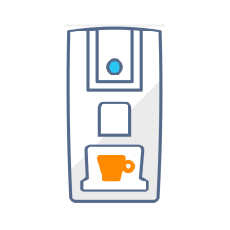
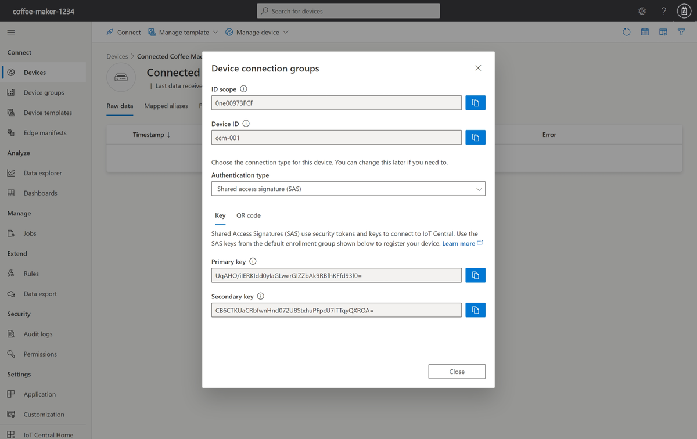
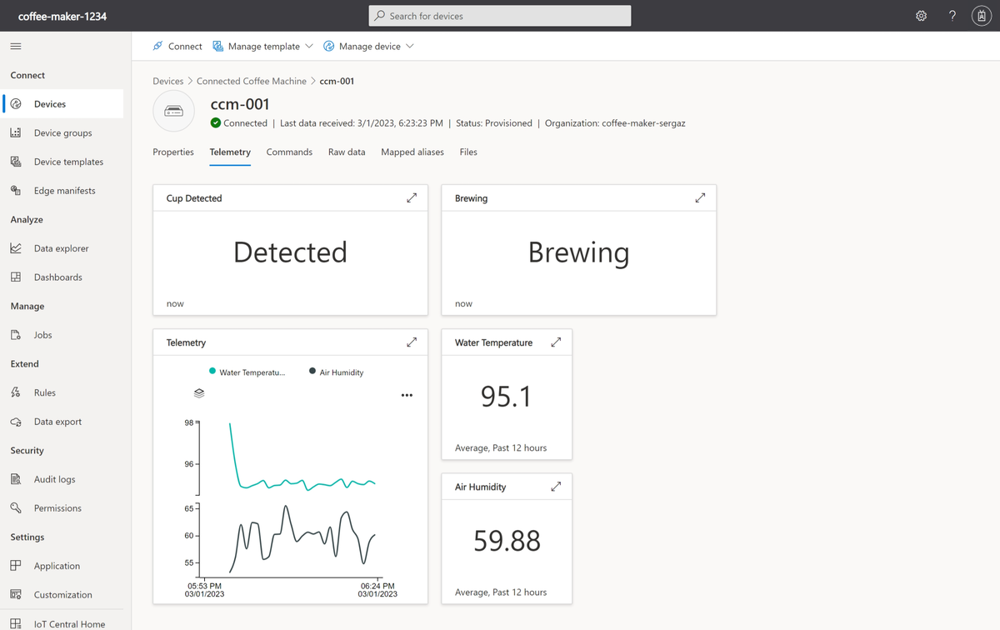

To validate your scenario before connecting a physical device, use a device simulator that implements the behaviors defined in the device model.

Recall that in the IoT enabled coffee machines example, you'll connect a coffee machine simulator to IoT Central for monitoring telemetry such as water temperature and humidity, observe the state of the machine, set optimal temperature, receive warranty status, and send commands.

Here, you'll simulate a device with a C# application and connect it to the Azure IoT Central application.



## Add the coffee machine to IoT Central

First, register the device:

1. In your IoT Central application, navigate to **Devices** and then **+ New**.
1. On the **Create a new device form**, change the **Device ID** to *ccm-001* and **Device name** to *Connected Coffee Machine - 001*. Make sure that **Device template** is *Unassigned* and **Simulate this device** is *No*, and then select Create.

The **Connected Coffee Machine - 001** device now shows in the list of devices with a status of **Registered** and template **Unassigned**. In the previous unit, we looked at the C# application code and confirmed that the model ID is sent when provisioning the device. That allows IoT Central to assign the correct device template the first time the device connects.

## Get connection information

To run the C# application, you need the following configuration values:

1. Select **Connected Coffee Machine - 001** in the list of devices to view the device details.
1. Select **Connect** to open the **Device connection groups** panel.
1. Either keep this page open, or make a note of the **ID scope**, **Device ID**, and **Primary key** values.

    

Use the Azure Cloud Shell to set the environment variables used by the C# application.

```azurecli
export ID_SCOPE=<The ID scope you made a note of previously>
export DEVICE_ID=<The Device ID you made a note of previously>
export DEVICE_KEY=<The Primary key you made a note of previously>
```

Print the environment variables and confirm they're correctly defined.

```azurecli
printenv ID_SCOPE DEVICE_ID DEVICE_KEY
```

## Create a C# application

The following steps show you how to create a client application that implements the coffee machine device simulator.

> [!TIP]
> In this exercise, you create the C# app in the Azure Cloud Shell so that you don't have to install anything on your local machine.

1. Execute the following command in the Azure Cloud Shell to create a `coffee-maker` folder and navigate to it:

    ```azurecli
    mkdir ~/coffee-maker
    cd ~/coffee-maker
    ```

1. Execute the following command in the Cloud Shell to download the source files in your `coffee-maker` folder:

    ```azurecli
    wget https://raw.githubusercontent.com/Azure-Samples/iot-central-docs-samples/main/monitor-manage-device-with-iotcentral/CoffeeMaker-csharp.csproj
    wget https://raw.githubusercontent.com/Azure-Samples/iot-central-docs-samples/main/monitor-manage-device-with-iotcentral/CoffeeMaker.cs
    wget https://raw.githubusercontent.com/Azure-Samples/iot-central-docs-samples/main/monitor-manage-device-with-iotcentral/Parameters.cs
    wget https://raw.githubusercontent.com/Azure-Samples/iot-central-docs-samples/main/monitor-manage-device-with-iotcentral/Program.cs
    ```

1. Execute the following command in the Cloud Shell to start the app:

    ```azurecli
    dotnet run
    ```

1. Verify that the app starts in the Cloud Shell window with the message *Device successfully connected to Azure IoT Central* along with *Telemetry send:* messages. 

Congratulations! Your app is up and running and communicating with IoT Central!

## Check your work

You've now worked with the Azure IoT Central application and connected the coffee machine to Azure IoT Central. You're well on your way to begin to monitor and manage your remote coffee machine. Here, you take a moment to validate your setup and connection by using the **Connected Coffee Machine** template that you defined earlier. You update the optimal temperature on the **Properties** form, run commands to update the state of your machine, and view your connected coffee machine telemetry.

### Update properties to sync your application with the coffee machine

Use the **Properties** form you defined in the device template to send configuration data to the coffee machine from your application.

1. Navigate to the **Devices** page in your Azure IoT Central application.

1. Select **ccm-001** from the list of devices to view the device details.

1. Select **Properties** to view the form.

1. Enter *95* as the optimal temperature. Then select **Save**.

When the property is changed, the property is marked as **Pending: now** in the UI until the coffee machine acknowledges the setting change. The property is then marked as **Accepted: now**.

> [!NOTE]
> Successful updates in the setting indicate data flow and validate your connection. The telemetry measurements will respond to the update in optimal temperature.

### Update cloud properties

Use the **Properties** form you defined in the device template to update configuration data for the coffee machine.

1. Navigate to the **Devices** page in your Azure IoT Central application.

1. Select **ccm-001** from the list of devices to view the device details.

1. Select **Properties** to view the form.

1. Enter *99* as the **Coffee Maker Max Temperature (&deg;C)** and *92* as the **Coffee Maker Min Temperature (&deg;C)**. Then select **Save**.

Cloud properties aren't synced with the device, they only exist in the IoT Central application.

### Run commands on the coffee machine

Navigate to the **Commands** page for your device for the following exercise. To validate the commands setup, you remotely run commands on the coffee machine from IoT Central. If the commands are successful, confirmation messages are sent back from the coffee machine.

1. Start brewing remotely by selecting **Run**.

    The coffee machine starts if these three conditions are satisfied:
    - Cup detected
    - Not in maintenance
    - Not brewing already  

    > [!NOTE]
    > When you've successfully started brewing, the state of the machine changes to **Brewing** as indicated on the **Telemetry** page.

    Look for confirmation messages in the console log of the simulated coffee machine.

    ```output
    Set up the device client.
    Device successfully connected to Azure IoT Central
    - Set handler for "SetMaintenanceMode" command.
    - Set handler for "StartBrewing" command.
    - Set handler to receive "OptimalTemperature" updates.
    - Update "DeviceWarrantyExpired" reported property on the initial startup.
     * Property: Update - { "DeviceWarrantyExpired": True } is Completed.
    Telemetry send: Temperature: 97ºC Humidity: 25.4% Cup Detected: Y Brewing: N Maintenance Mode: N
    Telemetry send: Temperature: 94.3ºC Humidity: 22.4% Cup Detected: Y Brewing: N Maintenance Mode: N
     * Property: Received - { "OptimalTemperature": 95°C }.
     * Property: Update - {"OptimalTemperature ": 95°C } is InProgress.
    Telemetry send: Temperature: 96.2ºC Humidity: 53.5% Cup Detected: N Brewing: N Maintenance Mode: N
     * Property: Update - {"OptimalTemperature ": 95°C } is Completed.
    Telemetry send: Temperature: 95.9ºC Humidity: 35.3% Cup Detected: N Brewing: N Maintenance Mode: N
    Telemetry send: Temperature: 96.4ºC Humidity: 75.5% Cup Detected: N Brewing: N Maintenance Mode: N
     * Start brewing command received
    Telemetry send: Temperature: 94.2ºC Humidity: 86.3% Cup Detected: Y Brewing: Y Maintenance Mode: N
    Telemetry send: Temperature: 94.8ºC Humidity: 85.4% Cup Detected: Y Brewing: Y Maintenance Mode: N
    Telemetry send: Temperature: 96.7ºC Humidity: 93.7% Cup Detected: Y Brewing: Y Maintenance Mode: N
    ```

1. Set maintenance mode by choosing **Run** on the **Commands** page. The coffee machine will set to maintenance if it's *not* already in maintenance mode.

    Look for confirmation messages in the console log of the coffee machine.

    > [!NOTE]
    > As in real life, when the technician takes the machine offline to perform necessary repairs before switching it back online, the coffee machine continues to stay in the maintenance mode until you reboot the client code.

    ```output
    Set up the device client.
    Device successfully connected to Azure IoT Central
    - Set handler for "SetMaintenanceMode" command.
    - Set handler for "StartBrewing" command.
    - Set handler to receive "OptimalTemperature" updates.
    - Update "DeviceWarrantyExpired" reported property on the initial startup.
     * Property: Update - { "DeviceWarrantyExpired": False } is Completed.
    Telemetry send: Temperature: 96.8ºC Humidity: 39.2% Cup Detected: Y Brewing: N Maintenance Mode: N
    Telemetry send: Temperature: 96.8ºC Humidity: 57.7% Cup Detected: Y Brewing: N Maintenance Mode: N
    Telemetry send: Temperature: 97.2ºC Humidity: 45.2% Cup Detected: Y Brewing: N Maintenance Mode: N
     * Maintenance command received
    Telemetry send: Temperature: 96ºC Humidity: 54.7% Cup Detected: Y Brewing: N Maintenance Mode: Y
    Telemetry send: Temperature: 95.6ºC Humidity: 22.1% Cup Detected: Y Brewing: N Maintenance Mode: Y
    Telemetry send: Temperature: 95.3ºC Humidity: 92% Cup Detected: Y Brewing: N Maintenance Mode: Y
     * Start brewing command received
     - Warning: The device is in maintenance mode.
    Telemetry send: Temperature: 94.5ºC Humidity: 85.5% Cup Detected: Y Brewing: N Maintenance Mode: Y
    Telemetry send: Temperature: 96.9ºC Humidity: 62.7% Cup Detected: Y Brewing: N Maintenance Mode: Y
    Telemetry send: Temperature: 97.6ºC Humidity: 47.3% Cup Detected: Y Brewing: N Maintenance Mode: Y
    ```

### View the coffee machine telemetry

Navigate to the **Telemetry** page for the coffee machine. You defined this page when you created the device template:



> [!IMPORTANT]
> It's recommended that you run the C# application no more than 60 minutes or so, to prevent the application from sending you unwanted notifications/emails. Stopping the application when you're not working on the module also prevents you from exhausting the daily message quota. You can add a flag to define the running time of the application: `dotnet run -n [TimeInSeconds]`.