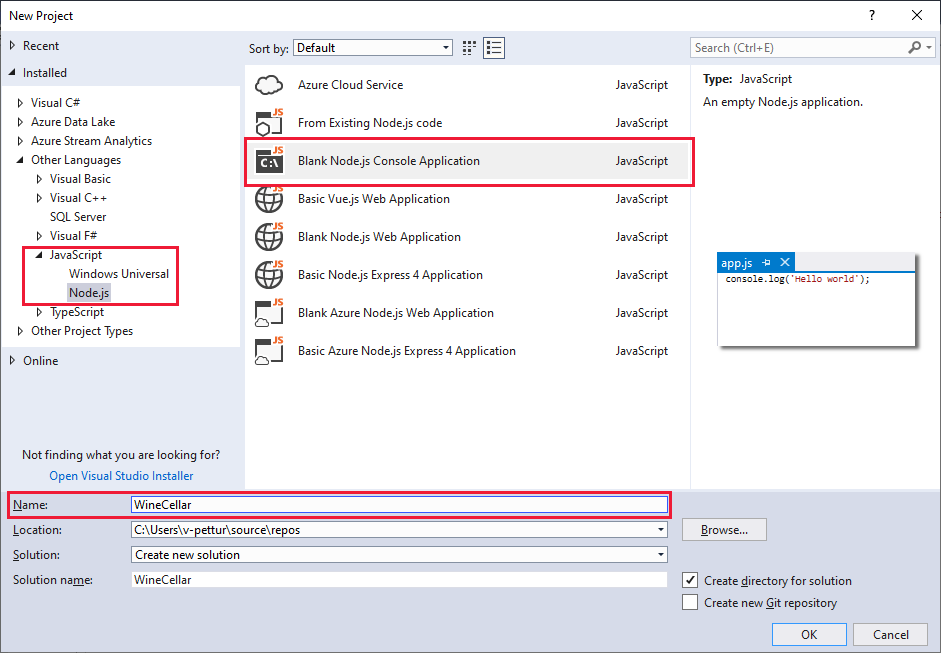
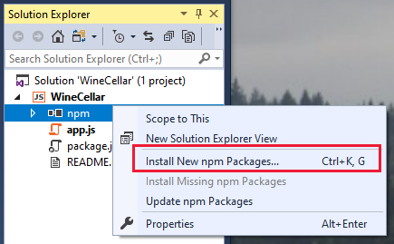
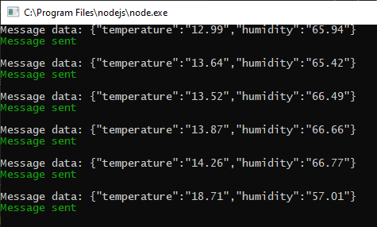
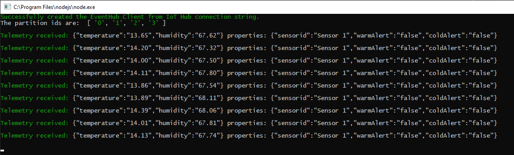

## Create an app to send telemetry

### Using Visual Studio Code

TBD

### Using Visual Studio

Create a new Visual Studio project.
1. Navigate to **Other Languages/JavaScript/Node.js**, and select **Blank Node.js Console Application** from the range of options. Give the project a friendly name, such as "WineCellar", and click **OK**.

    

1. In the **Solution Explorer** tab, right click **npm**, and select **Install New npm Packages**.

    

1. Search for "azure-iot-device" and install the latest package. Then repeat the process for the "chalk" utility package.
1. Click **Close**, and verify the two packages are installed by expanding the **npm** node in **Solution Explorer**.
1. Open up the **app.js** file, and delete the default contents.

### Add code to send telemetry

This section adds code to send telemetry from a simulated device. The device sends temperature (in degrees centigrade) and humidity (in percentages) regardless of whether any app is listening or not.

1. With the **app.js** file open, copy and paste the following code.

``` JavaScript
// Copyright (c) Microsoft. All rights reserved.
// Licensed under the MIT license. See LICENSE file in the project root for full license information.

'use strict';

const chalk = require('chalk');

// The device connection string to authenticate the device with your IoT hub.
var connectionString = '<your device connection string>';

// The sample connects to a device-specific MQTT endpoint on your IoT Hub.
var Mqtt = require('azure-iot-device-mqtt').Mqtt;
var DeviceClient = require('azure-iot-device').Client
var Message = require('azure-iot-device').Message;

var client = DeviceClient.fromConnectionString(connectionString, Mqtt);

// Timeout created by setInterval
var intervalLoop = null;

var idealTemperature = 12.77777;                        // Ideal temperature for stored wine, in degrees C.
var idealTempLimit = 5.5;                               // Acceptable range above or below the ideal temp, in degrees C.
var idealHumidity = 65;                                 // Humidity in relative percentage of air saturation.
var idealHumidityLimit = 15;                            // Acceptable range above or below the ideal humidity, in percentages.
var intervalInMilliseconds = 1000;                      // Interval at which telemetry is sent to the cloud.
var intervalInSeconds = intervalInMilliseconds / 1000;
var seconds = 0;                                        // Seconds from when the app is started.
var cellarCompromised = false;                          // Set to true if the wine cellar is compromised (doors open, too much activity, etc.).

// Send a telemetry message to your hub
function sendMessage() {

    // Simulate telemetry.
    var temperature;
    var humidity;

    seconds += intervalInSeconds;

    if (!cellarCompromised) {
        if (Math.random() < 0.01) {
            cellarCompromised = true;
        }
    }
    else {
        if (Math.random() > 0.99) {
            cellarCompromised = false;
        }
    }
    if (!cellarCompromised) {
        temperature = idealTemperature + 15 * Math.sin(seconds/100) + Math.random(5);
        humidity = idealHumidity + 20 * Math.sin(seconds/100) + Math.random(10);
    } else {
        temperature = 5 + idealTemperature + 15 * Math.sin(seconds/100) + Math.random(10);
        humidity = idealHumidity - 10 + 20 * Math.sin(seconds/100) + Math.random(15);
    }

    var message = new Message(JSON.stringify({
        temperature: temperature.toFixed(2),
        humidity: humidity.toFixed(2),
    }));

    // Add custom application properties to the message.
    // An IoT hub can filter on these properties without access to the message body.
    message.properties.add('sensorid', "Sensor 1");
    message.properties.add('warmTemperatureAlert', (temperature > idealTemperature + idealTempLimit) ? 'true' : 'false');
    message.properties.add('coldTemperatureAlert', (temperature < idealTemperature + idealTempLimit) ? 'true' : 'false');

    console.log('Message data: ' + message.getData());

    // Send the message.
    client.sendEvent(message, function (err) {
        if (err) {
            console.error(chalk.red('Send error: ' + err.toString()));
        } else {
            console.log(chalk.green('Message sent'));
            console.log('');
        }
    });
}

// Create a message and send it to the IoT hub, initially every second.
intervalLoop = setInterval(sendMessage, intervalInMilliseconds);

```

1. Replace the &lt;your device connection string&gt; with the device connection string you saved off in the previous unit. No other lines of code need to be changed.

### Test your code to send telemetry

1. In Visual Studio, select **Debug/Start Without Debugging**. In Visual Studio Code select TBD.
1. You should quickly get a console screen, similar to the following image. Note the use of the chalk utility to set some text to green. If you do not get a screen similar to this, check your device connection string carefully.

    

1. Watch the telemetry for a short while, checking that is it giving temperatures and humidity in the expected range.
1. You can leave this app running, as it is needed for the next section.

## Create a second app to receive telemetry

Now we have a device pumping out telemetry, we need to listen for that telemetry with a backend app, also connected to our IoT Hub.

### Using Visual Studio Code

TBD

### Using Visual Studio

1. Open up a new instance of Visual Studio, so that you don't interfere with the running "WineCellar" app.
1. Go through the same steps as you did at the beginning of this unit, to create a Visual Studio **Blank Node.js Console Application**, except call it "WineCellarOperator" (or a similar friendly name).
1. This time, add three npm packages (by right-clicking on **npm** in **Solution Explorer** and selecting **Install New npm Packages**). The three packages are: **@azure/event-hubs**, **azure-iothub**, and **chalk**.
1. Delete the default contents of the **app.js** file.

### Add code to receive telemetry

1. With the **app.js** file open, copy and paste the following code.

``` JavaScript
// Copyright (c) Microsoft. All rights reserved.
// Licensed under the MIT license. See LICENSE file in the project root for full license information.

'use strict';

const chalk = require('chalk');

// Connection string for the IoT Hub service.
var connectionString = '<your IoT Hub service connection string>';


// The sample connects to service-side endpoint to call direct methods on devices.
var Client = require('azure-iothub').Client;

// The sample connects to an IoT hub's Event Hubs-compatible endpoint to read messages sent from a device.
var { EventHubClient, EventPosition } = require('@azure/event-hubs');

var printError = function (err) {
    console.log(err.message);
};

// Display the message content - telemetry and properties.
// - Telemetry is sent in the message body
// - The device can add arbitrary application properties to the message
// - IoT Hub adds system properties, such as Device Id, to the message.
var printMessage = function (message) {
    console.log(chalk.green('Telemetry received: ') + JSON.stringify(message.body) + " properties: " + JSON.stringify(message.applicationProperties));
    console.log('');
};

// Connect to the partitions on the IoT Hub's Event Hubs-compatible endpoint.
// This example only reads messages sent after this application started.
var ehClient;


EventHubClient.createFromIotHubConnectionString(connectionString).then(function (client) {

    console.log(chalk.green("Successfully created the EventHub Client from IoT Hub connection string."));
    ehClient = client;
    return ehClient.getPartitionIds();
}).then(function (ids) {
    console.log("The partition ids are: ", ids);
    return ids.map(function (id) {
        return ehClient.receive(id, printMessage, printError, { eventPosition: EventPosition.fromEnqueuedTime(Date.now()) });
    });
}).catch(printError);
```

### Test your code to receive telemetry

This is an important test in this module, testing whether your backend app is picking up the telemetry being sent out by your simulated device. Remember that your device app is still running, and sending telemetry.

1. Using Visual Studio, select **Debug/Start Without Debugging**. In Visual Studio Code select TBD.
1. A second console window should open up, and immediately respond if it successfully connects to IoT Hub. If not, carefully check your IoT Hub service connection string, noting that this should be the _service_ connection string, and not any other.

    

## Next steps

If everything is working so far, this is great progress. You have an app sending telemetry from a device, and a backend app acknowledging the receipt of the data. This covers the _monitoring_ side of our scenario. The next step handles the _control_ side - what to do when there are issues with the data!
